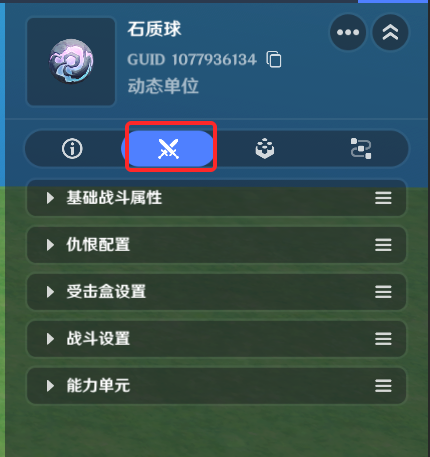
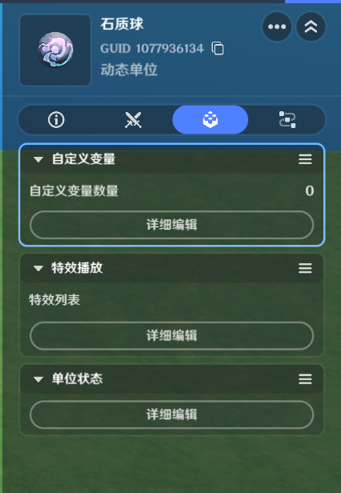
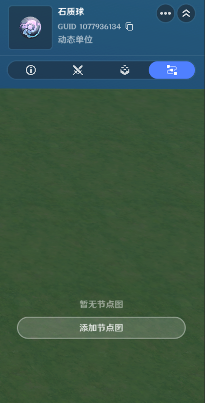

# 物件

**URL**: https://act.mihoyo.com/ys/ugc/tutorial/detail/mhlh4n9m4i56

**爬取时间**: 2026-01-04 08:06:09

---

## 物件

# 一、物件的定义

物件是对地貌、植被、建筑、人造装饰、机关等的统称

物件无法对角色做出自主反应

物件无法自主移动，但可以通过挂载运动器组件来使其按照特定规则移动

# 二、物件分类

## 1.静态物件

主要为环境、氛围表现使用的纯表现向实体 

不支持组件、节点图等任何功能 

## 2.动态物件

动态物件运行时可根据配置的预设状态，呈现不同的动画表现

动态物件实体遵循实体的一切通用规则

# 三、动态物件编辑

切换到实体摆放页签，动态物件的编辑分为以下四部分内容

## 1.基础信息

*实体*的*基础信息*是与实体模型和位置相关的特征或数据，在游戏过程中，基础信息可以被动态读取或修改，但不能被动态添加或删除

基础信息包括变换、模型、原生碰撞、可见性、创建设置、阵营、单位标签、实体布设组、负载优化、音效、引用源、备注等部分

详见[基础信息](基础信息_mh3oxo0ojgxk.md)

## 2.特化配置

特化配置提供了与战斗表现、数值校验相关的内容，而物件和造物的特化配置包含的内容有所不同

详见[特化配置](特化配置_mhtwkur42see.md)

## 3.通用组件

*组件*是可以添加给实体的一项功能，当为实体添加通用组件后，实体就可以使用通用组件提供的功能。

部分物件会默认携带一些自身常用的组件。

详见[通用组件](通用组件_mhei6orvcbkm.md)

## 4.节点图

节点图是自定义逻辑的载体，创作者(奇匠)任何想要自行设计和制作的逻辑，均可以通过配置和挂载节点图来实现

详见[节点图](节点图_mhjwjrr5n73i.md)
