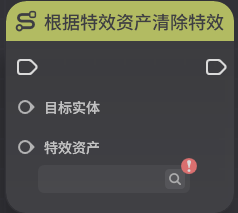

# 特效

**URL**: https://act.mihoyo.com/ys/ugc/tutorial/detail/mhe1030vx380

**爬取时间**: 2026-01-04 08:19:22

---

## 特效

# 一、特效的定义

*特效*是游戏运行时，可额外用于增强视觉表现效果的美术资产。

特效的引用，必须依赖实体，每个特效必定存在一个明确的挂载实体。

特效播放时，以实体的*挂接点*作为基准位置，运行时跟随其位置移动。

特效的引用，必须依赖特效播放器组件[特效播放](特效播放_mh4ppo02m1o8.md)。

# 二、特效的分类

根据特效资产的播放时间，分别提供了限时特效池和循环特效池

## **1.限时特效**

限时特效有明确的生效时长。

限时特效在触发后只播放一次，不会重复。

## **2.循环特效**

循环特效的没有明确的生效时长，会循环不断的播放，直到被明确停止或移除。

# **三、特效的使用**

## 1.以组件挂载

支持在元件/实体编辑时，通过特效播放器组件挂载特效，这些特效会与实体一同创建

编辑详情查看[特效播放](特效播放_mh4ppo02m1o8.md)使用。

## 2.以节点图使用

支持节点图中，通过特效相关节点，控制特效资产的创建和删除。

针对不同的特效类型，提供不同的引用特效资产节点。

* **播放限时特效**

可引用限时特效池中的特效，选定配置了“特效播放组件”的实体，配置*挂接点*进行使用。

若挂接点填写错误，则特效不会播放

若挂接点未填写，则会默认以GI\_RootNode挂接点播放

* **挂载循环特效**

可引用循环特效池中的特效，选定配置了“特效播放组件”的实体，配置挂接点进行使用。

若挂接点填写错误，则特效不会播放

若挂接点未填写，则会默认以GI_RootNode挂接点播放

* **清除循环特效**

“挂载循环特效”节点创建的循环特效，可以通过该节点将其清除

* **根据特效资产清除特效**

将选定的运行时实体上的指定特效资产清除

可通过点击符号，查看所有特效枚举，选取指定特效资产

