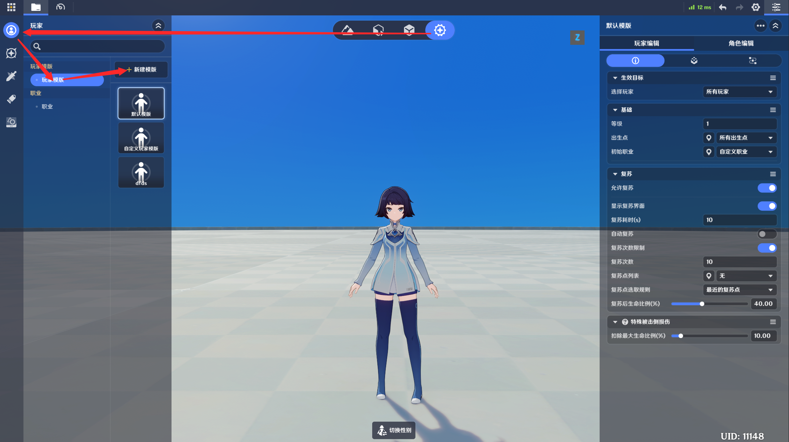

# 一、玩家的概念

*玩家*一种特殊的抽象实体类型，用于描述游戏中“角色的从属概念”，如：

在提瓦特上，玩家队伍中可以编入多个角色。

在超限模式中，每个*玩家*只对应一个*角色*。

# 二、玩家的配置

玩家的具体配置通过玩家模板进行引用，模板配置入口如下：

点击*新建模版*即可创建一个新的玩家模板

## 1.基础信息

基础信息页签：可配置所有可用的玩家基础信息

*生效目标*：决定了该模板对哪些玩家生效

*等级*：覆写职业的初始等级

*出生点*：玩家可用的出生点列表，见预设点文档[预设点](./预设点_mhfvn30c.md)

*初始职业*：该玩家模板的初始职业，职业定义见职业文档[职业](./职业_mhodlcrp.md)

*复苏*：玩家对应的复苏规则，见复苏规则文档[复苏](./复苏_mh796lr4.md)

*特殊被击倒损伤*：当角色因为溺水、摔伤等特殊原因被击倒时，扣除的生命的百分比

## 2.组件

组件页签，可在此页签给玩家实体添加组件，或查看已添加的组件

玩家实体的可用组件概览

[自定义变量](./自定义变量_mhso1b9w.md)

[全局计时器](/ys/ugc/tutorial//detail/mhawd6y)

[单位状态](./单位状态_mhd7nxrf.md)

## 3.节点图

节点图配置页签，可在此页签给玩家实体添加节点图，或查看已添加的节点图

# 三、运行时特性

## **1.无物理实体**

玩家实体是一个纯逻辑实体

## **2.没有布设信息**

玩家实体并不会直接布设在场景上，因此没有布设信息

## **3.生命周期**

玩家实体的生命周期随关卡初始化创建，随关卡销毁而移除

当用户主动退出返回大厅时，玩家实体会被移除