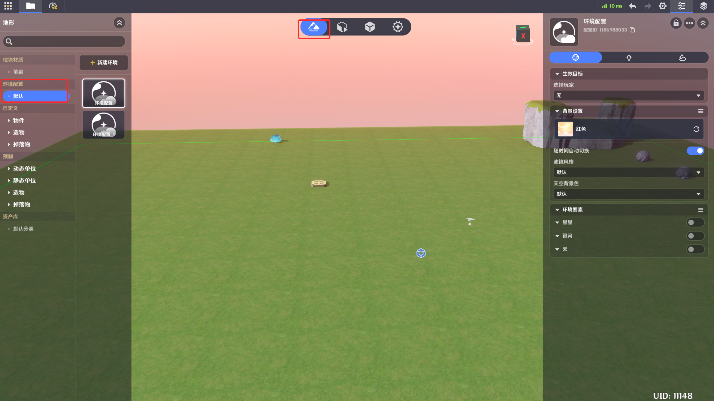
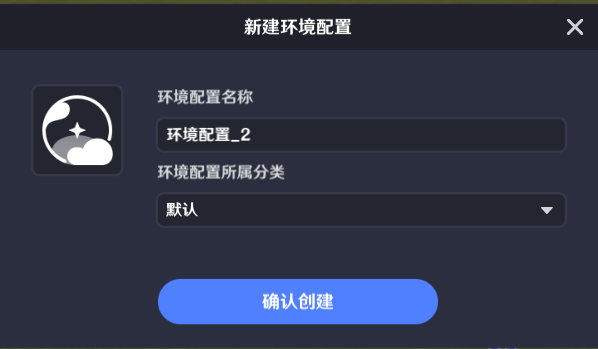
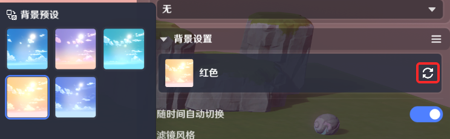
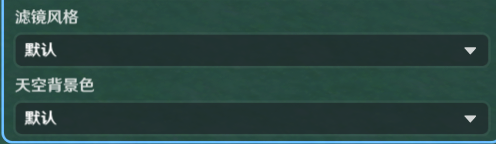
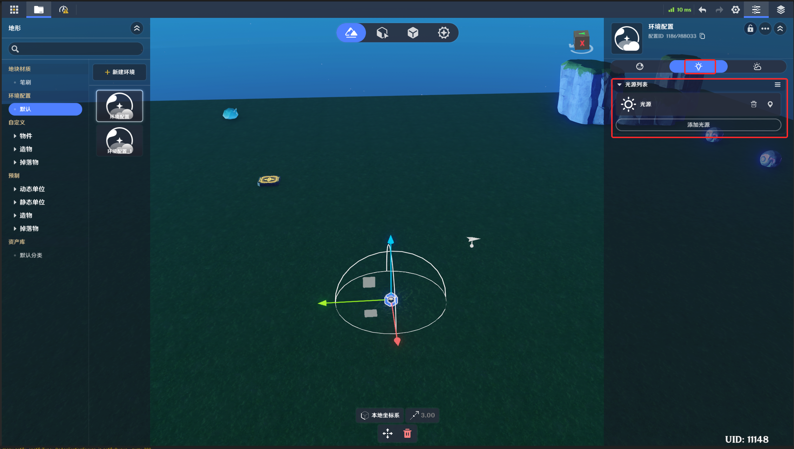
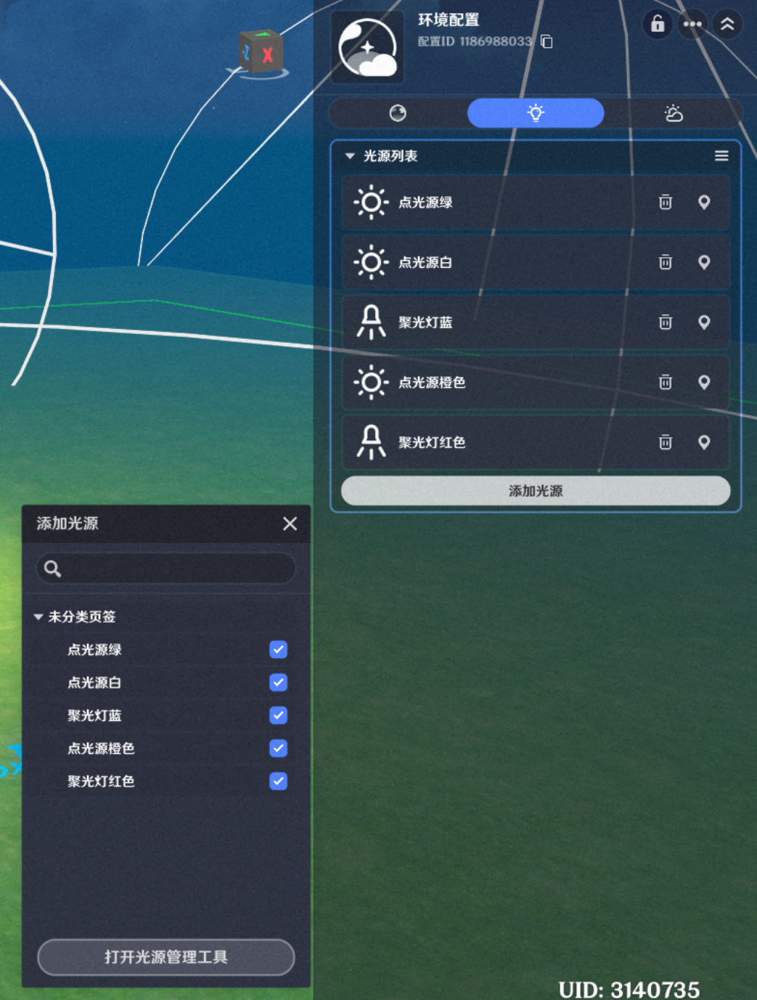
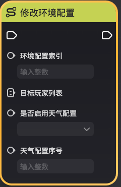
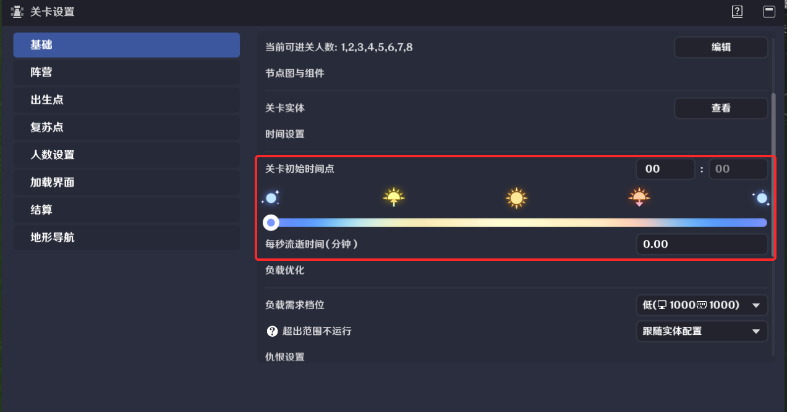

# 环境配置

**URL**: https://act.mihoyo.com/ys/ugc/tutorial/detail/mhdznsie9up8

**爬取时间**: 2026-01-04 08:29:58

---

## 环境配置

# 一、环境配置的定义

环境配置包含一系列环境表现相关参数，可用于丰富场景中各要素的表现

环境配置需要预先定义，并应用于各玩家的客户端

# 二、环境配置的编辑

切换至地形编辑页签，可在左侧选择环境配置。

点击【新建环境】并【确认创建】即可新建一份环境配置

## 1.背景设置

可选择一份背景预设，决定场景表现的大致风格

随时间自动切换：如果启用，则场景中的太阳月亮、光照角度和强弱都会随时间变换。关卡设置中可定义游戏开始时的时间点，以及游戏中的时间流逝速度，也可以通过节点图调整。

如果随时间自动切换为不启用，则有额外参数需要配置：

设定时间点：将场景表现固定至特定时间。

背景旋转：按Y轴调整背景的角度

直射角、强度、模糊程度、受光颜色：调整环境主光源的参数

滤镜风格：在相机层增加滤镜效果

天空背景色：天空盒的背景颜色

## 2.环境要素

星星：启用后可设置密度、强度

银河：启用后可设置强度、受光颜色

云：启用后可设置强度和开关高、中、低层云

## 3.光源列表

与这份环境配置绑定的光源，当环境配置生效时，对应的光源列表也会一起生效。

### (1)光源配置的入口

* 点击添加光源>打开光源管理工具，可以打开光源管理工具

* 点击左上角系统菜单，点击【光源管理】可以打开光源管理工具

### (2)光源配置

光源的参数设置：

归属文件：指被哪些环境配置引用

位置、旋转：控制其在场景中的位置、旋转。

光源类型：目前可选点光源、聚光灯两种。

颜色：照射在其他模型上时，模型显现的颜色变化

半径：照射的半径

强度：被照射的模型上，颜色或亮度变化的程度

生效范围：角色进入该范围时，光源才会被加载，可用于性能优化。

## 4.天气

一份环境配置下可设置多份天气配置，可随环境配置一同启用

天气类型：雾

距离雾设置：根据镜头位置，使远处的模型、天空显现被雾遮挡的效果。

高度雾设置：根据场景高度，使远处的模型、天空显现被雾遮挡的效果。

# 三、环境配置的使用

环境配置可以配置初始生效的玩家列表

也可以通过节点切换

# 四、环境时间

关卡设置中可定义游戏开始时的时间点，以及游戏中的时间流逝速度，也可以通过节点调整。

环境时间也可以通过节点进行调整：

环境时间是全局唯一的运行值，无论各玩家应用的环境配置如何，服务器中将会持续地推进环境时间。仅有勾选“随时间自动切换”的环境配置生效时，才会看到环境时间变换产生的效果变化
