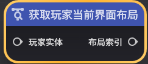
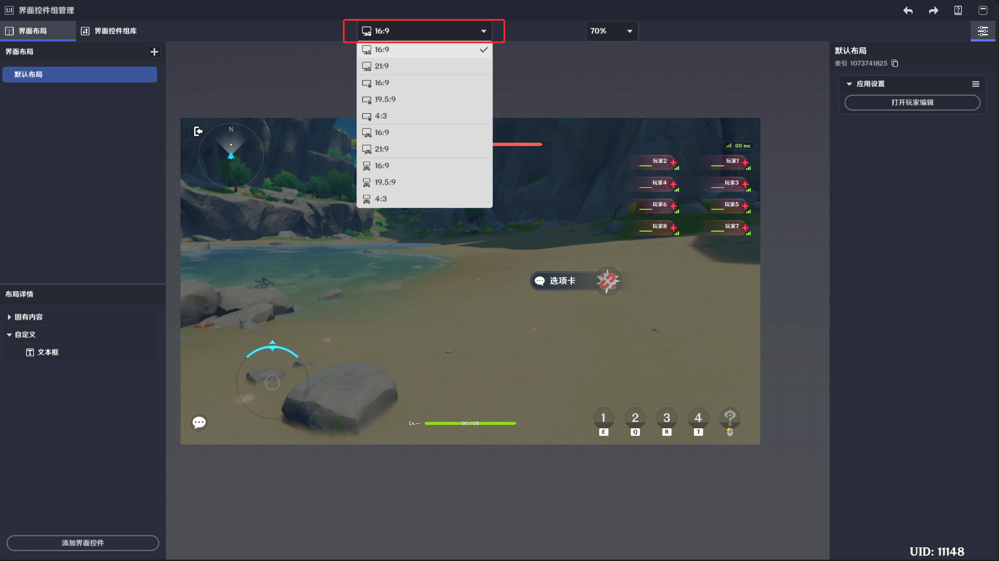
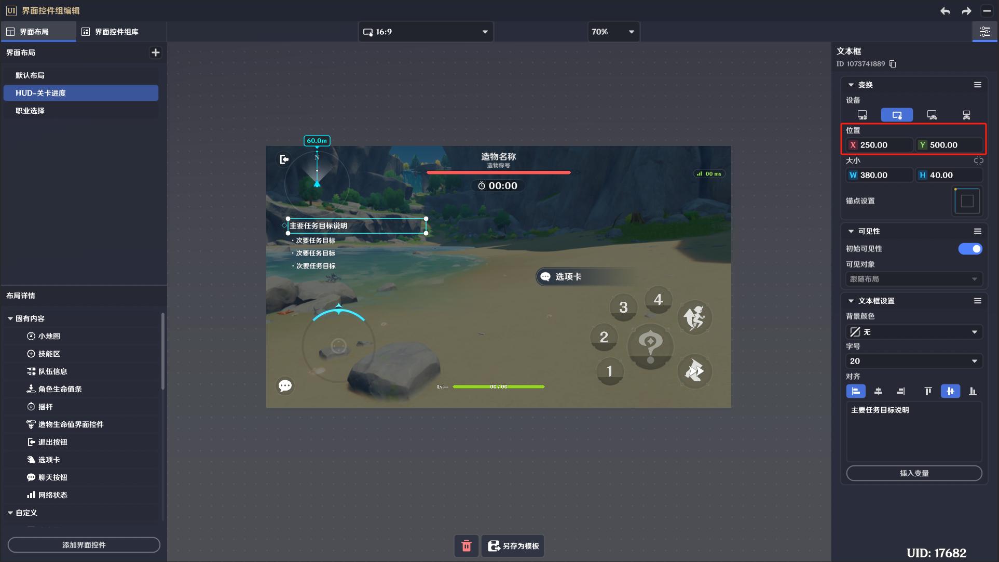
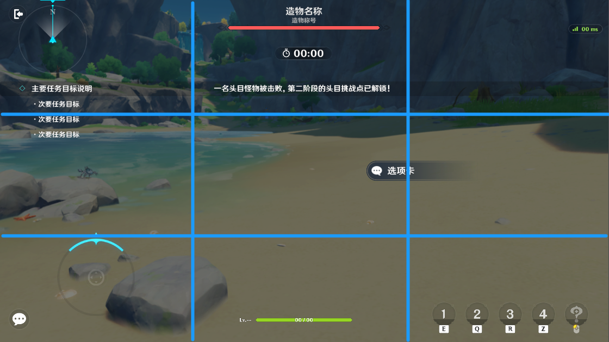
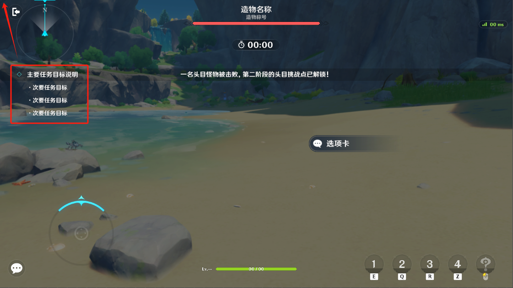
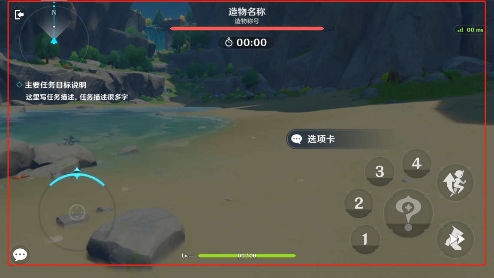
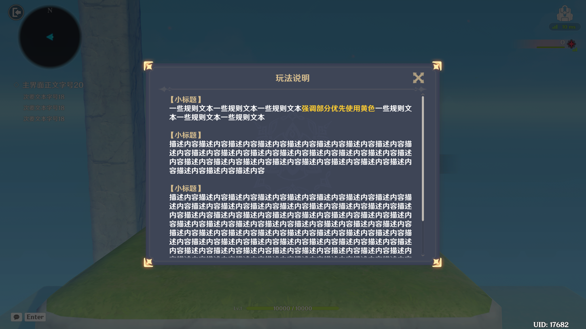

# 界面布局

**URL**: https://act.mihoyo.com/ys/ugc/tutorial/detail/mhozt0r74ng6

**爬取时间**: 2026-01-04 08:23:11

---

## 界面布局

# 一、界面布局的定义

界面布局是关卡运行时，玩家用于进行信息获取和交互操作的界面。

在包含基础功能的*默认布局*之上，支持玩家对界面布局自定义。

界面布局依赖玩家运行，运行时每个玩家有且仅有一个生效的界面布局。

# **二、界面布局的管理**

界面布局通过*界面控件组管理-界面布局*统一管理。

仅支持对关卡运行中表现的界面做编辑和引用，并不支持对匹配、结算等必要流程界面的编辑。

## 1.默认配置

玩家在关卡游玩时使用的界面布局，需要通过*职业*进行配置。

* *打开“职业”编辑界面，通过选择布局，引用界面布局*

* 界面布局的参数配置窗口也可以直接跳转到该编辑界面

## 2.以节点图管理

* 切换当前界面布局

通过布局索引，将目标玩家当前的界面布局按需替换。

|  |  |
| --- | --- |
| 配置参数 | 说明 |
| 目标玩家 | 需要切换界面布局的玩家实体 |
| 布局索引 | 界面布局管理工具中，指定布局的索引 |

* 获取当前界面布局

运行时，获取玩家当前的界面布局索引。

# **三、界面布局的适配说明**

## 1.选择设备

由于不同设备上的分辨率/按钮排布等界面布局差异较大，如果需要制作PC端/移动端/主机端都可以游玩的关卡，则需要调整控件在不同设备上的位置、大小、锚点

可调整设备的位置有两处：

(1)顶部栏：可选择设备及分辨率

(2)控件详情-变换：点击选择设备

不同设备在16：9分辨率下的主界面样式：

|  |  |  |
| --- | --- | --- |
| 所选设备 | 图标 | 主界面示意图（16:9分辨率） |
| PC端 |  |  |
| 移动端 |  |  |
| 主机端 |  |  |
| 移动端手柄 |  |  |

## 2.调整位置与大小

### (1)位置

以画布左下角为原点，显示控件中心点与原点的相对位置

每个设备需单独设置

### (2)大小

调整控件当前大小，点击右上角链条按钮可锁定当前长宽比，部分控件大小不可调整

每个设备需单独设置

## 3.锚点

### (1)定义

当分辨率变化时，控件会自适应位置与设置的锚点保持相对位置不变

以下图选中的任务文本为例：

|  |  |
| --- | --- |
| 所选锚点 | 分辨率更改为21:9后 |
|  |  |
|  |  |

### (2)**锚点选择建议**

* 根据控件所在位置：在九宫格中主体位于哪部分就选择对应位置的锚点

* 根据功能区：比如任务描述，多条文本框的锚点选择应该保持一致

## 4.界面死区

移动端界面最小，需要以移动端16:9适配作为基准确保可点击控件在红框区域内

# 四、界面规范参考

## 1.文字参考

### (1)字号

输入文本时建议参考下图选择字号，通常采用20号字

|  |  |
| --- | --- |
| 类型 | 推荐字号 |
| 大标题 | 36-32 |
| 小标题/按钮文本 | 24 |
| 正文（最常用） | 20 |
| 辅助字 | 18 |
| 推荐最小字号 | 16 |

### (2)字色

可使用<color=#FFFFFF>文本内容</color>的命令符来改变中间文本的颜色，其中#FFFFFF可替换为下列颜色编码

|  |  |
| --- | --- |
| 深色底（弹窗/主界面中） | |
| 标题/次要文字 | #D3BC8E |
| 普通文字 | #FFFFFF |
| 关键字1 | #FFCC33 |
| 关键字2 | #37FFFF |
| 警示文字 | #FF5E41 |

|  |  |
| --- | --- |
| 浅色底（Tips等） | |
| 普通文字 | #4A5366 |
| 次要文字（75%不透明度） | #4A5366BF |
| 关键字1 | #F39000 |
| 关键字2 | #3399CC |
| 警示文字 | #FF5E41 |

其他特殊颜色：

|  |  |
| --- | --- |
| 元素属性颜色 | |
| 水 | #80C0FF |
| 火 | #FF9999 |
| 风 | #80FFD7 |
| 雷 | #FFACFF |
| 草 | #99FF88 |
| 冰 | #99FFFF |
| 岩 | #FFE699 |

|  |  |
| --- | --- |
| 品质颜色 | |
| 灰 | #CCCCCC |
| 绿 | #ACFF44 |
| 蓝 | #50F4FF |
| 紫 | #F998FF |
| 橙 | #FFE14B |

弹窗：

小标题——字色#D3BC8E

内容——强调文本优先使用黄色（#FFCC33），新起的段落前需空一行

## 2.界面布局参考

### (1)主界面任务

任务：主要任务文本框字号20号，次要任务字号18号，锚点左上角

* 多个次要任务：

* 次要任务带成功失败的情况：成功字色#ACFF44，失败字色#FFFFFFBF

* 有任务描述：描述文本18号，文本数量过多可考虑使用16号

* *带追踪距离的任务：距离显示需在文本中插入自定义变量*

### (2)提示

文本框字号20，居中，长度5000（适配各种屏幕不露出边界），锚点正上方

### (3)窗口

弹窗：

小标题——字色#D3BC8E

内容——强调文本优先使用黄色（#FFCC33），新起的段落前需空一行

