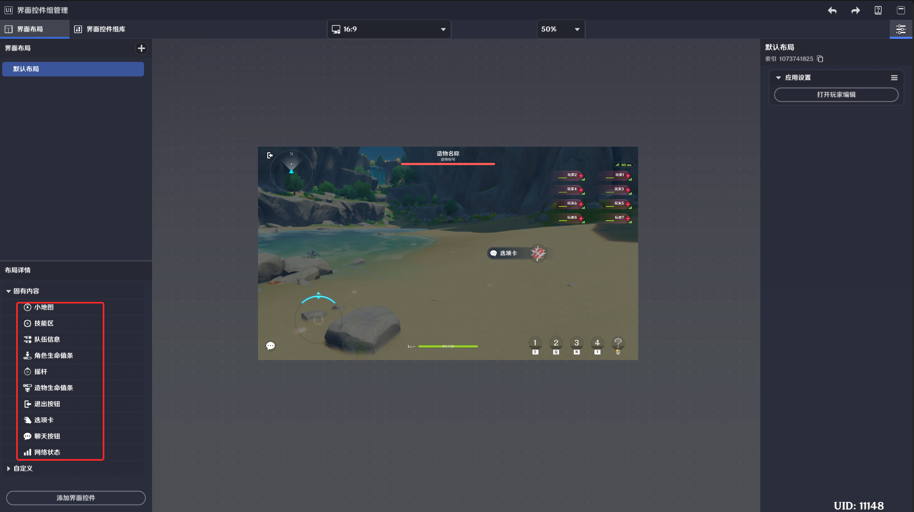
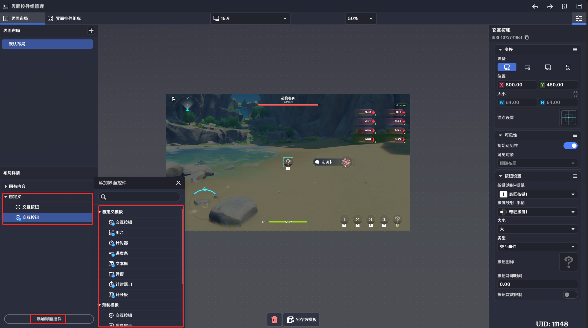

# 界面控件

**URL**: https://act.mihoyo.com/ys/ugc/tutorial/detail/mhnapxrumtzy

**爬取时间**: 2026-01-04 08:19:52

---

## 界面控件

# 一、界面控件是什么

界面控件是指设计和实现[界面布局](界面布局_mhozt0r74ng6.md)的各种文本框、图标或特殊功能的基础资产

# 二、界面控件的特点

每一种界面控件都有其特定的功能，可在后续介绍中查看。

界面控件可以直接配置在界面布局默认生效，也可以编辑为界面控件组模板使用。

界面控件的运行显示依赖界面布局。

# 三、界面控件的分类

界面控件分为固有界面控件和预制界面控件

固有界面控件是关卡运行时不可缺少的流程型控件，或与业务关联的功能型控件

预制界面控件提供原子化的界面资产，可以进行编辑修改和自定义组合，来构成更加定制的界面控件组

## 1.固有界面控件

### (1)固有界面控件的概述

固有界面控件是界面布局的默认包含的控件，大部分和业务逻辑相关，例如选项卡控件，需要通过选项卡组件进行调用。

不支持移除，不可移动，不可调节尺寸，仅支持少量编辑配置。

部分固有控件支持调整可见性。

### **(2)固有界面控件的引**用

在界面布局中会默认存在的控件，无需主动添加

部分固有界面控件会在关卡运行时默认存在，部分固有界面会通过业务按需调用

### **(3)固有界面控件资**产

* **小地图**

位于界面布局左上角

关卡运行中，若满足条件，会在小地图控件中，显示带有小地图标识的实体，并根据组件的配置显示内容

* **技能区**

关卡运行时，用于释放角色技能的按键

* **队伍信息**

显示共同运行关卡的玩家角色信息

* **角色生命值条**

关卡运行时，显示当前角色的生命值的控件

* **摇杆**

关卡运行时，移动端用于操控角色移动的控件

* **造物生命值条**

关卡运行时，显示造物名称和血量的控件

* **退出按钮**

关卡运行时，用于中断/退出关卡的按键

* **选项卡**

关卡运行时，和选项卡组件关联，当满足组件配置时，会显示对应信息

* **聊天按钮**

关卡运行时，用于展开聊天窗口的按键

* **网络状态**

关卡运行时，用于实时显示当前网络情况的界面控件

## 2.预制界面控件

### **(1)预制界面控件的概**述

预制界面控件可以直接配置在界面布局默认生效，也可以编辑为界面控件组模板使用。

### **(2)预制界面控件的引**用

在界面控件组库中，可以利用界面控件资产将其编辑为界面控件组模板，并通过节点图来使用

在界面布局中，可以通过【添加界面控件】来引用界面控件资产，随界面布局一同生效

### **(3)预制界面控件资**产

* **交互按钮**

关卡运行中，点击和外接设备输入，都可以触发该界面控件的交互。

支持玩家进行交互，并在交互后向节点图发送：“界面控件组触发时“事件

详见[交互按钮界面控件](交互按钮界面控件_mhwkfsitckrw.md)

* **道具展示**

关卡运行中，点击和外接设备输入，都可以触发该界面控件的交互。

支持玩家进行交互，并在交互后向节点图发送：“界面控件组触发时“事件

详见[道具展示界面控件](道具展示界面控件_mhjja1ipq9ck.md)

* **文本框**

关卡运行中，显示预先编辑的文本内容。

若文本内容中，包含*自定义变量*，会实时更新显示。

详见文本框界面控件

* **弹窗**

关卡运行中，一种通过逻辑触发出现的界面，用于向玩家提供重要信息、提示、选项或交互功能。

详见[弹窗界面控件](弹窗界面控件_mhen7r0djxkg.md)

* **进度条**

关卡运行中，可以实时展示需求变量在默认配置范围中占比的图形界面。

详见[进度条界面控件](进度条界面控件_mhwpzpixrad0.md)

* **计时器**

用于显示时间进度的界面，包括倒计时、正计时两种表现方式。

详见[计时器界面控件](计时器界面控件_mhnrdor7uyra.md)

* **计分板**

关卡运行时，用于显示玩家自定义变量，并可以根据自定义变量进行排名的信息展示界面

详见[计分板界面控件](计分板界面控件_mhesro0hyn5k.md)

* **卡牌选择器**

选择器面板提供编辑简单的决策交互界面功能

支持对可决策内容进行编辑，包括决策时间、决策项的表现、决策的交互方式等

详见[卡牌选择器界面控件](卡牌选择器界面控件_mh2teu0bmfbc.md)
