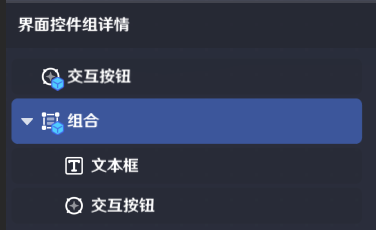
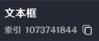
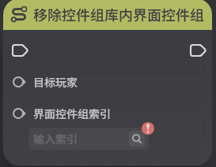
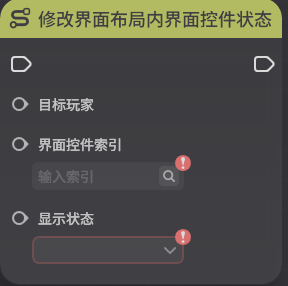

# 界面控件组

**URL**: https://act.mihoyo.com/ys/ugc/tutorial/detail/mhg1700h8bug

**爬取时间**: 2026-01-04 08:23:25

---

## 界面控件组

# 一、界面控件组的定义

*界面控件组*是创作者(奇匠)对界面控件的自定义数据。

界面控件组是对单个/多个预制*界面控件*，进行组合、编辑参数后保存的数据。

界面控件组包括单个界面控件组，组合界面控件组两种。

[界面控件](界面控件_mhnapxrumtzy.md)指用于设计和实现[界面布局](界面布局_mhozt0r74ng6.md)的各种资产

# 二、界面控件组的编辑

界面控件组模板可以直接引用于*界面布局*的配置，也可以通过节点图管理。

组合界面控件组可以通过界面控件组组合统一管理，也可以对包含的单个界面控件做状态管理。

## 1.命名和索引

在*界面控件组库管理工具*中，每个界面控件组都有其索引，作为节点图的入参

界面控件组模板的组合、组合内控件，都有自己的索引进行标识

## **2.界面控件组状态**

(1)界面控件组状态：**激活、未激活**

* 激活 存在于界面布局，可通过节点图管理表现状态
* 未激活 不存在于界面布局，不可操作表现状态

(2)已经激活的界面控件组表现状态：**开启、关闭、隐藏**

* 开启，界面控件组可见性开启。

隐藏状态到开启状态，将界面控件组可见性开启。

关闭状态到开启状态，将界面控件组重新初始化，并开启可见性

* 关闭，界面控件组可见性关闭，并且不保留动态改动的信息

关闭后开启的界面控件组，表现和数据都会初始化

* 隐藏，界面控件组可见性关闭，并且保留动态改动的信息

隐藏后开启的界面控件组，表现和数据都和隐藏前的一致

# 三、界面控件组的管理

## 1.以界面布局引用

在界面布局中引用的界面控件组模板，默认随界面布局一同激活。不可对状态修改，仅可对表现状态做调整。

## 2.以节点图管理

* **激活控件组库内界面控件组**

运行时，可以将界面控件组创建在玩家的当前界面布局中。

* **移除控件组库内界面控件组**

运行时，可以将”**激活控件组库内界面控件组**“节点创建的界面控件组在玩家的当前界面布局中移除

* **修改界面布局内界面控件状态**

对已经激活的界面控件，可调整其表现状态。

* **界面控件组触发时**

交互按钮界面控件，道具展示界面控件在关卡进行中被执行交互操作，会发送节点图事件“界面控件组触发时”	该事件只有触发按钮的*玩家*节点图可以收到。

