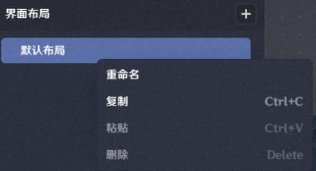
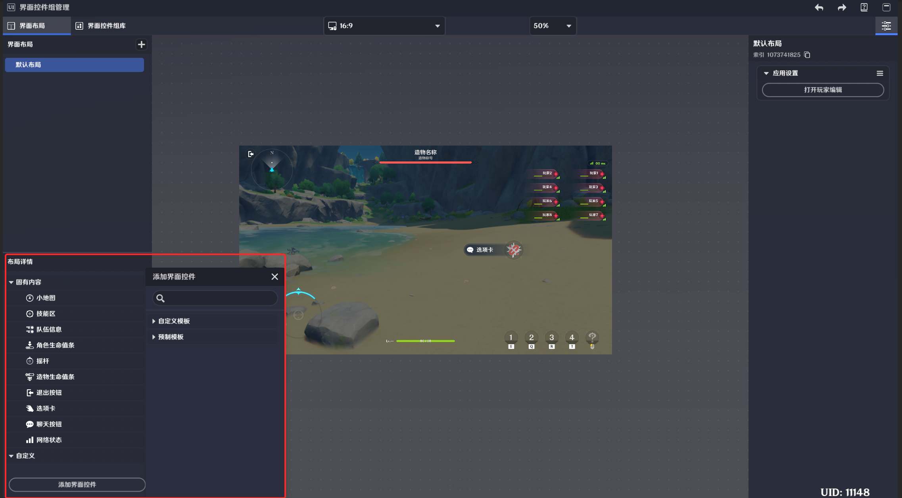
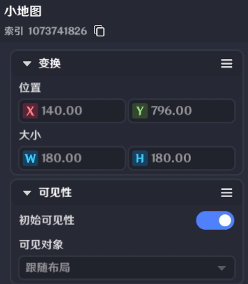
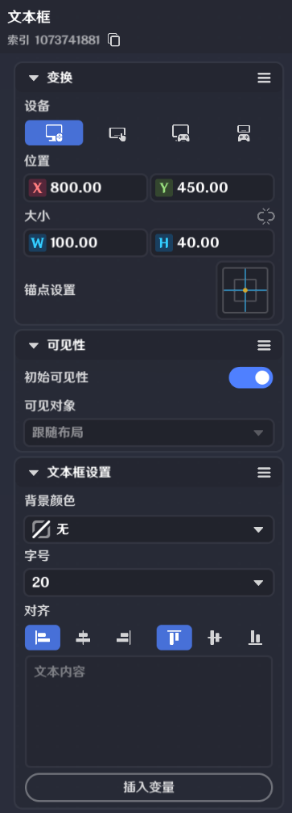
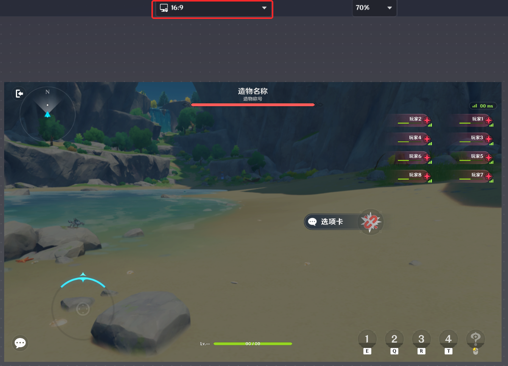
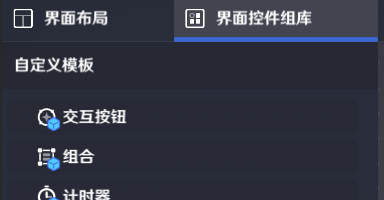
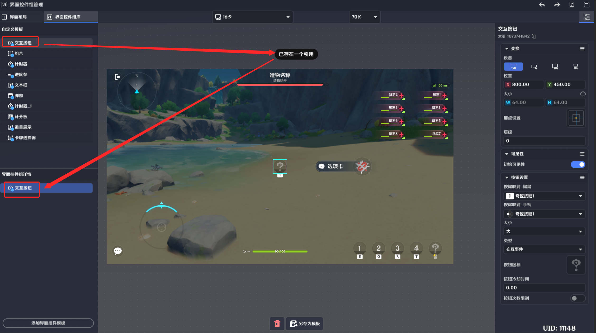
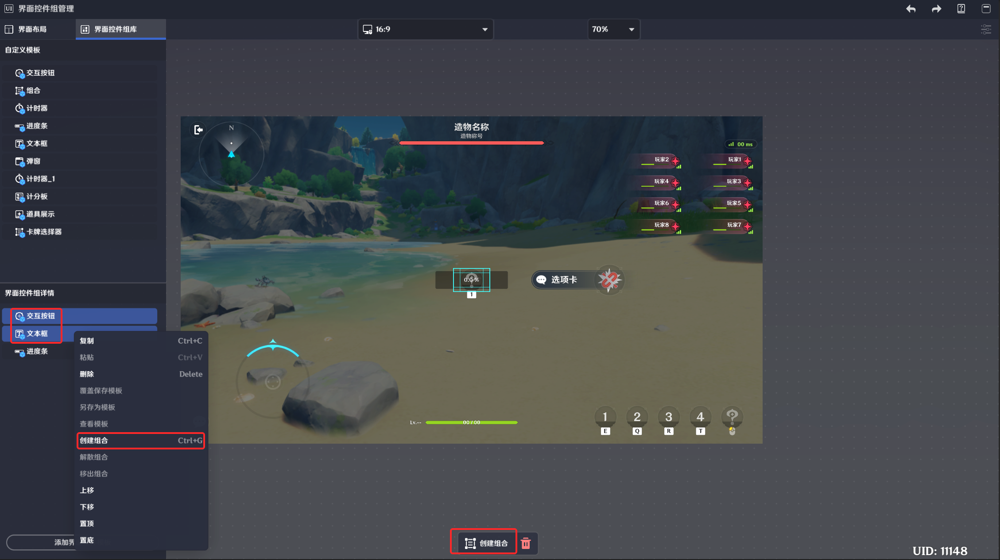

# 界面控件组管理

**URL**: https://act.mihoyo.com/ys/ugc/tutorial/detail/mhewyi0fjfvs

**爬取时间**: 2026-01-04 08:22:37

---

## 界面控件组管理

*界面控件组管理，统一管理*界面布局*和*界面控件组*。

# 一、入口

左上角系统菜单，选择【界面控件组管理】，打开管理界面

分为菜单栏、库窗口、详情窗口、预览窗口、编辑按键处、参数配置窗口

# 二、界面布局管理工具

## **1.界面布局**

默认包含“默认布局”界面，包含关卡运行的必要界面控件

界面布局库不可为空，最少包含一个界面布局

切换选择界面布局，可以同步在界面布局预览窗口查看

右键可以操作复制、粘贴、重命名

## **2.界面布局详情**

当前选中的界面布局包含内容，以界面控件为基础枚举列出。

通过【添加界面控件】可以给当前界面布局添加界面控件

### (1)固有内容

是流程、功能必要的界面控件属于此分类。

通过节点图管理时，仅支持修改表现状态，不支持进行移除。

不可调整位置、大小。默认生效，不可更改。

|  |  |
| --- | --- |
| 配置参数 | 说明 |
| 索引 | 当前界面控件组/界面控件的唯一标识 |
| 初始可见 | 当关卡运行，此界面布局生效时，该界面控件是否可见 |

### **(2)自定义**

通过【添加界面控件】增加的自定义或者预制界面控件，属于此分类

通过节点图管理时，仅支持修改表现状态，不支持进行移除

可调整位置、大小。默认生效，不可更改。

|  |  |
| --- | --- |
| 配置参数 | 说明 |
| 索引 | 当前界面控件组/界面控件的唯一标识 |
| 初始可见 | 支持配置界面布局生效时，该界面控件组是否可见 |
| 文本框设置 | 可配置文本框的颜色、字号、内容 |

## **3.界面布局预览窗口**

可预览编辑中的界面布局的基础表现效果

可以调整设备，进行对比

## 4.参数配置窗口

当前界面布局的默认应用配置，作为某位玩家运行关卡后的默认界面

【打开玩家编辑】 ，会跳转到[职业](职业_mhodlcrpht3q.md)配置界面，配置其应用的默认界面布局

# 三、界面控件组管理工具

## **1.界面控件组自定义模板**

保存为自定义模板的界面控件组枚举在此罗列

通过右键可以对选定的自定义模板进行操作

* 重命名

对界面控件组自定义模板重命名

* 删除模板

将所选模板删除

删除模板，若有引用，会将所有引用（界面布局、界面控件组详情）一起删除。

*界面控件组详情窗口*编辑的界面控件组保存为自定义模板后，会出现在*界面控件组库*中

当选中界面控件组库内的自定义模板

* 若界面控件组详情内没有自定义模板的引用，通过点击库中的目标，会在界面控件组详情内创建一个引用，并默认选中，用于编辑，编辑后可以覆盖修改模板内容，也可以另存为新的模板。
* 若界面控件组详情内已有该模板的引用，通过单点，会选中“界面控件组详情”的对应引用，用于覆盖修改模板内容。

## **2.界面控件组详**情

显示编辑中的界面控件组枚举

只有处于该窗口的界面控件组，才可以被编辑

模板在该界面的引用，支持修改后覆盖保存模板

通过【添加界面控件模版】可以创建以预制界面控件资产为基础的界面控件组

### (1)界面控件组

* 通过鼠标多选，或者shift按键多选界面控件/界面控件组
* *右键【创建组合】，或者**编辑按键处**的【创建组合】，生成界面控件组组合，生成索引*
* 单个界面控件也可以直接选择【保存】，生成界面控件组，生成索引

### **(2)界面控件组预览窗**口

* 可预览编辑中的界面控件组的基础效果
* 可以调整设备，进行对比

## 3.编辑按键处

预览窗口下方交互，只对编辑中的界面控件组生效

### (1)界面控件组-多界面控件

|  |  |
| --- | --- |
| 配置参数 | 说明 |
| 创建组合 | 将选中的界面控件组打包为一个组合的功能 |
|  | 删除多选的界面控件组 |

*

|  |  |
| --- | --- |
| 配置参数 | 说明 |
| 解散组合 | 将组合拆散为单独界面控件组，并删除组合 |
|  | 删除该界面控件组 |
| 保存修改 | 若组合内容有调整，会提示保存覆盖 |
| 另存为模板 | 将当前数据另存为一个新的界面控件组模板 |

### (2)界面控件组-单界面控件

|  |  |
| --- | --- |
| 配置参数 | 说明 |
|  | 删除该界面控件组 |
| 保存修改 | 若该界面控件组内容有调整，会提示保存覆盖 |
| 另存为模板 | 将当前数据另存为一个新的界面控件组模板 |

## **4.参数配置窗**口

### (1)界面控件组-多界面控件

|  |  |
| --- | --- |
| 配置参数 | 说明 |
| 初始可见 | 界面控件组模板激活时的默认表现状态 |
| 位置 | 界面布局上的位置 |
| 大小 | 不可修改。代表界面控件组的最大范围 |
| 层级 | 代表界面控件组的显示层级 |

### (2)界面控件组-单界面控件

|  |  |
| --- | --- |
| 配置参数 | 说明 |
| 初始可见 | 界面控件组模板激活时的默认表现状态 |
| 位置 | 界面布局上的位置 |
| 大小 | 不可修改。代表界面控件组的最大范围 |
| 层级 | 代表界面控件组的显示层级 |

**