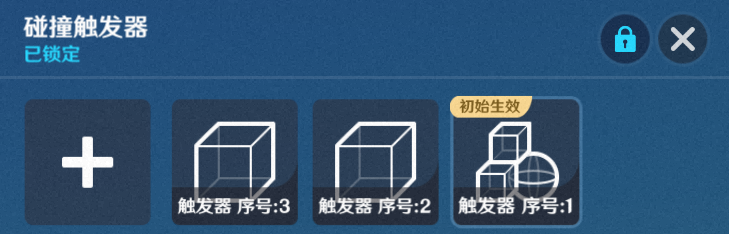
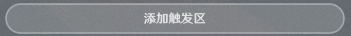

# 碰撞触发器

**URL**: https://act.mihoyo.com/ys/ugc/tutorial/detail/mh8w69rzuc3i

**爬取时间**: 2026-01-04 08:11:52

---

## 碰撞触发器

# 一、碰撞触发器组件的功能

碰撞触发器组件，提供关卡运行中碰撞检测的检测范围，是进行接触判定的一种工具。

碰撞触发器组件可支持同时生效多个碰撞触发器。

## 1.碰撞触发器、**碰撞触发源**的碰撞检测

关卡运行中，“碰撞触发器”持续监测其他携带“碰撞触发源组件”的实体。

实体运行时生效的“碰撞触发源”范围，进入和离开挂载“碰撞触发器组件”的运行时实体对应范围，这两个组件的生效范围发生碰撞时，会发送节点图事件给配置”碰撞触发器“的实体。

这种碰撞并不会带来物理层的碰撞阻碍。

“碰撞触发源”与不同的“碰撞触发器”发生碰撞时，它们之间的碰撞检测独立计算

举例：当“碰撞触发源”与“碰撞触发器1”和“碰撞触发器2”发生碰撞时，会分别发送节点图事件，互不影响

## 2.碰撞触发源组件

[碰撞触发源](碰撞触发源_mhn95di01j84.md)

# 二、碰撞触发器组件的编辑

## 1.添加组件

(1)在实体/元件编辑界面中，打开组件编辑页签

(2)点击下方的“添加通用组件”，选择并点击“碰撞触发器”，成功添加

(3)点击“详细编辑”，展开编辑页

## 2.碰撞触发器组件的编辑

|  |  |
| --- | --- |
| 配置参数 | 说明 |
| 初始生效触发器 | 枚举实体运行时默认生效的碰撞触发器  支持通过下拉箭头修改触发器后面的枚举勾选方框来修改触发器的默认生效状态，修改后的生效状态会同步到对应触发器的详细编辑页内 |
| \触发器列表 | 枚举实体配置的所有碰撞触发器 |

## **3.碰撞触发器的编**辑

关卡编辑窗口中，实体会显示当前选中的碰撞触发器范围。

### **(1)碰撞触发器组**

* 枚举该实体预定义的所有碰撞触发器
* 通过点击，添加碰撞触发器
* “序号:X”，X为“触发器序号”，作为节点输入项，可以调整碰撞触发器的参数

### (2)碰撞触发器基础信息

|  |  |
| --- | --- |
| 配置参数 | 说明 |
| 初始生效 | 若开启，则该碰撞触发器随实体创建立即生效 |
| 生效目标 | 仅对配置的实体类型，进行碰撞触发源的检测  提供*角色、物件、造物*枚举 |

### (3)碰撞触发器范围

通过“添加触发区”可新增触发区域，同一碰撞触发器下的范围会取并集范围生效

|  |  |
| --- | --- |
| 配置参数 | 说明 |
| 触发区形状  | 支持长方体、球体、胶囊体，根据选择的不同形状会展开具体的大小配置参数 |
| 中心 | 相对实体/元件中心的偏移 |
| 旋转 | 以中心位置为基准，在不同轴向上支持调整朝向 |
| 缩放倍率  | 触发区配置形状在不同轴向上支持定义缩放 |

# 三、通过节点图管理碰撞触发

运行时，可通过节点图管理运行时实体的碰撞触发情况

* **进入碰撞触发器时**

运行中实体的”碰撞触发源“范围，进入其他运行中实体的“碰撞触发器”范围。

会发送节点图事件给配置“碰撞触发器”的实体

* **离开碰撞触发器时**

运行中实体的“碰撞触发源”范围，离开其他运行中实体的“碰撞触发器”范围。

会发送节点图事件给配置“碰撞触发器”的实体

* **激活/关闭碰撞触发器**

“碰撞触发器”组件功能支持通过节点图动态调整生效参数

