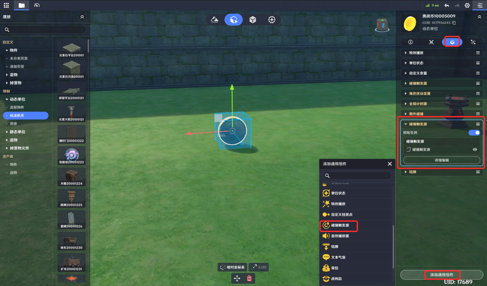
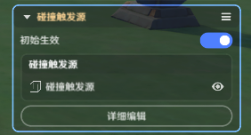
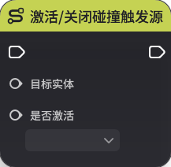

# 碰撞触发源

**URL**: https://act.mihoyo.com/ys/ugc/tutorial/detail/mhn95di01j84

**爬取时间**: 2026-01-04 08:14:47

---

## 碰撞触发源

# 一、碰撞触发源组件的功能

碰撞触发源组件，提供关卡运行中碰撞检测的触发源，是进行逻辑范围接触判定的一种工具。

碰撞触发源组件仅可同时生效一个碰撞触发源。

## 1.碰撞触发源、**碰撞触发器**的碰撞检测

关卡运行中，“碰撞触发器”持续监测其他携带“碰撞触发源组件”的实体。

实体运行时生效的“碰撞触发源”范围，进入和离开挂载“碰撞触发器组件”的实体对应范围，这两个组件的生效范围发生碰撞时，会发送节点图事件给配置”碰撞触发器“的实体

这种碰撞并不会带来物理层的碰撞阻碍。

## 2.碰撞触发器组件

[碰撞触发器](碰撞触发器_mh8w69rzuc3i.md)

# 二、碰撞触发源组件的编辑

## 1.添加组件

(1)在实体/元件编辑界面中，打开组件编辑页签

(2)点击下方的“添加通用组件”，选择并点击“碰撞触发源”，成功添加

(3)点击“详细编辑”，展开编辑页

## 2.碰撞触发源组件的编辑

通过“详细编辑”可对碰撞触发源的形状和尺寸参数做调整

|  |  |
| --- | --- |
| 配置参数 | 说明 |
| 初始生效 | 是否在物件创建时激活 |
| 触发区形状  | 支持长方体、球体、胶囊体，根据选择的不同形状会展开具体的大小配置参数 |
| 中心 | 相对实体/元件中心的偏移 |
| 旋转 | 以中心位置为基准，在不同轴向上支持调整朝向 |
| 缩放倍率  | 触发区配置形状在不同轴向上支持定义缩放 |

# 三、通过节点图管理碰撞触发

运行时，可通过节点图管理运行时实体的碰撞触发情况

* **进入碰撞触发器时**

运行中实体的“碰撞触发源”范围，进入其他运行中实体的“碰撞触发器”范围。

会发送节点图事件给配置“碰撞触发器”的实体

* **离开碰撞触发器时**

运行中实体的“碰撞触发源”范围，离开其他运行中实体的“碰撞触发器”范围。

会发送节点图事件给配置“碰撞触发器”的实体

* **激活/关闭碰撞触发源**

“碰撞触发源”组件功能支持通过节点图动态调整生效参数

# 四、举例说明

对于不包含*碰撞触发源*的实体，他们无法通过接触*碰撞触发器*，产生进入范围/碰撞范围事件

造物、角色实体，默认包含碰撞触发源，无需额外编辑

如图

* 给”木箱“添加碰撞触发源组件，配置大小等于木箱尺寸
* 给”尖刺平台“加一个碰撞触发器，放于地面

下图为了清晰显示范围，用空物件做了演示，不代表实际编辑视觉效果，只是为了方便提示

* *木箱的碰撞触发源<->尖刺平台的碰撞触发器，两者接触时，尖刺平台会收到**进入碰撞触发器时事件***
* 若有逻辑需求，可在节点图中进行编辑，例如木箱碰到尖刺平台，会受到伤害，就可以通过本例来做编辑

