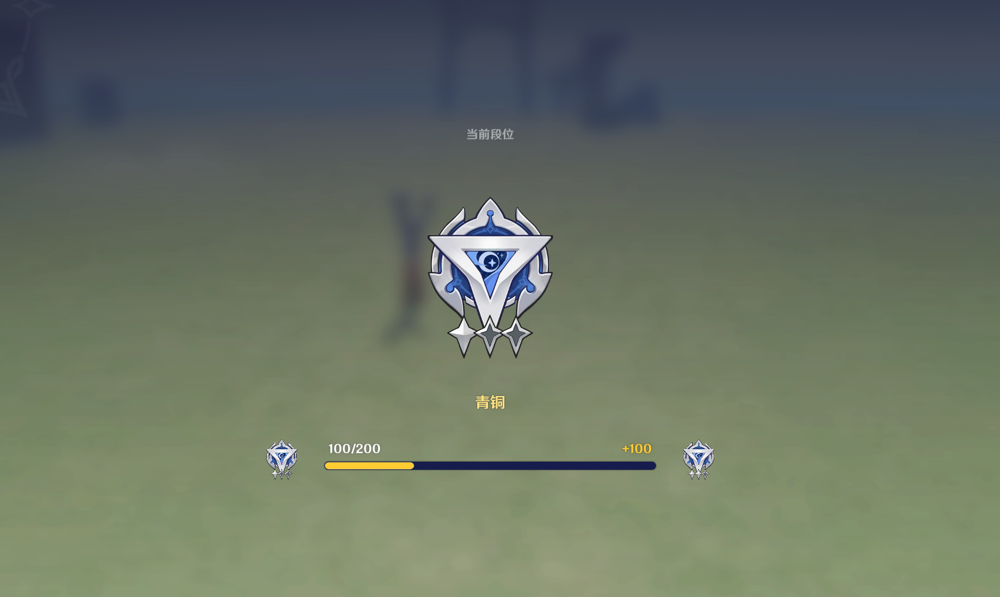

# 一、竞技段位的功能

*竞技段位*功能支持创作者(奇匠)定义玩家在该关卡内的段位积分，在关卡结算时，根据不同的*结算状态*玩家会获得不同的段位积分，各个状态可获得的对应积分可由创作者(奇匠)定制。

其他玩家在大厅内浏览该关卡的信息时，可以看到持久化记录的段位信息，如下图：

在对局结束进行结算时，玩家的段位积分会有相应的累计

# 二、计分组的编辑

从系统菜单点击【外围系统管理】，可进入外围面

在外围系统设置界面的竞技段位页签，即可进行竞技段位相关的设置

段位分的修改通过计分组模板的形式进行预设，对局内的每一个玩家应用一份，点击右下角的“新建计分组”按钮，即可新增一个计分组模板

*是否开启竞技段位*：排行榜和竞技段位功能选择一个开放

*允许房间内游玩结算分数*：当玩家通过房间组队而非匹配来游玩本关卡时，是否允许在结算时修改段位分

*奇匠留言*：允许创作者(奇匠)编写一份详细的段位分积分规则，显示在局外的关卡信息界面

*计分组设置*：每一个计分组模板的具体加分值设置

*计分组名称*：可自定义，用于创作者(奇匠)区分不同的计分组

*序号*：该计分组的标识方式，用于在节点图内修改计分组数据时进行标识

*胜利分数*：玩家以胜利状态结算时获得的段位分

*失败分数*：玩家以失败状态结算时获得的段位分

*未定分数*：玩家以未定状态结算时获得的段位分

*逃跑分数*：玩家以逃跑状态结算时获得的段位分

*包含的玩家*：该计分组对哪些玩家生效

# 三、段位分数模板配置建议

建议按照玩法预期时长以及实际游玩体验，参考以下分数表进行配置

|  |  |  |  |  |
| --- | --- | --- | --- | --- |
| 玩法预期时长（分钟） | 胜利 | 失败 | 未定 | 逃跑 |
| 0-2 | 20 | -5 | 0 | -20 |
| 2-4 | 40 | -10 | 0 | -40 |
| 4-6 | 60 | -15 | 0 | -60 |
| 6-8 | 80 | -20 | 0 | -80 |
| 8-10 | 100 | -25 | 0 | -100 |
| 10-15 | 120 | -30 | 0 | -120 |
| 15-20 | 140 | -35 | 0 | -140 |
| 20-30 | 160 | -40 | 0 | -160 |
| 30-40 | 180 | -45 | 0 | -180 |
| 40-999 | 200 | -50 | 0 | -200 |

# 四、特殊情境下的段位分数处理

## 1.特殊情况下的逃跑扣分

玩家逃跑可能是由于多种情况导致的，例如队友大量逃跑或挂机、由于网络原因掉线超时、对局在后半期双方实力过于不平衡导致对局不再有可玩性，创作者(奇匠)可以按照关卡的实际情况，对玩家的逃跑b-4b12-9d58-df7e7bacd911.png)外处理

## **2.连续胜**利

玩家连续胜利时，可按照胜利得分的一定百分比给予额外分数奖励

## 3.连续逃跑

玩家连续逃跑时，可以给予额外惩罚

## 4.段位保护

建议提供段位保护机制，例如达到白银段位后，若失败扣分会导致玩家下落到青铜段位，则给予保护，避免玩家掉落段位

若有以上特殊处理，建议在段位的创作者(奇匠)公告中进行说明

# 五、节点图管理计分组数据

* 切换玩家的段位分数配置计分组

* 设置玩家段位变化分数

* 获取玩家段位变化分数

* 获取玩家段位信息

