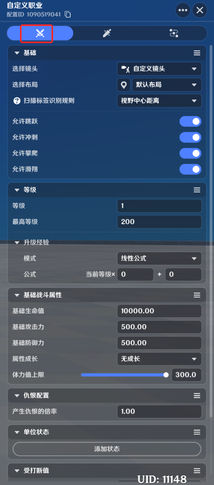
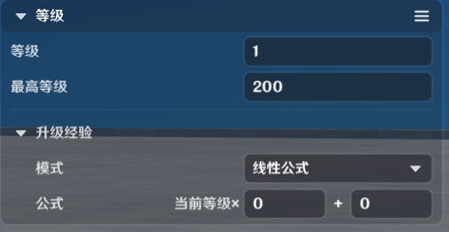
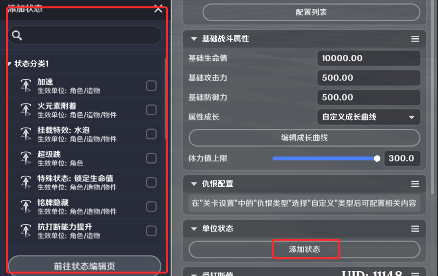

# 一、职业的定义

*职业*是玩家的一个属性，但主要的影响单位是玩家的角色。职业决定了大部分玩家实体和角色实体的初始属性和技能。

可以使用职业来区分不同玩家的玩法职责或分类，比如玩家的能力，角色的技能和发展路径等。

# 二、职业的功能

职业的主要功能是统筹和封装多个模块的功能，简单来说就是打包一整套配置，在职业切换时统一修改玩家和角色身上的配置，除职业的等级外，其他数据只会在职业切换时进行一次覆写。后续创作者(奇匠)仍可以使用节点图等其他方法修改玩家和角色数据。举例说明：当玩家生效职业1时，默认普通攻击被替换为技能1，但后续仍可用节点图将技能1替换为其他技能。

# 三、职业的编辑

## 1.编辑入口

职业的编辑入口在战斗预设下的职业页签下，进入方式如图所示：

## 2.新建职业模板

s/330b7-4df2-b6c0-15ea0865cc16.png)06a04f93661a9006d69c02dc55_1818194431287328309.png)

点击【新建职业】按钮，并在弹出的窗口中点击确认，即可新增一份职业模板配置

# 四、职业的参数设置

## 1.基础设置

*选择镜头*：选中一个镜头模板，当玩家切换为该职业时，镜头会被替换为此处配置的模板

*选择布局*：选中一个主屏布局，当玩家切换为该职业时，主屏布局会被替换为此处配置的模板

*扫描标签识别规则*：以何种规则在全部的可用扫描物中筛选出激活的单位

*视野中心距离*：在屏幕坐标系下，距离屏幕中心越近，优先级越高

*实际位置距离*：在世界坐标系下，距离本地角色位置越近，优先级越高

*允许跳跃*：该职业的角色是否接受跳跃输入

*允许冲刺*：该职业的角色是否接受冲刺输入

*允许攀爬*：该职业的角色是否可以攀爬，注意当该职业不可攀爬时，即使物件的碰撞设为可攀爬，角色也无法进行攀爬

*允许滑翔*：该职业的角色是否可以打开风之翼并在空中滑 2.等级设置

职业的*等级*可以被近似看做该角色的等级，当职业发生切换时，角色的等级也会同时发生变化，职业等级拥有以下特性：

* 角色等级和职业等级同步
* 单次游玩过程中，玩家可以切换多个职业，这些职业的等级会被记录，举例：玩家1的职业1为5级，切换到职业2再切换回职业1时，职业1仍为5级，且职业经验也会恢复值
* 在玩家模写一次玩家初始职业的创建等级，该等级会在关卡初始化时设置到玩家上

等级模块定义该职业的等级上限，以及每升一级所需要的经验值配置

*等级*：在一次游玩过程中，玩家首次切换为该职业时，玩家的职业等级

*最高等级*：该职业可达到的最高等级

*升级经验*：描述了职级升级所需的经验，支持两种配置方式

*线性公式*：提供了一个固定公式即：该等级的升级所需经验=当前等级\*常数1+常数2，常数1,2可配置

*列表配置*：使用一张二维表来精确定义每一级所需经验，如下图

## 3.基础战斗属性

职业的属性会直接作用到s/685cc9ae-7678-4591-a42c-aa66c281244b.png)角色上，相对的，玩家模板上不可配置基础战斗属性信息

*基础生命值*：在不叠加属性成长时的默认生命值

力*：在不叠加属性成长时的默认攻击力

*基础防御力*：在不叠加属性成长时的默认防御力

*属性成长*：定义了属性值随等级提升的增长量，目前提供了三种类型

* *无成长*：属性随等级无成长，即无论等级是多少，属性都为基础属性
* *默认成长曲线*：使用默认的成长曲线，可以通过查看成长曲线进行预览，但无法修改

曲线成长的公式如下：

最终生命值=基础生命值\*等级对应的生命值倍率

最终攻击力=基础攻击力\*等级对应的攻击力倍率

最终防御力=基础防御力\*等级对应的防御力倍率

* *自定义成长曲线*：自定义成长曲线的计算规则和默认曲线一致，但支持创作者(奇匠)通过【编辑成长曲线】按钮自由配置

*体力值上限*：该职业的体力值所能达到的最大值

## 4.仇恨配置

如果关卡设置中的仇恨类型选择为自定义，则可以配置仇恨倍率

## 5.单位状态

职业附加的*单位状态*，作用机制是当玩家切换到该职业时，自动帮对应角色上配置好的单位状态，单位状态的详情和相关配置见[单位状态](./单位状态_mh6rh59i.md)说明文档
)

## 6.抗打断相关配置

角色有三个抗打断相关状态：**抗打断状态**，**易受打断状态**，**受保护状态**，以及影响抗打断状态转换的*受打断值*

* **抗打断状态**

在未受击的状态下，角色受打断值初始值为0，处于抗打断状态。

抗打断状态下，受到任意不超过受打断值上限的打断值大于0的攻击），仅有受击表现，但不会被击退或击飞。同时当前受打断值增加该次攻击造成的打断值（实际增长值还会受到受击者上单位状态的受打断倍率的影响）

抗打断状态下，受打断值会每秒按照受打断值衰减速度进行衰减，直到衰减到0

* **易s/695984e4-9319-4f24-89bc-da9648c23666.png)e15d-c1cc-4d3e-87ed-fabb9de5899f.png)0d-5197-4ba6-b77e-b1a3f5a0a476.png)s/47bdfc50-44c5-422d-be6e-8742e95ea16d.png)f4-7e9c-4072-9a0a-8f972f2e19d9.png)s/da1c915e-78ab-4ce4-87d9-a0aac0f4c47b.png)g)**

当受打断值到达受打断值上限时，进入易受打断状态

易受打断状态下，受打断值恒为受打断值上限，不会增长或衰减。

受到打断攻击时，可能被击退或击飞（取决于该次攻击的击飞力），导致受打断值到达上限的该次攻击同样会造成击退或击飞

易受打断状态持续若干秒，为易受打断状态恢复时间所配置的时间

* **受保护状态**

易受打断状态结束后，进入受保护状态

受保护状态下，受打断值恒为0，不会增长或衰减

受到打断攻击时，不会被击退或击飞

受保护状态持续若干秒，为受保护状态持续时间所配置的时间

受保护状态结束后，进入抗打断状态，然后开始新的一轮抗打断状态循环

*受打断值上限*：决定了受到多少打断值伤害后会进入易受打断状态

*受打断值衰减速度*：抗打断状态下受打断值的每秒衰减值

*易受打断状态恢复时间*：易受打断状态的持续时间，结束后会进入受保护状态。可以为0

*受保护时间*：受保护状态的持续时间，结束后会进入抗打断状态。可以为0

# 五、职业技能

职业附加的职业技能，当玩家切换到该职业时，角色的技能会被自动切换为该职业所配置的技能

需要特殊注意的是，职业模板上配置的技能会被视为职业的默认技能，虽然职业切换后，后续仍可以通过节点图节点替换别的技能，但在使用“初始化角色技能”这个节点时，角色技能会被还原成职业模板配置的技能

# 六、职业节点图

职业附加的节点图，当玩家切换到该职业时，会根据模板配置自动帮玩家和角色添加配置的节点图，编辑入口在节点图页签下：

职业节点图施加单位支持玩家和角色

# 七、使用节点图修改职业

相关事件节点

修改职业经验

修改玩家职业

查询职业

