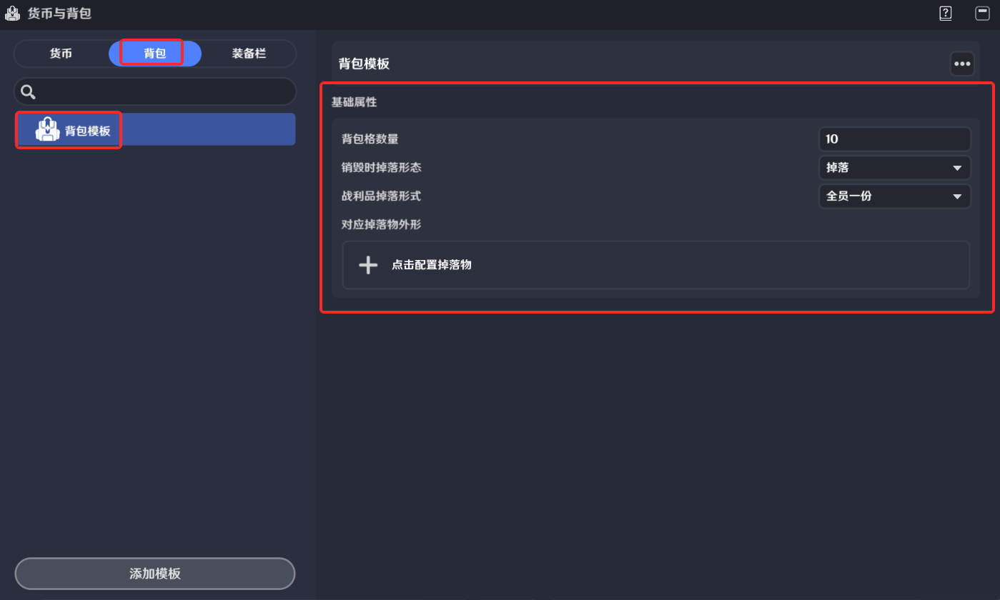
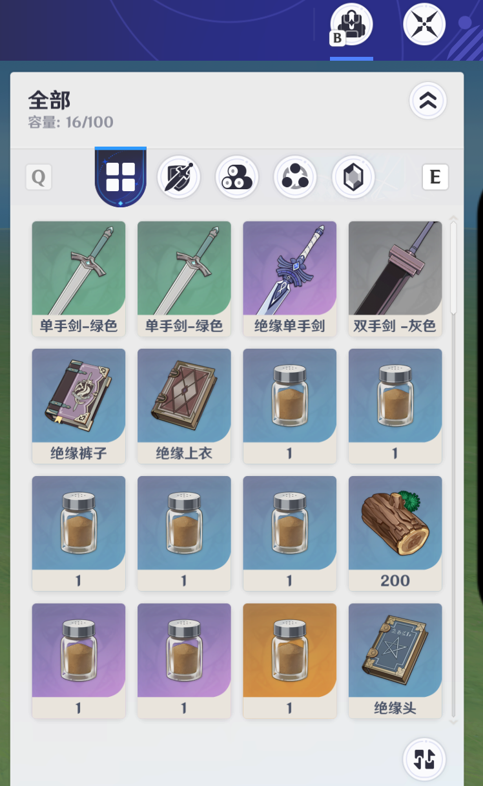

# 背包

**URL**: https://act.mihoyo.com/ys/ugc/tutorial/detail/mhogfq9bf86q

**爬取时间**: 2026-01-04 08:26:03

---

## 背包

# 一、背包的定义

背包是整个资源系统的容器，背包管理持有者的所有虚拟道具、装备和货币。

在背包界面中，道具以槽位的方式进行展示，玩家可以在运行时对背包内的道具进行拆分，销毁或丢弃操作

# 二、背包的编辑

打开系统菜单，通过点击【货币与背包】按钮进入编辑界面

进入背包页签，进行背包模板的详细编辑

背包模板名称：由创作者(奇匠)定义的背包模板的命名

**基础属性**

* *背包格数量：初始的背包内栏位数量，每一个背包栏位可以容纳一种道具，并根据堆叠数量可能堆叠多个*
* *销毁时掉落形态：当背包的持有者被击倒时，背包内的所有道具会根据该设置进行统一的批量处理，当此处的配置不为“应用道具掉落规则”时，此处的配置将会覆盖道具模板上配置的同名字段*

掉落：持有者被击倒时背包内的所有道具转化为掉落物实体，创建在场景中

销毁：持有者被击倒时背包内的所有道具销毁

保留：持有者被击倒时背包内的所有道具保留在背包内，该设置仅在持有者是角色时有意义，如果为其他类型的实体则逻辑同销毁

应用道具掉落规则：遵循背包内单个道具自身的“销毁时掉落形态”配置

* *战利品掉落形式：背包掉落时，所有道具会转化为一个实体掉落在场景内，而不是每个道具单独创建一个实体*

全员一份：所有玩家共享同一份背包掉落物实体，当一名玩家拾取时，其他玩家无法再次拾取

每人一份：每一个玩家的本地会独立掉落一份背包对应的掉落物实体，玩家之间的拾取行为互不干预

* *对应掉落物外形：配置一个掉落物元件，掉落物是一个有物理实体的元件，当背包被创建在场景上，会以关联掉落物的模型进行展示*

# 三、背包运行时实例

在实际游玩时，背包模板定义由[背包组件](背包组件_mh5y5001vqd4.md)进行引用并实例化

# 
