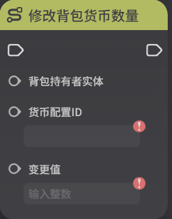
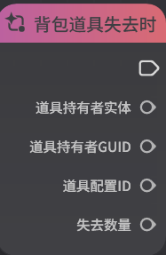
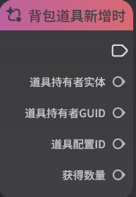
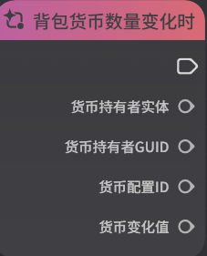
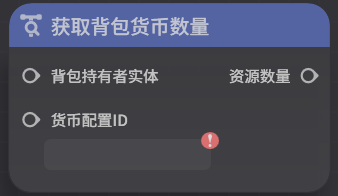

# 背包组件

**URL**: https://act.mihoyo.com/ys/ugc/tutorial/detail/mh5y5001vqd4

**爬取时间**: 2026-01-04 08:16:17

---

## 背包组件

# 一、背包组件的功能

背包组件将直接引用[背包](背包_mhogfq9bf86q.md)模板，并在运行时生成对应的背包实例

背包组件仅支持同时选择一个背包模板

背包组件可以挂载在角色、造物、动态物件上

# 二、背包组件的编辑

## 1.添加组件

(1)在实体或元件编辑界面中，打开组件编辑页签

(2)点击下方的“添加组件”，选择并点击“背包”，成功添加

(3)点击“详细编辑”，展开编辑页

## 2.基础概念

通过组件添加可以为角色配置背包组件，并定义背包内的默认道具

背包模板：引用一个背包模板

初始物品：背包内默认拥有的物品配置，在玩法初始化时，会使角色默认携带这些物品

# 三、背包运行时实例

# 四、节点图操作背包数据

## 1.背包组件相关执行节点

* 设置背包掉落道具/货币数量

* 设置背包道具掉落内容

* 修改背包道具数量

* 修改背包货币数量

* 增加背包最大容量

## 2.背包组件相关事件节点

* 背包道具失去时

* 背包道具数量变化时

* 背包道具新增时

* 背包货币数量变化时

* 背包内道具被使用时

## 3.背包组件相关查询节点

* 获取背包道具数量

* 获取背包容量

* 获取背包所有基础道具

* 获取背包所有装备

* 获取背包所有货币

* 获取背包货币数量

