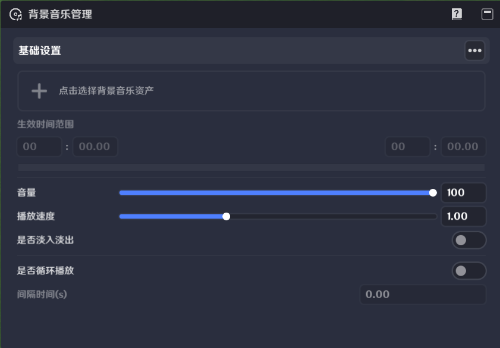
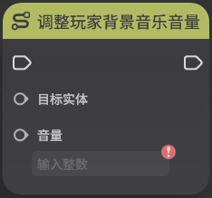
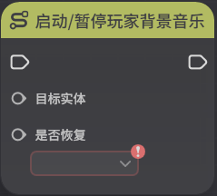

# 背景音乐

**URL**: https://act.mihoyo.com/ys/ugc/tutorial/detail/mhq9b601kh9k

**爬取时间**: 2026-01-04 08:29:37

---

## 背景音乐

# 一、背景音乐的功能

通过背景音乐管理，创作者(奇匠)可以为自己的玩法定制专属的背景音乐，同时在后续的游玩过程中，也可以通过节点图进行修改

在联机游玩时，不同玩家的背景音乐可以不同

# 二、背景音乐的编辑

## 1.入口

点击左上角系统菜单按钮可打开菜单界面

点击【背景音乐管理】即可进入背景音乐管理界面

## 2.具体介绍

背景音乐资产：可以通过音乐库选择具体的背景音乐资产

生效时间范围：可以将整段音乐资产截取其中的一部分作为实际的背景音乐播放

音量：可以配置背景音乐的音量大小

播放速度：默认为1，可配置背景音乐的播放速度，过快或过慢可能影响实际的听感

是否淡入淡出：在开始播放和播放结束时，是否有对应的过渡效果

是否循环播放：背景音乐播放完成后，是否会再次播放

间隔时间（s）：如果配置了循环播放，在播放结束后等待对应的间隔时间后再次播放

# 三、使用节点图控制背景音乐

调整玩家背景音乐音量

启动/暂停玩家背景音乐

修改玩家背景音乐

