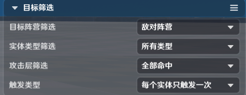
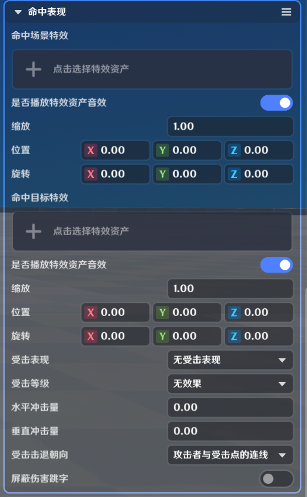
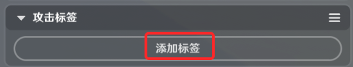
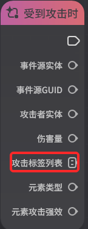
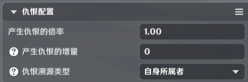
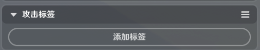
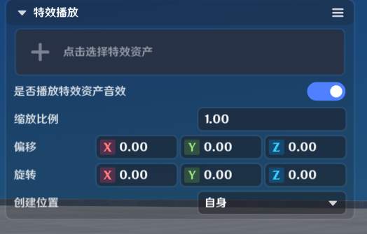
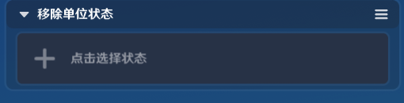

# 能力单元效果

**URL**: https://act.mihoyo.com/ys/ugc/tutorial/detail/mhrvqvioautg

**爬取时间**: 2026-01-04 08:39:09

---

## 能力单元效果

## 1.攻击盒攻击

发起一次攻击盒攻击：会对攻击盒碰撞到的受击盒的所属实体发起一次攻击

* **攻击盒配置**

配置本次攻击的攻击盒相关配置

|  |  |
| --- | --- |
| **参数名** | **说明** |
| 基准位置 | 当基准位置为自身时，会选取自身挂接点打出一次攻击，常见于由实体自身发出的攻击；当基准位置为命中位置时，仅在投射物的命中检测组件中调用有意义，在命中位置打出一次攻击 |
| 攻击盒形状 | 攻击盒的形状，支持长方体、球体、圆柱体 |
| 缩放 | 攻击盒的尺寸（长方体的长宽高、球体的半径、圆柱体的半径高度） |
| 位置 | 攻击盒相对基准位置的偏移 |
| 旋转 | 攻击盒相对基准位置的旋转 |

* **目标筛选相关配置**

对攻击盒命中的目标进行筛选，只有符合筛选条件的目标才会受到攻击

|  |  |  |
| --- | --- | --- |
| **参数名** | **说明** | **备注** |
| 目标阵营筛选 | 仅当攻击盒击中的目标满足阵营筛选的条件时，才会触发攻击。  **可选项**  不找目标：无法命中任何目标  友善阵营：仅命中友善阵营的实体，但不包含自身所在阵营  敌对阵营：仅命中敌对阵营的实体  自身：仅命中自身  自身所在阵营：命中自身所在阵营的实体  全部：命中所有实体  除自身外全部：命中除了自身外的所有实体  友善阵营包括自身：命中友善阵营以及自身所在阵营 | **战斗阵营关系**  在目标阵营筛选中使用的是*战斗阵营*，而非实体的【阵营】属性  超限模式中，阵营遵循以下关系：  角色->造物：敌对  角色->物件：敌对  造物->物件：友善  物件->造物：敌对  造物->角色：敌对  物件->角色：敌对 |
| 实体类型筛选 | 仅当攻击盒命中的目标满足所选实体类型时，才会触发攻击  **可选项**  物件、角色、造物 |  |
| 攻击层筛选 | 仅当攻击盒命中指定攻击层时，才会触发攻击  **可选项**  只命中受击盒：仅在命中受击盒时触发攻击  只命中场景：仅在命中场景时触发攻击  全部命中：会同时命中受击盒、场景以及水面和草 |  |
| 触发类型 | **可选项**  生命周期只触发一次：即不论攻击盒命中了多少个实体，只会有一个实体受到攻击，多用于单体攻击  每个实体只触发一次：会攻击攻击盒命中的所有实体 |  |

* **攻击参数**

攻击相关参数配置，影响本次攻击的伤害等数值

|  |  |  |
| --- | --- | --- |
| **参数名** | **说明** | **备注** |
| 伤害系数 | 伤害计算中的系数 |  |
| 伤害增量 | 伤害计算中的增量值 |  |
| 元素类型 | 包括七种*元素*以及无元素（即*物理*伤害） |  |
| 元素攻击强效 | 本次攻击附加的*元素攻击强效* |  |
| 打击类型 | 本次攻击的打击类型，会影响  -本次攻击的打击*音效*  -本次攻击的基础打击*特效*  -钝击类型的攻击会额外产生削减*岩属性*护盾以及*碎冰反应*的效果  **可选项**  无、默认、斩击、钝击、投射物、刺击攻击 |  |
| 攻击类型 | 本次攻击的攻击类型，可以当作*节点图*中的判据  **可选项**  无、近战攻击、远程攻击、默认 |  |
| 打断值 | 本次攻击的*打断值* |  |
| 是否是绝对伤害 | 本次攻击是否为绝对伤害  绝对伤害造成的攻击会基于伤害增量造成一次伤害，忽略攻击者的攻击力以及防御者的相关防御属性 |  |
| 伤害变化曲线 | 伤害变化曲线是一个距离-伤害倍率的曲线，可以用来实现子弹远距离伤害衰减类的效果。每两个距离节点之间伤害倍率是线性的  无变化：当前伤害不适用伤害变化曲线  自定义变化曲线：创作者(奇匠)可以自定义变化的曲线  预制衰减曲线：提供的预制弓箭箭矢类的伤害衰减曲线，在35米外开始线性衰减  预制增长曲线：提供的反向增伤类攻击的伤害增长曲线 |  |
| 伤害变化距离计算方式 | 决定了伤害变化曲线中的距离如何计算  与当前位置的距离：适用于直接造成伤害类的伤害衰减，例如一些即时命中的远程武器  与创生位置的距离：适用于投射物类有飞行过程的实体造成的伤害衰减 |  |
| 额外破盾值 | 在本次攻击进行护盾计算前，移除受击者的护盾值。 |  |
| 护盾穿透率 | 受击者护盾的【承伤比例】，会减去【护盾穿透率】，得出最终的【承伤比例】，最小减至0 |  |

* **仇恨配置**

当关卡设置中仇恨类型设置为自定义时，启用该配置

* **命中表现**

用于配置本次攻击命中实体以及命中场景后的表现相关参数

|  |  |  |
| --- | --- | --- |
| **参数名** | **说明** | **备注** |
| 命中场景特效 | 用于配置本次攻击盒命中场景后的特效表现，支持配置偏移、旋转以及缩放 | 仅可使用*限时特效* |
| 命中目标特效 | 用于配置本次攻击盒命中实体后的特效表现，支持配置偏移、旋转以及缩放 | 仅可使用*限时特效* |
| 受击表现 | 可选本次受击表现的类型，会影响到*受击等级*、*水平冲量*、*垂直冲量* |  |
| 受击等级 | 本次攻击命中后产生的受击等级，会受造物的*霸体值*影响 |  |
| 水平冲击量 | 受受击表现的类型影响，也可以自定义修改 |  |
| 垂直冲击量 | 受受击表现的类型影响，也可以自定义修改 |  |
| 受击击退朝向 | 受击者被击退的方向  包含：攻击者与受击点的连线、攻击盒命中朝向、攻击者主人与受击点连线、攻击者与受击点连线切线、受击反朝向、攻击者面朝朝向、攻击者与受击点连线反朝向 |  |
| 屏蔽伤害跳字 | 勾选后，本次攻击不会显示伤害跳字 |  |

* **攻击标签**

用于配置本次攻击携带的标签。标签本身没有固有的功能，而是可以在节点图中获取本次攻击的标签来实现自定义的逻辑

例如：

可以这样实现一个炸药桶爆炸伤害命中怪物后立刻消灭怪物：

炸药桶爆炸的攻击携带“炸药桶爆炸”这样的标签

部分怪物在自身的节点图的【受到攻击时】事件中判定攻击标签是否等于“炸药桶爆炸”，如果【是】，则立刻【销毁自身】

点击后可以新增若干标签

在受击者的节点图上，可以通过【攻击标签列表】参数获取这里配置的攻击标签

## 2.直接攻击

对指定目标发起一次直接攻击

直接攻击与攻击盒攻击相比少一些参数，但【攻击参数】、【仇恨配置】、【命中表现】、【攻击标签】参数配置基本一致

* **攻击参数**

攻击相关参数配置，与【攻击盒攻击】相关配置完全一致

* **仇恨配置**

与【攻击盒攻击】完全一致

* **命中表现**

相比【攻击盒攻击】少了【命中场景特效】相关参数（因为直接攻击是针对实体发起的，不会命中场景）

* **攻击标签**

与【攻击盒攻击】的配置一致

## 3.特效播放

以自身或命中位置为原点播放一个限时特效

|  |  |  |
| --- | --- | --- |
| **参数名** | **说明** | **备注** |
| 特效资产 | 可以选择限时特效资产 |  |
| 是否播放特效资产音效 | 开启则会同时播放该资产携带的音效 |  |
| 创建位置 | 可选项：自身、命中位置  自身：在自身位置播放特效  命中位置：仅在投射物的命中检测组件中调用有意义，在命中位置播放特效 |  |
| 缩放比例 | 播放特效的缩放比例 |  |
| 偏移 | 播放特效的相对偏移 |  |
| 旋转 | 播放特效的相对旋转 |  |

## 4.创建投射物

以自身或命中位置为原点创建一个投射物实体

|  |  |  |
| --- | --- | --- |
| **参数名** | **说明** | **备注** |
| 投射物资产 | 选择一个预先定义好的投射物 |  |
| 创建位置 | 可选项：  自身：在自身位置创生投射物  命中位置：仅在投射物的命中检测组件中调用有意义，在命中位置创建投射物 |  |
| 偏移 | 投射物创建的相对偏移 |  |
| 旋转 | 投射物创建的相对旋转 |  |

## 5.添加单位状态

向投射物命中的实体添加单位状态

|  |  |  |
| --- | --- | --- |
| **参数名** | **说明** | **备注** |
| 单位状态资产 | 选择一个预先定义好的*单位状态* |  |
| 层数 | 施加的单位状态层数 |  |

## 6.移除单位状态

从投射物命中的实体上移除指定的单位状态

|  |  |  |
| --- | --- | --- |
| **参数名** | **说明** | **备注** |
| 单位状态资产 | 移除指定的*单位状态* |  |

## 7.销毁自身

销毁实体自身，仅在本地投射物中可以使用

|  |  |  |
| --- | --- | --- |
| **参数名** | **说明** | **备注** |
| 延迟时间 | 在触发这个能力单元后，会延迟指定时间后触发自身的销毁  通常用于确保特效等需要一定时间的表现可以正确播放完成 |  |

## 8.恢复生命

为目标恢复一定的生命

|  |  |  |
| --- | --- | --- |
| **参数名** | **说明** | **备注** |
| 百分比恢复基准方式 | 恢复生命的方式  包含基于目标最大生命、基于目标当前生命、基于释放者最大生命、基于释放者攻击力 |  |
| 百分比 | 根据百分比回复基准方式所恢复的百分比 |  |
| 额外固定恢复值 | 为目标恢复的固定生命值 |  |
| 是否忽略恢复调整 | 是否受到*单位状态*中【受恢复效果调整】以及【恢复效果调整】的影响 |  |
| 治疗标签 | 治疗标签，在服务端节点图中可以获取本次治疗的标签，通常用来辨别一次治疗 |  |

**