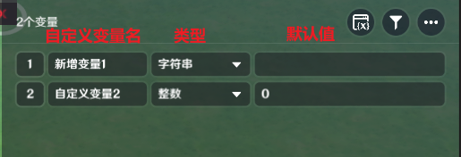
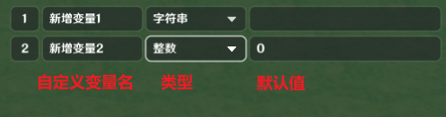
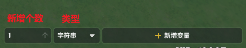
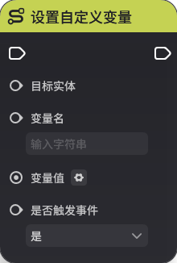
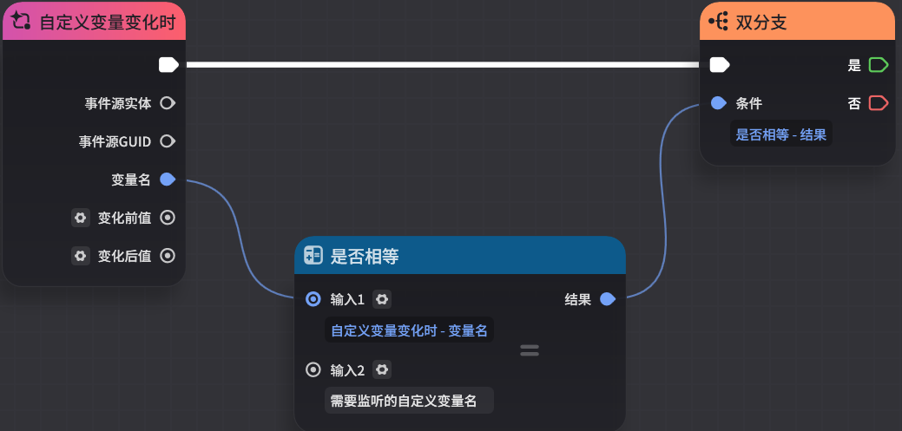
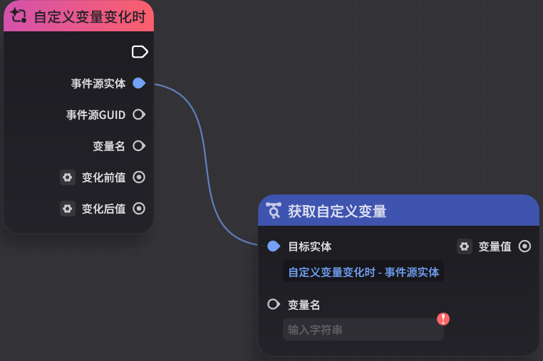
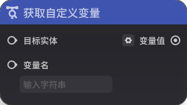
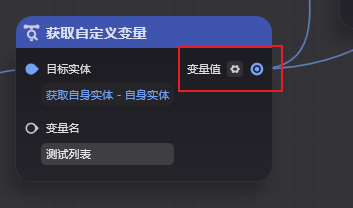
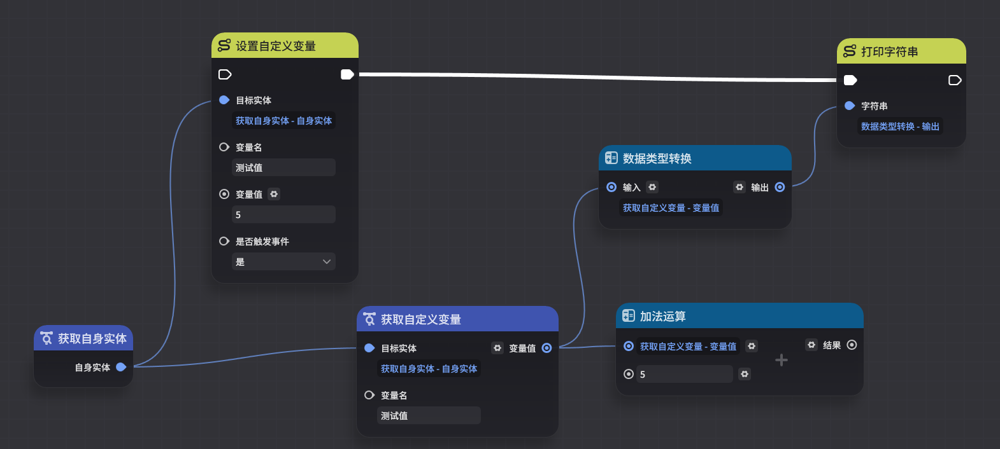
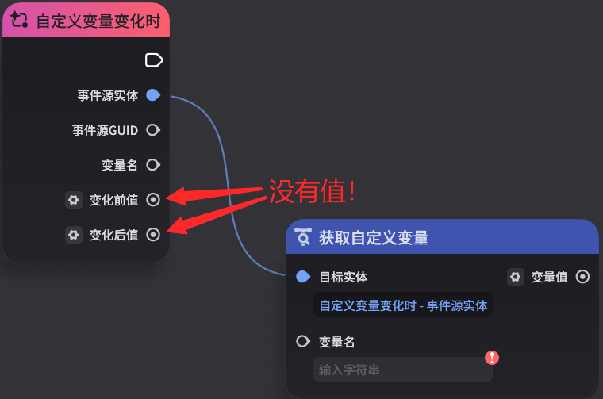

# 自定义变量

**URL**: https://act.mihoyo.com/ys/ugc/tutorial/detail/mhso1b9wjica

**爬取时间**: 2026-01-04 08:12:12

---

## 自定义变量

# 一、自定义变量的定义

## 1.自定义变量是什么

自定义变量是一组存储在实体的自定义变量*组件*内、创作者(奇匠)可以自行定义和使用的数据结构

自定义变量有很多用途，常见的用法是用来承载玩法逻辑的自定义数据，例如：使用关卡实体上的自定义变量来记录玩家的得分，或在一个开关物件上记录玩家击打的次数来判断是否打开机关门

自定义变量使用自定义变量名（字符串型）作为唯一索引，读取、修改、监听事件等操作均依赖自定义变量名称，因此在同一个实体上，自定义变量不能重名

自定义变量支持大部分节点图中可用的*基础数据类型*以及*列表数据类型*，可支持的类型见下表：

|  |  |  |
| --- | --- | --- |
| **基础数据类型** | **列表数据类型** | **字典数据类型** |
| 整数 | 整数列表 | 所有字典数据类型 |
| 浮点数 | 浮点数列表 |  |
| 字符串 | 字符串列表 |  |
| 布尔值 | 布尔值列表 |  |
| 三维向量 | 三维向量列表 |  |
| 实体 | 实体列表 |  |
| GUID | GUID列表 |  |
| 元件ID | 元件ID列表 |  |
| 配置ID | 配置ID列表 |  |
| 结构体 | 结构体列表 |  |

数据类型的说明见[基础概念](基础概念_mhk23ora1wom.md)-节点图中的数据类型

特别地，在自定义变量组件中，整数无法取到-2147483648，即取值范围为-2147483647~2147483647，若填入数据超出该范围，则会返回上一次的合法输入值

## 2.自定义变量的生命周期与作用域

**生命周期**

自定义变量的生命周期跟随组件（同理也跟随组件挂载的实体）

当实体被*销毁*时，自定义变量也会同步销毁（无法访问、修改）

**作用域**

自定义变量的读和写拥有全局的作用域，即实体可以读取、修改任意实体上的自定义变量

与其他绝大多数事件类似，自定义变量的事件仅会推送给节点图所挂载的实体

## 3.自定义变量的操作

在组件中定义自定义变量后，可以在节点图内进行读、写、监听等操作，包括

* *在**服务端节点图**内读取*
* 在服务端节点图内写入
* 在服务端节点图内监听自定义变量的变化事件
* *在**本地节点图**内读取*

# 二、自定义变量组件的功能

自定义变量组件是自定义变量的数据承载者

自定义变量组件可支持同时配置多个自定义变量

实体拥有自定义变量组件后，才可以对其进行自定义变量操作

仅有配置在组件中默认创建的自定义变量才会被同步至本地，被界面、本地过滤器等功能使用

自定义变量**不需要**定义后再使用。在服务端节点图中，可以使用设置自定义变量节点为实体动态创建新的自定义变量（但要确保新创建的自定义变量不与现存的重名）

定义过程中需要确定

* 自定义变量名：这是自定义变量的唯一标识。同一个组件内，自定义变量不允许重名
* *自定义变量数据类型：当前模式使用的是强类型，所有自定义变量定义时必须明确其类型。*
* 自定义变量的默认值：当实体创建时，该自定义变量会以这个默认值创建

# 三、自定义变量的编辑入口

**步骤1**：在实体或元件的组件页签找到或新增自定义变量组件

1、切换到实体或元件的组件页签

2、找到或新增一个自定义变量组件

自定义变量组件是所有单位的默认挂载组件（即单位创建时会默认挂载），因此对于新建的实体或元件，可以在组件页签直接找到自定义变量组件

如果不存在，可以通过添加通用组件按钮新增一个自定义变量组件

在组件页面可以看到当前已定义的自定义变量数

点击【详细编辑】进入自定义变量组件详细编辑页面

**步骤2**：在自定义变量组件详细编辑页面新增或修改自定义变量

进入详细编辑后页面如下：

【已定义自定义变量】：可以查看和修改当前已定义的自定义变量，修改它们的命名、类型和默认值

需要注意的是，在组件内修改一个已经定义好的自定义变量的命名、类型，可能会导致节点图中自定义变量相关节点无法执行

例如：假定图中有一个名为【新增变量1】、类型为【整数】的自定义变量，在节点图中使用【设置自定义变量】修改了值

如果将组件中的【新增变量1】修改名字或类型，会导致节点图中的【设置自定义变量】节点因为无法找到对应变量而无法执行

【新增自定义变量】：可以新增一个或若干个执行类型的自定义变量

【其他功能】：关卡变量总览、筛选以及其他功能

关卡自定义变量总览：可以查看当前关卡内所有实体上定义的自定义变量

筛选：可以按照类型筛选已定义的自定义变量

其他功能-批量删除：开启后可以批量删除自定义变量

注意，与修改相同的是，删除组件中定义的自定义变量也可能会导致节点图中自定义变量相关节点无法执行

# 四、在节点图中使用自定义变量

## 1.在服务端节点图中使用自定义变量

**设置自定义变量**

**节点类型**：执行

**节点功能**

* 将目标实体上特定名字的自定义变量设置为指定的变量值
* 要求目标实体上存在自定义变量组件，且有对应名字的变量值，否则节点无法正常执行
* 该节点支持泛型输入

**节点参数**

|  |  |  |  |
| --- | --- | --- | --- |
| **参数类型** | **参数名** | **类型** | **说明** |
| 入参 | 目标实体 | 实体 | 设置自定义变量的目标实体 |
| 入参 | 变量名 | 字符串 | 需要设置值的自定义变量名 |
| 入参 | 变量值 | 泛型 | 需要设置的变量值。支持泛型输入 |
| 入参 | 是否触发事件 | 布尔值 | 当该值为【是】时，会触发【自定义变量变化时】事件 |

**获取自定义变量**

**节点类型**：查询

**节点功能**

* 获取目标实体上特定名字的自定义变量值
* 需要目标实体上有自定义变量组件，且有对应名字的自定义变量
* 该节点输出参数类型为泛型，需要连线确定泛型后使用

**节点参数**

|  |  |  |  |
| --- | --- | --- | --- |
| **参数类型** | **参数名** | **类型** | **说明** |
| 入参 | 目标实体 | 实体 | 获取自定义变量的目标实体 |
| 入参 | 变量名 | 字符串 | 需要获取的自定义变量名 |
| 出参 | 变量值 | 泛型 | 查询到的变量值，泛型输出，需要通过连线或手动确定泛型后使用 |

**自定义变量变化时**

**节点类型**：事件

**节点功能**

* 当节点图所挂载的实体上自定义变量的值发生变化时，节点图中会收到该事件
* 需要注意的是，只要自定义变量发生任意形式的修改就会触发该事件，即使修改前后值相同也会推送

例如：某自定义变量的值为3（整数），使用【设置自定义变量】节点将其值再次设置为3，仍然会触发该事件（该事件的变化前值和变化后值均为3）

* 所有自定义变量的变化都会推送该事件，因此推荐使用类似下图的做法对需要监听的变量名进行筛选

需要特别注意的是，所有容器数据类型的自定义变量变化事件中不会包含该变化的变化前值和变化后值，需要额外使用获取自定义变量节点来获取变化后的值

容器数据类型包括：所有列表数据类型、所有字典数据类型以及所有结构体数据类型

如下图所示

**节点参数**

|  |  |  |  |
| --- | --- | --- | --- |
| **参数类型** | **参数名** | **类型** | **说明** |
| 出参 | 事件源实体 | 实体 | 事件通用参数，事件触发者的实体 |
| 出参 | 事件源GUID | GUID | 事件通用参数，事件触发者的实体GUID |
| 出参 | 变量名 | 字符串 | 发生变化的变量名 |
| 出参 | 变化前值 | 泛型 | 该自定义变量变化前的值 |
| 出参 | 变化后值 | 泛型 | 该自定义变量变化后的值 |

## 2.在本地节点图中使用自定义变量

**获取自定义变量**

**节点类型**：查询

**节点功能**

-获取目标实体上特定名字的自定义变量值

-需要目标实体上有自定义变量组件，且有对应名字的自定义变量

**节点参数**

|  |  |  |  |
| --- | --- | --- | --- |
| **参数类型** | **参数名** | **类型** | **说明** |
| 入参 | 目标实体 | 实体 | 获取自定义变量的目标实体 |
| 入参 | 变量名 | 字符串 | 需要获取的自定义变量名 |
| 出参 | 变量值 | 泛型 | 查询到的变量值，泛型输出，需要通过连线或手动确定泛型后使用 |

# 五、自定义变量的运行时细节

## 自定义变量与容器类型

节点图中的容器数据类型的自定义变量有着较为特殊的引用传值的性质

容器数据类型包括：所有列表数据类型、所有字典数据类型以及所有结构体数据类型

下文以列表数据类型为例

见下图：

在执行完上述流程后，【测试列表】这个自定义变量的值会变为{1，3，5，7}

我们可以发现，【对列表插入值】、【列表排序】这两个节点在实际上改变了自定义变量中的值。

这种方式我们称为【引用传值】。即当【获取自定义变量】节点获取的变量值类型为列表时，输出的是自定义变量中存储的列表的引用（而不是值），后续对其进行修改都会导致自定义变量内存储的列表的修改

另外需要注意的是，这里的修改不会导致【自定义变量变化时】事件触发（该事件只有【设置自定义变量】节点可以触发）

与之相对比的可以见下图

【加法运算】节点不会修改【测试值】这个自定义变量的值，因此打印出来的自定义变量值仍然为5（而不是加法运算后的10）

这就是典型的【值传递】，即【获取自定义变量】的出参输出的是自定义变量中存储的变量的值，因此修改这个值不会影响到组件内存储的自定义变量自身的值

总而言之，节点图中**对容器类型自定义变量的操作，会导致自定义变量的值发生变化，而非容器类型的操作则不会**

此外，容器数据类型的自定义变量变化时事件中的变化前值和变化后值出参**是没有值的**，需要通过获取自定义变量节点来获取变化后的值

