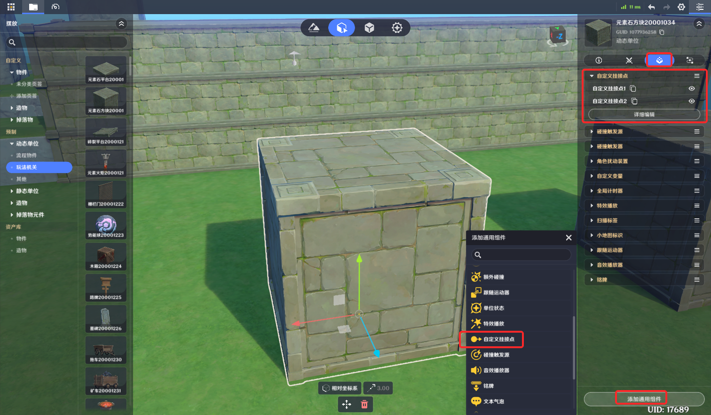
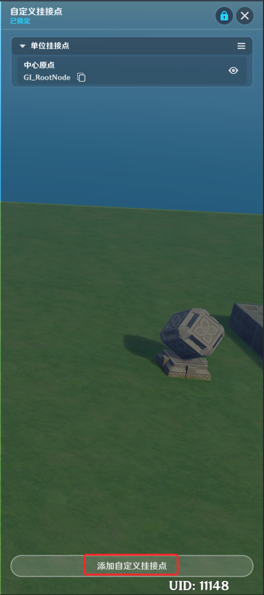
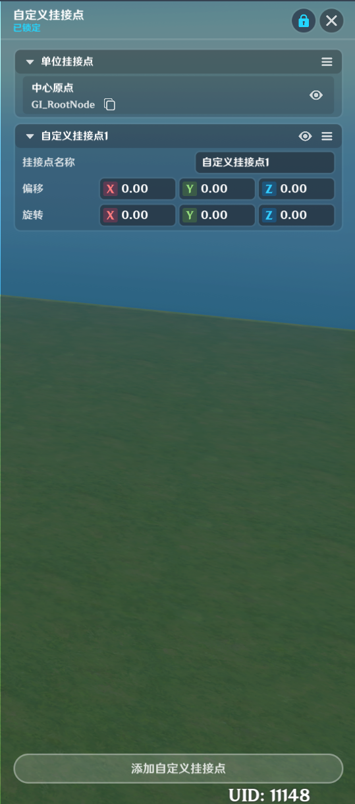

# 自定义挂接点

**URL**: https://act.mihoyo.com/ys/ugc/tutorial/detail/mhmshmimtegs

**爬取时间**: 2026-01-04 08:14:36

---

## 自定义挂接点

# 一、自定义挂接点组件的功能

挂接点是指在*实体*的骨骼或结构上指定的特定位置，用于附加其他*单位*或*特效*。

自定义挂接点组件允许创作者(奇匠)自由的选择一个位置作为该单位的挂接点

此类挂接点在添加后，对于中心原点的偏移是固定的，不会随实体的骨骼运动而改变相对偏移

自定义挂接点组件上同时可添加多个自定义挂接点

# 二、自定义挂接点组件的编辑

## **1.添加**单位挂接点组件

(1)在实体/元件编辑界面中，打开组件编辑页签

(2)点击下方的“添加通用组件”，选择并点击“自定义挂接点”，成功添加

(3)点击“详细编辑”，展开编辑页

## **2.**新增自定义挂接点

在自定义挂接点组件的详情页面，可以点击【添加自定义挂接点】来新增一个挂接点

## **3.**配置自定义挂接点

挂接点名称：挂接点的命名，可以被其他系统直接引用

偏移：挂接点对元件或实体中心原点的位置偏移

旋转：挂接点对元件或实体中心原点的朝向偏移
