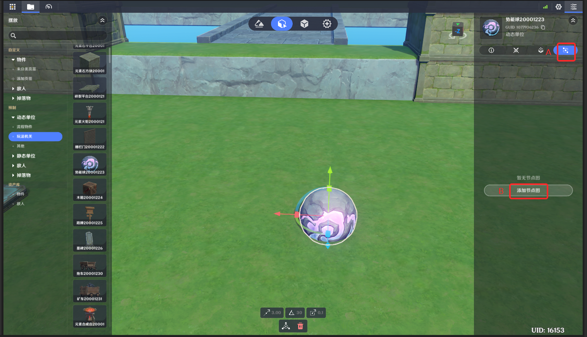
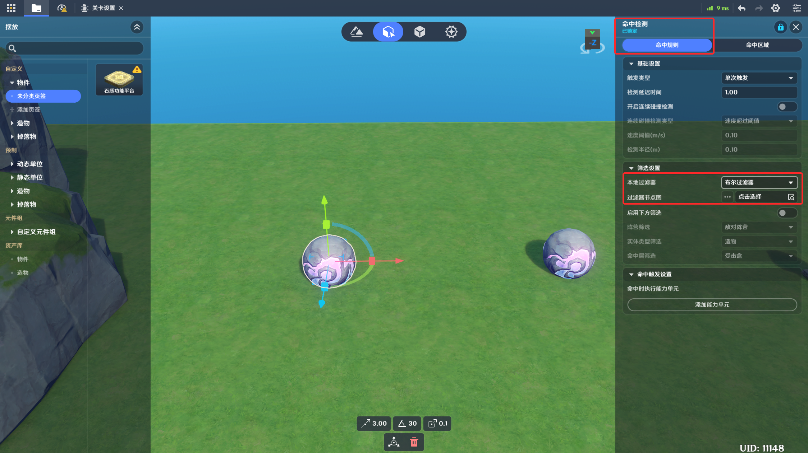

# 一、节点图功能概述

## 1.自定义逻辑的载体

节点图是一类由创作者(奇匠)编写的自定义逻辑

如下图所示，就是一个典型的实体节点图

它描述了一个炸药桶的逻辑：这个炸药桶受到攻击时，会使攻击者玩家积分+1（以*自定义变量*的方式），之后会**播放特效**、**发起攻击**并销毁自身

通常来说，每张节点图都会包含以下两个要素

*节点*：节点图的基础功能单元，每个节点都描述了一种特定的功能。例如：**播放特效**、**加法运算**等

*连线*：分为*执行流连线*（节点图中白色连线）以及*运算流连线*（节点图中蓝色连线）。连线将各个节点连接起来，用于描述节点的执行顺序以及参数传递的逻辑

## 2.节点图的用法

如前所述，任何创作者(奇匠)想要自行设计和制作的逻辑，均可以通过配置和挂载节点图来实现

例如：

* 在*元件*上挂载节点图，来实现一个受到攻击后会爆炸的炸药桶（即上图实现功能）
* 在*关卡实体*上挂载节点图，用于实现一个全局计分的机制
* 在*命中检测组件*中使用本地过滤器节点，用于筛选命中检测组件可以命中的目标
* 在*自定义技能*编辑中使用技能节点图，用于编写自定义技能的逻辑

# 二、节点图的类型

当前模式中，节点图被分为五类

* 实体节点图
* 单位状态节点图
* 职业节点图
* 技能节点图
* 本地过滤器节点图

其中*实体节点图*、*单位状态节点图*和*职业节点图*的逻辑在服务端运行，因此统称为*服务端节点图*；

*技能节点图*和*本地过滤器节点图*都是在玩家本地运行，因此统称为*本地节点图*

它们的特点如下表

|  |  |
| --- | --- |
| **节点图类型** | **功能说明** |
| 实体节点图 | 挂载于实体上的节点图，通常来说是实体逻辑的承载者。  生命周期跟随所挂载的实体，当实体被销毁时，节点图也同样不再生效 |
| 状态节点图 | 挂载于*单位状态*上的节点图，通常用于实现单位状态的自定义逻辑。例如：一个持续攻击附近敌对单位的火环状态，可以通过单位状态来实现持续攻击的效果  生命周期跟随单位状态。当单位状态被移除时，节点图失效 |
| 职业节点图 | 挂载于*职业*配置上的节点图。用于实现一些职业特有的逻辑。可以选择挂载在玩家或角色实体上  生命周期跟随职业，当职业切换时，切换前的职业节点图会失效，切换后的职业节点图生效 |
| 道具节点图 | 挂载于*道具*配置上的节点图。用于实现一些道具自身的逻辑。 |
| 技能节点图 | 自定义技能使用的节点图，用于描述一个技能的逻辑  当自定义技能运行到挂载了技能节点图的时点时，会开始运行该技能节点图 |
| 本地过滤器节点图 | 在各个组件中使用的节点图，用于描述一种自定义的、在本地执行的判定规则。  **本地过滤器节点-布尔型** 节点图固定会以一个布尔值（是/否）作为返回值  例如：命中检测组件中可以配置本地过滤器节点图，当本地过滤器节点图的返回结果为是时，认为碰撞到了合法的目标，触发【**命中检测触发时**】事件，反之则认为是不合法的目标，不触发事件  **本地过滤器节点-整数型**  节点图会以整数作为返回值 |

由于服务端节点图是一个更全面且更基础的节点图类型，后文会侧重以服务端节点图的功能进行介绍。技能节点图以及本地过滤节点图与服务端节点图规则基本一致，特殊部分会单独介绍

# 三、节点图的挂载

如前文所述，节点图需要通过挂载在实体、单位状态等逻辑元素上时才可以生效，下面是上述五种节点图的挂载方式

在挂载前，需要先在*千星沙箱*中制作一张节点图，见[节点图编辑指引](./节点图编辑指引_mhb3ho0k.md)。在制作完成后，对应的节点图挂载入口即可添加已制作的节点图

## 1.实体节点图

入口位于：实体或元件的详情编辑页-节点图页签

(1)实体或元件编辑页面切换到节点中A

(2)点击新增节点图，图中B

## 2.单位状态节点图
：单位状态详情编辑页-通用信息-状态节点图

## 3.职业节点图

自定义职业详情编辑页-节点图页签

可以切换配置玩家节点图或角色节点图，两者-f7bf-4f3c-b10a-a4f73c1fb211.png)换上该职业时，对玩家实体和角色实体生效

(1)切换到职业配置的节点图页签，(2)切换玩家或角色节点图，图中B

(3)点击新增节点图，图中C

## 4.道具节点986-9429-b1d26110a33e.png)位于：战斗预设-道具页签-基础设]()

(1)切换到战斗预设页签，图中A

(2)切换到道具页签，图中B

(3)点击选择节点图，图中C

## 5.技能节点图

入口位于：自定义技能编辑页-动画编辑-时间轴

进入动画编辑页面

在节点图事件轨道上右键点击添加事件，后在框内选择要添加的节点图

## 6.本地过滤器节点图

本地过滤器节点图在多个组件中均有使用，以过滤器节点图的返回值，决定该业务是否生效实施管理，过滤器节点图分为以下两种类型

### (1)布尔过滤器节点图

此类型的节点图，最终输出结果为布尔类型，当结果为TRUE时，引用节点图的业务生效，为FALSE则不生效

以下以命中检测组件为例

入口：命中检测组件-命中规则页-本地过滤器节点图

### (2)整数过滤器节点图

此类型的节点图，最终输出结果为整数，同时引用该类型节点图的业务，支持配置整数列表。

当整数过滤器节点图的输出整数，属于业务配置的整数列表时，则业务生效

以下以选项卡组件为例

