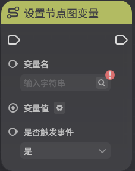
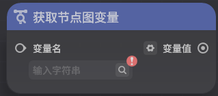
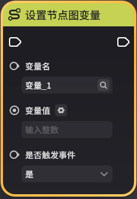
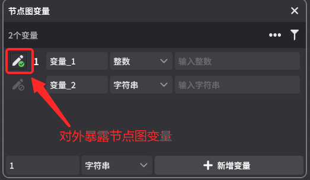

# 节点图变量

**URL**: https://act.mihoyo.com/ys/ugc/tutorial/detail/mhtshailzs7w

**爬取时间**: 2026-01-04 08:41:32

---

## 节点图变量

# 一、节点图变量是什么

## 1.节点图变量的定义

节点图变量是一种生命周期跟随节点图的变量（仅在*服务端节点图*中可用）

其作为变量自身的功能与[自定义变量](自定义变量_mhso1b9wjica.md)基本一致，但二者生命周期与定义域有一些不同

## 2.生命周期与定义域

节点图变量的生命周期跟随节点图。以实体节点图为例，当节点图挂载在实体上时，该实体就持有了这些变量，可以通过相关的节点设置、获取以及监听事件

节点图变量仅在节点图所在的节点图内可以进行访问（设置、获取以及监听事件）

# 二、与自定义变量的异同

下表整理了节点图变量与自定义变量的异同

|  |  |  |
| --- | --- | --- |
|  | **节点图变量** | **自定义变量** |
| 生命周期 | 跟随节点图 | 跟随实体 |
| 定义域 | 仅在定义该变量的节点图内可访问 | 全局可访问，需要指明访问的实体 |
| 命名规则 | 同节点图内不可重名 | 同组件（实体）内不可重名 |
| 是否可在实体上覆写 | 可以。但需要手动将其对外暴露 | 可以，遵循通用的组件参数覆写规则 |
| 可用数据类型 | 所有基础和列表数据类型 | 所有基础和列表数据类型 |
| 相关操作 | 设置值、获取值、监听变化 | 设置值、获取值、监听变化 |

# **三、为什么要使用节点图变量**

相比【*自定义变量*】，节点图变量有着以下的特点

* 使用更轻量，可以在千星沙箱内部完成定义和使用，可以在千星沙箱内完成完整的逻辑+数据的编写
* 允许重名，在实体上可以有多个同名的节点图变量（只要分布在各个节点图内即可）
* 避免将一些专属于节点图功能的变量暴露到外部，可以降低节点图逻辑的阅读难度
* 创作者(奇匠)可以更专注于节点图功能的封装，而不需要关心这个节点图具体会被挂载在哪个实体上。可以实现更模块化的设计

在设计玩法的数据结构时，我们推荐创作者(奇匠)这样使用这两个功能

**自定义变量**：将一些隶属于实体的、全局可访问的通用性数据存储在实体的自定义变量中

例如：一个机关的受击次数，用自定义变量来存储就较为合适（因为可能需要被其他实体和节点图读取和修改）

**节点图变量**：将一些隶属于节点图的局部性的、临时性的变量存储在实体的节点图变量中

例如：一个物件的节点图功能中需要暂存全局的玩家列表，放在节点图变量中会更好（因为外部不需要使用这个变量，放在自定义变量组件中可能会理解困难）

# 四、节点图变量的编辑

## 1.节点图变量页签入口

在节点图编辑页面-快捷菜单栏，可以打开节点图变量页签

## 2.新建节点图变量

页签操作与[自定义变量](自定义变量_mhso1b9wjica.md)类似，可以新增、修改已配置的节点图变量

## 3.在节点图中使用节点图变量

在节点图中，可以使用以下节点图相关节点（与自定义变量相关节点用法基本一致）

此外，可以通过拖拽节点图变量中的变量到编辑区域来创建节点图变量的操作节点

松开后，会显示快捷创建选单，允许选择设置和获取该节点图变量

选择后，会快速新建一个节点图变量的设置或获取节点

## 4.向关卡暴露节点图变量

* **向关卡暴露节点图变量功能**

通过节点图变量的暴露功能，允许在*编辑关卡时*覆写节点图变量的值

例如：

在一个炸药桶节点图中，使用一个节点图变量实现了炸药桶的爆炸伤害。但在关卡布设中，希望配置两个伤害不同的炸药桶

可以通过将该节点图变量暴露至关卡层，然后在两个炸药桶实体上填写不同的覆写值来实现

* **向关卡暴露节点图变量操作**

点击节点图变量前的对外暴露按钮后保存节点图，可以将该节点图变量对关卡暴露

在关卡的节点图上，可以看到目前已对外暴露的节点图变量数。

点击编辑变量数，即可编辑该节点图变量在该实体上的覆写值

