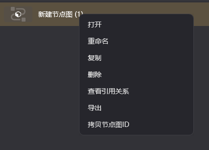
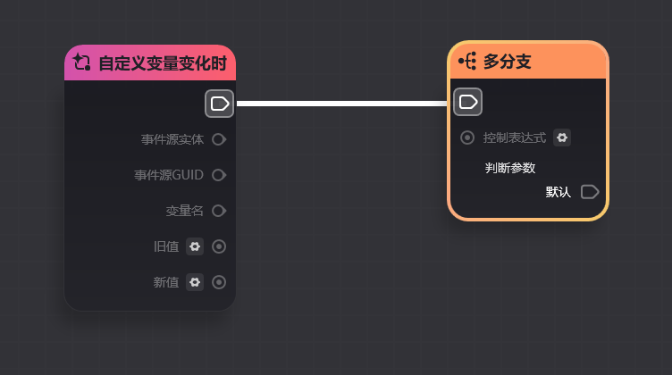
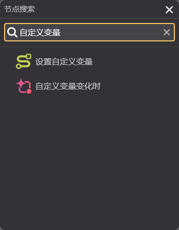

# 节点图编辑指引

**URL**: https://act.mihoyo.com/ys/ugc/tutorial/detail/mhb3ho0k5l2w

**爬取时间**: 2026-01-04 08:19:07

---

## 节点图编辑指引

# 一、节点图编辑入口

节点图的编辑均需要在*千星沙箱*中进行，按照下图找到千星沙箱的入口

千星沙箱的主窗口如下图所示

* 服务端节点图，图中A
* 已创建的节点图，图中B

# 二、新建节点图

## 1.服务端节点图

* 在左侧节点图管理界面选择需要创建的节点图类型（实体节点图、状态节点图、职业节点图、道具节点图）,图中A
* 在右键菜单中选择【创建节点图】

对新建的节点图双击，即可进入节点图编辑页面

在此界面也可以右键点击节点图，打开快捷菜单进行重命名等常见文件操作

## 2.客户端节点图

客户端节点图资源管理器默认处于关闭状态，点击左上角窗口-客户端节点图资源管理器可以打开

客户端节点图资源管理器与服务端节点图资源管理器操作基本一致，在左侧资产管理栏找到需要新增的节点图类型后，在右侧右键点击新建节点图

# 三、节点图操作

进入节点图编辑页面后，如下图所示

## 1.新建节点

* **通过菜单新建**

最常见的创建节点方式是在编辑区域右键打开节点菜单

可以通过节点分类查询到具体的节点

下图以【自定义变量变化时】节点为例。可以在【事件节点】-【自定义变量】找到这个节点

点击后便可以在编辑区域内创建一个新节点

* **通过连线快速创建**

另一种常用的节点创建方式是连线快速创建

操作方式是从一个引脚向外拖拽出连线，且在不与任何其他节点进行连线的状态下松开左键，即可弹出节点创建菜单。

该菜单会自动筛选与该引脚**类型匹配**的（即可以直接连接的）所有节点

## 2.节点连线

在引脚上长按并向外拖拽即可产生一条连线

将其与合法的其他节点的引脚连接后，即可完成连线

## 3.其他节点图操作

* **连线详情**

在引脚或连线上悬停，会高亮显示该连线以及两端的节点。在节点连线较为复杂时该功能会较为实用

* **节点右键菜单操作**

删除：删除节点

剪切：剪切节点，之后可以使用粘贴（Ctrl+V）粘贴该节点

复制：复制节点，之后可以使用粘贴（Ctrl+V）粘贴该节点

断开节点连线：断开与该节点相关的所有连线

注释：在该节点上创建一个注释

生成复合节点：见[复合节点](复合节点_mhty17iqeht0.md)

* **引脚右键菜单操作**

跳转到下个节点：跳转至通过该引脚连接的下个节点

断开此连接：断开该引脚的连线

* **节点图快捷菜单操作**

收起菜单：将快捷菜单收起

添加注释：向节点添加注释。点击后在点击节点即可新增注释

搜索节点：点击后打开节点搜索页签

节点图变量：点击后打开节点图变量页签

信号管理：点击后打开服务器信号管理器

编辑区域缩放：缩放编辑区域。此外也可以用鼠标滚轮进行缩放

操作记录：可以查看对当前节点图中的操作

撤销：可以撤销一步操作

还原：撤销后可以还原撤销

保存：保存当前节点图

另存为：将当前节点图另存为一份新的节点图文件
