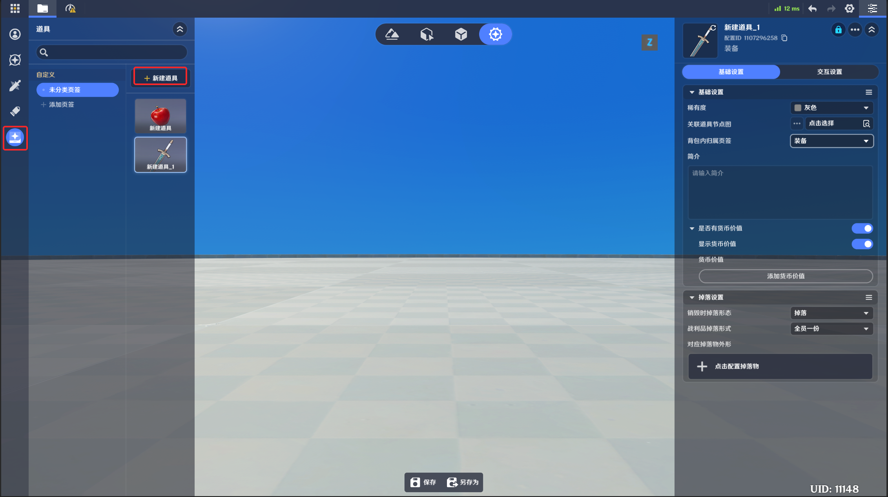
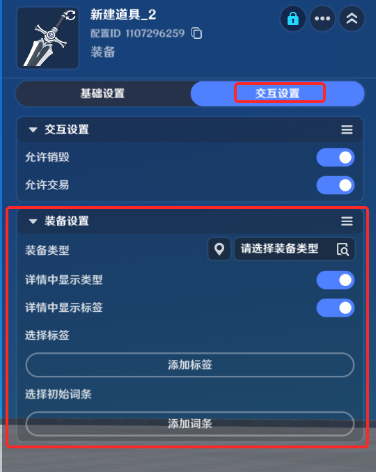
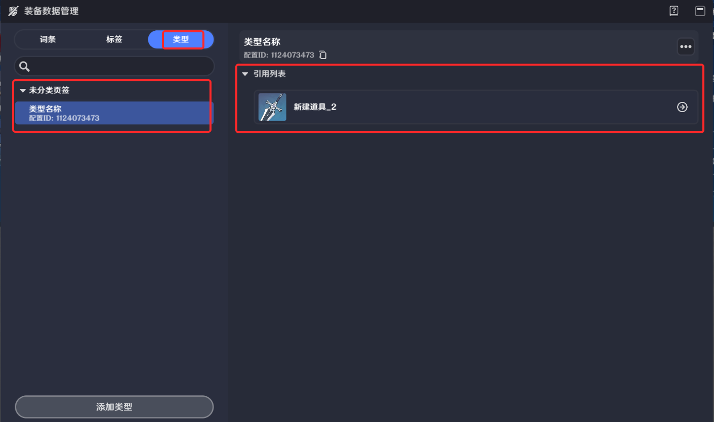

# 一、装备的定义

装备是一种道具的子类型，和普通道具一样通过背包进行管理，不同之处在于装备可以被装备到装备栏位上，为装备者提供属性加成或额外的逻辑功能

# 二、装备的编辑

## 1.新建装备

同道具编辑的页签，如下图点击新建道具

在弹出的窗口下拉【选择类型】，选择装备即可新建一个装备模板

## 2.基础设置

装备的基础设置和普通道具基本一致，但不支持配置堆叠。可参考[道具](./道具_mhbgx0rs.md)

## 3.交互设置

交互设置中支持对于装备类型的额外设置

*装备类型*：装备类型可在装备类型页签进行定义，在尝试装备一件装备时，需要*装备栏位*支持该装备类型，才可装备成功

*详情中显示类型*：在实际运行时，界面上是否显示该件装备的类型信息

*详情中显示标签*：在实际运行时，界面上是否显示该件装备的标签信息

*选择标签*：此处可以在已提前配置好的所有装备标签内选择该装备需要携带的*标签*

*选择初始词条*：此处可以在已提前配置好的所有装备词条内选择该装备需要携带的*初始词条*

## 4.装备类型

装备类型是装备的属性，被两处业务引用：

*装备模板身的类型定义

*装备栏模板*：每个装备栏位定义可以装入哪些类型的装备

当装备模板配置的类型列表与装备栏位的类型列表交集不为空时，即有任意类型匹配成功，即可成功进行装备

由图据管理*处进入装备相关编辑界面

进入装备类型页签，即可进行装备类型的编辑和新增

*类型名称*：由创作者(奇匠)定义的类型的命名

*配置ID*：装备类型数据的唯一标识

*引用列表*：可以在此查看使用该类型的所有装备模板

## 5.装备标签

标签是一种装备的外显备注，者(奇匠)向玩家传达该装备的特性

在装备数据管理的标签页签，可以对行定义，并由装备模板引用：

*标签名称*：由创作者(奇匠)定义的标签的命名

*配置ID*：装备标签数据的唯一标识

*引用列表*：可以在此查看使用该标签的所有装备模板

## 6.装备词条

装备词条是装备属性加成和机制加成的唯一来源，一件装备可以持有多个词条，根据词条的具体配置，当装备进入背包或被装备时，词条提供的加成会应用到持有者或装备者实体上

在装备数据管理的词条页签，可以对装备词条进行定义，并由装备模板引用：

*词条名称*：由创作者(奇匠)定义的词条的命名

*配置ID*：装备词条数据的唯一标识

*引用列表*：可以在此查看使用该词条的所有装备模板

**词条属性**

*生效实机*：该词条对应的加成会在什么时点生效

*获取时生效*：装备进入背包时，就对背包持有者生效

*装备时生效*：装入装备栏位时才对装备者生效

词条分为多种不同的类型，其提供加成的内容也不相同

* *基础属性加成*：提供基础的战斗属性类型加成

*选择属性*：选择具体要加成哪一种战斗属性，每一个词条能提供的加成属性类型是唯一的

*加成类型*：分为*随机值*和*固定值*两种，随机值加成会从创作者(奇匠)配置的随机值范围内随机一个值作为最终加成，而固定值加成则会使用创作者(奇匠)配置的确定数值作为最终加成

*随机值范围*：加成类型为随机值时，创作者(奇匠)可配置随机的上下限

*加成固定值*：加成类型为固定值时，创作者(奇匠)可配置具体的加成数值

*描述类型*：在游玩过程中查看装备时，在界面上会显示词条的具体描述，创作者(奇匠)可以使用预制好的描述文本，也可以自己对词条描述进行编辑

*固定描述*：使用预制好的描述文本，只在基础属性加成类型的词条上可以使用

*描述中显示随机值的上下限*：开启时则会在固定描述的最后显示配置的随机值上下限

*自定义描述*：创作者(奇匠)自定编辑描述，选择后可在下方的文本框内进行文本输入

*插入变量*：在词条描述文本中插入占位符，以显示加成的范围以及实际加成数值

* *赋予节点图*：提供创作者(奇匠)自己定义的

*关联节点图*：词条类型为赋予节点图时，可以选择节点图

* *赋予单位状态*：支持词条绑定一个单位状态

*对应单位状态*：词条类型为赋予单位状态时，可以选择所需关联的单位状态

# 三、装备实例
5f7-420e-abe3-a3fae3e9d852.png)a-48f6-85cb-d0ec978f9813.png)5ef3ef7aec1.png)-dc1c-4da9-9e93-b6d756b6ff66.png)-461f-4a9d-9305-a25f31a24aa7.png)4-4593-b484-61f64a7e25c3.png)-c15aa79752d9.png)c-4d23-93a0-d034390467aa.png)-e7d4-4463-8f5d-25eac1a038c4.png)-9a7c-42ab-b068-eb24c2e64711.png)5c233ed1e.png)30-f8d150ab53c4.png)958bcc2bae2.png)拾取时，会以模板的形式存在在掉落物组件内，当装备模板首次被获取进入背包时，会进行初始化，此时词条的数值会发生随机，并抛出*装备初始化*事件，此时事件出参会返回装备实例的唯一索引，通过此索引即可对装备的词条属性进行动态修改，如创作者(奇匠)有自定义的装备初始化规则，也可在此事件内自行编写逻辑覆写预制的随机规则

# 四、装备栏

装备栏是装备的容器，装备的词条生效依赖装备行为触发

## 1.装备栏模板

用于定义装备栏位的样式、数量以及每个栏位的装备标签。通过【货币与背包】按钮进入编辑界面

进入装备栏页签，可进行模板编辑

*模板名称*：由创作者(奇匠)定义的装备栏模板的命名

*配置ID*：装备栏模板数据的唯一标识

*装备栏样式*：通过点击“加号”图标，可以动态叠加装备栏位，添加完成后可对一个装备栏位进行详细设置

*栏位设置*：单个装备栏位的设置

*当前栏位名称*：创作者(奇匠)可以为栏位命名，会显示在栏位界面的底部

*可装备类型*：选择该栏位可接受的装备类型

*图标*：未放入装备时，栏位界面的底图显示

配置完成后，一个装备栏位的表现如下图所示：

## 2.装备栏组件

装备栏组件仅有角色可以添加

选择添加通用组件->添加装备栏组件即可添加

组件界面如下

*装备栏模板*：引用预先定义好的装备栏模板

# 五、节点图修改装备属性

## 1.装备相关执行节点

* 修改装备词条值

* 移除装备词条

* 装备添加词条

* 装备指定序号添加词条

## 2.装备相关事件节点

* 装备初始化时

* 装备的词条数值改变时

* 装备被卸下时

* 装备被穿戴时

## 3.装备相关查询节点

* 查询装备标签列表

* 获取装备词条配置ID

* 获取装备词条列表

* 获取装备词条数值

