# 装备

**URL**: https://act.mihoyo.com/ys/ugc/tutorial/detail/mhkl2yin0cxo

**爬取时间**: 2026-01-04 08:25:47

---

## 装备

# 一、装备的定义

装备是一种道具的子类型，和普通道具一样通过背包进行管理，不同之处在于装备可以被装备到装备栏位上，为装备者提供属性加成或额外的逻辑功能

# 二、装备的编辑

## 1.新建装备

同道具编辑的页签，如下图点击新建道具

在弹出的窗口下拉【选择类型】，选择装备即可新建一个装备模板

## 2.基础设置

装备的基础设置和普通道具基本一致，但不支持配置堆叠。可参考[道具](道具_mhbgx0rspbqu.md)

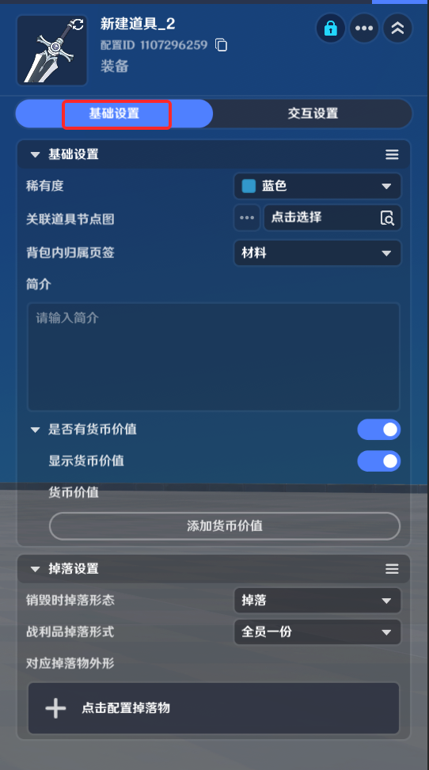

## 3.交互设置

交互设置中支持对于装备类型的额外设置

装备类型：装备类型可在装备类型页签进行定义，在尝试装备一件装备时，需要装备栏位支持该装备类型，才可装备成功

详情中显示类型：在实际运行时，界面上是否显示该件装备的类型信息

详情中显示标签：在实际运行时，界面上是否显示该件装备的标签信息

选择标签：此处可以在已提前配置好的所有装备标签内选择该装备需要携带的标签

选择初始词条：此处可以在已提前配置好的所有装备词条内选择该装备需要携带的初始词条

## 4.装备类型

装备类型是装备的属性，被两处业务引用：

装备模板：装备本身的类型定义

装备栏模板：每个装备栏位定义可以装入哪些类型的装备

当装备模板配置的类型列表与装备栏位的类型列表交集不为空时，即有任意类型匹配成功，即可成功进行装备

由图示装备数据管理处进入装备相关编辑界面

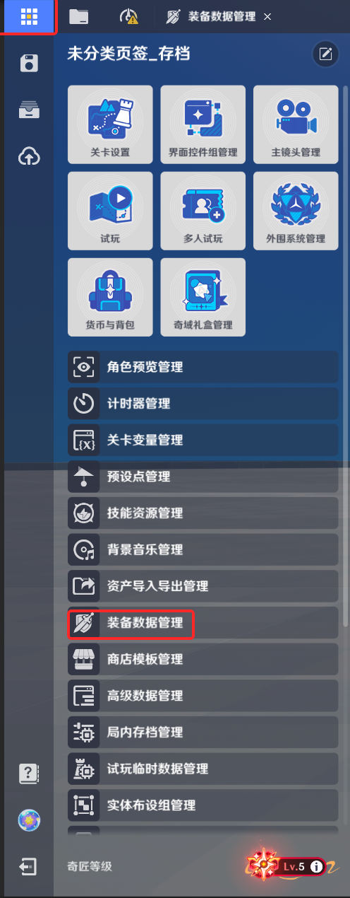

进入装备类型页签，即可进行装备类型的编辑和新增

类型名称：由创作者(奇匠)定义的类型的命名

配置ID：装备类型数据的唯一标识

引用列表：可以在此查看使用该类型的所有装备模板

## 5.装备标签

标签是一种装备的外显备注，可用于创作者(奇匠)向玩家传达该装备的特性

在装备数据管理的标签页签，可以对装备标签进行定义，并由装备模板引用：

标签名称：由创作者(奇匠)定义的标签的命名

配置ID：装备标签数据的唯一标识

引用列表：可以在此查看使用该标签的所有装备模板

## 6.装备词条

装备词条是装备属性加成和机制加成的唯一来源，一件装备可以持有多个词条，根据词条的具体配置，当装备进入背包或被装备时，词条提供的加成会应用到持有者或装备者实体上

在装备数据管理的词条页签，可以对装备词条进行定义，并由装备模板引用：

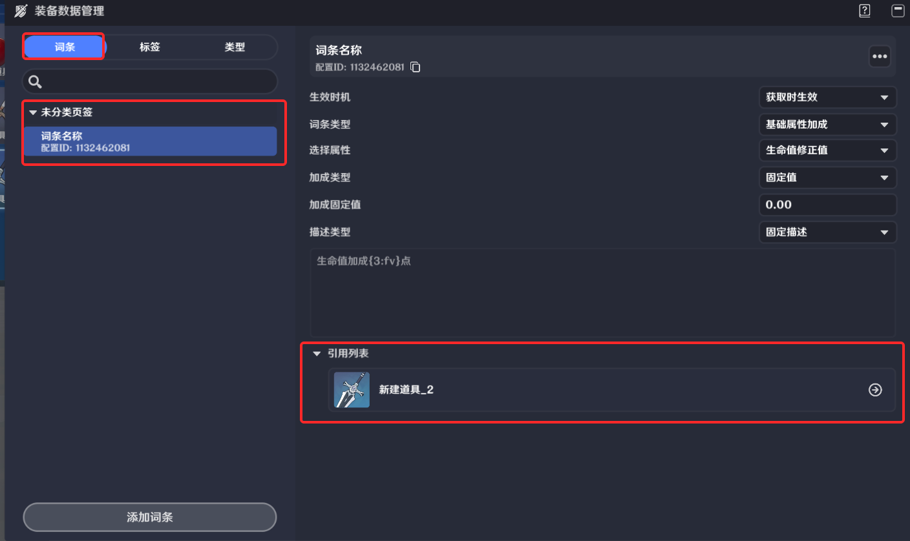

词条名称：由创作者(奇匠)定义的词条的命名

配置ID：装备词条数据的唯一标识

引用列表：可以在此查看使用该词条的所有装备模板

**词条属性**

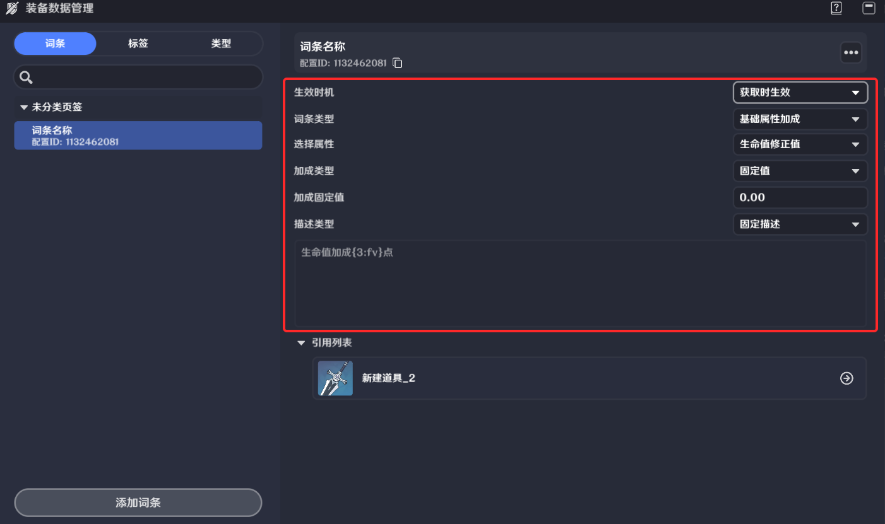

生效实机：该词条对应的加成会在什么时点生效

获取时生效：装备进入背包时，就对背包持有者生效

装备时生效：装入装备栏位时才对装备者生效

词条分为多种不同的类型，其提供加成的内容也不相同

* *基础属性加成：提供基础的战斗属性类型加成*

选择属性：选择具体要加成哪一种战斗属性，每一个词条能提供的加成属性类型是唯一的

加成类型：分为随机值和固定值两种，随机值加成会从创作者(奇匠)配置的随机值范围内随机一个值作为最终加成，而固定值加成则会使用创作者(奇匠)配置的确定数值作为最终加成

随机值范围：加成类型为随机值时，创作者(奇匠)可配置随机的上下限

加成固定值：加成类型为固定值时，创作者(奇匠)可配置具体的加成数值

描述类型：在游玩过程中查看装备时，在界面上会显示词条的具体描述，创作者(奇匠)可以使用预制好的描述文本，也可以自己对词条描述进行编辑

固定描述：使用预制好的描述文本，只在基础属性加成类型的词条上可以使用

描述中显示随机值的上下限：开启时则会在固定描述的最后显示配置的随机值上下限

自定义描述：创作者(奇匠)自定编辑描述，选择后可在下方的文本框内进行文本输入

插入变量：在词条描述文本中插入占位符，以显示加成的范围以及实际加成数值

* *赋予节点图：提供创作者(奇匠)自己定义的节点图逻辑*

关联节点图：词条类型为赋予节点图时，可以选择所需关联的节点图

* *赋予单位状态：支持词条绑定一个单位状态*

对应单位状态：词条类型为赋予单位状态时，可以选择所需关联的单位状态

# 三、装备实例

装备未被拾取时，会以模板的形式存在在掉落物组件内，当装备模板首次被获取进入背包时，会进行初始化，此时词条的数值会发生随机，并抛出装备初始化事件，此时事件出参会返回装备实例的唯一索引，通过此索引即可对装备的词条属性进行动态修改，如创作者(奇匠)有自定义的装备初始化规则，也可在此事件内自行编写逻辑覆写预制的随机规则

# 四、装备栏

装备栏是装备的容器，装备的词条生效依赖装备行为触发

## 1.装备栏模板

用于定义装备栏位的样式、数量以及每个栏位的装备标签。通过【货币与背包】按钮进入编辑界面

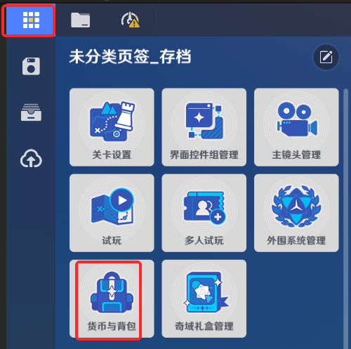

进入装备栏页签，可进行模板编辑

模板名称：由创作者(奇匠)定义的装备栏模板的命名

配置ID：装备栏模板数据的唯一标识

装备栏样式：通过点击“加号”图标，可以动态叠加装备栏位，添加完成后可对一个装备栏位进行详细设置

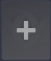

栏位设置：单个装备栏位的设置

当前栏位名称：创作者(奇匠)可以为栏位命名，会显示在栏位界面的底部

可装备类型：选择该栏位可接受的装备类型

图标：未放入装备时，栏位界面的底图显示

配置完成后，一个装备栏位的表现如下图所示：

## 2.装备栏组件

装备栏组件仅有角色可以添加

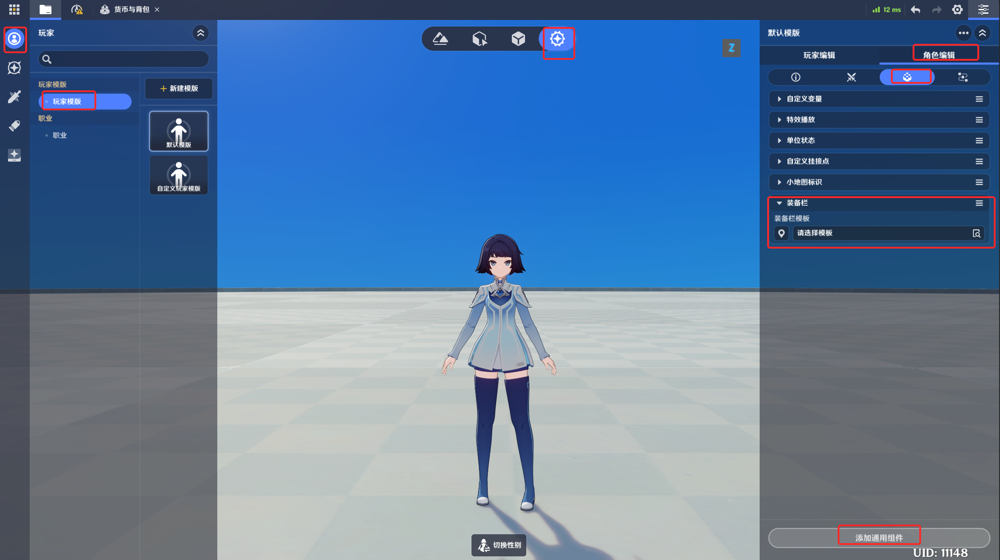

选择添加通用组件->添加装备栏组件即可添加

组件界面如下

装备栏模板：引用预先定义好的装备栏模板

# 五、节点图修改装备属性

## 1.装备相关执行节点

* 修改装备词条值

* 移除装备词条

* 装备添加词条

* 装备指定序号添加词条

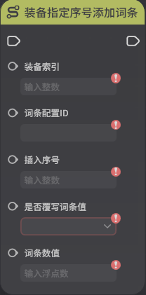

## 2.装备相关事件节点

* 装备初始化时

* 装备的词条数值改变时

* 装备被卸下时

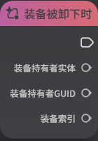

* 装备被穿戴时

## 3.装备相关查询节点

* 查询装备标签列表

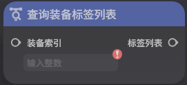

* 获取装备词条配置ID

* 获取装备词条列表

* 获取装备词条数值

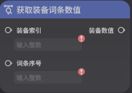
