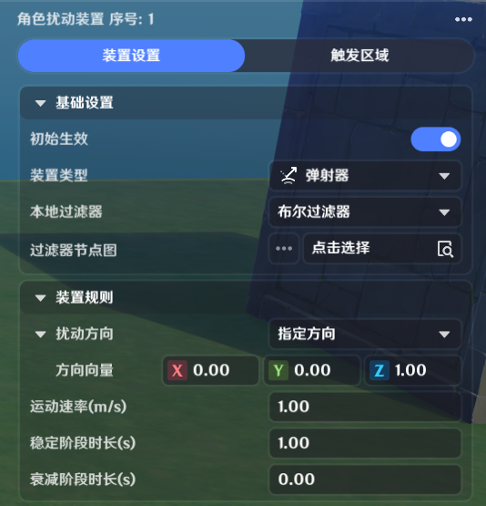
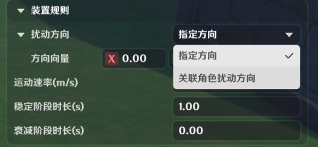
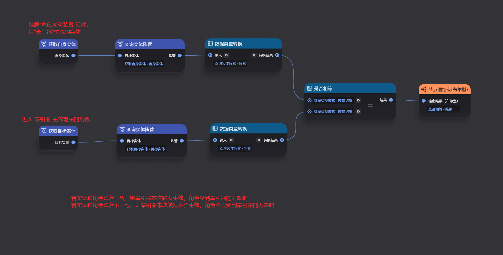
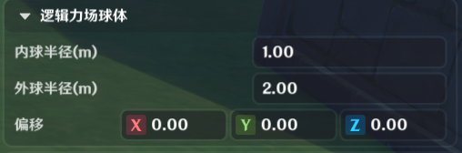
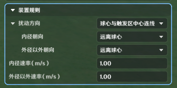
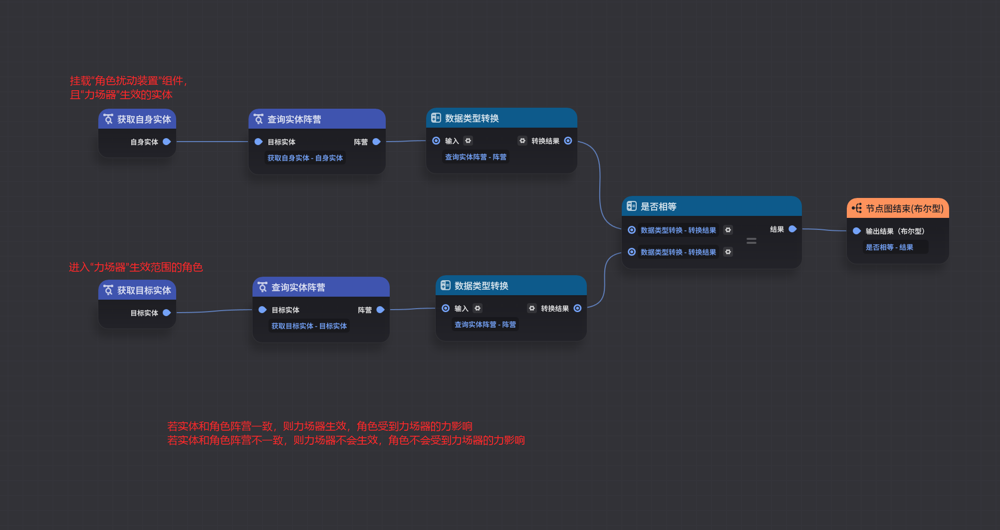
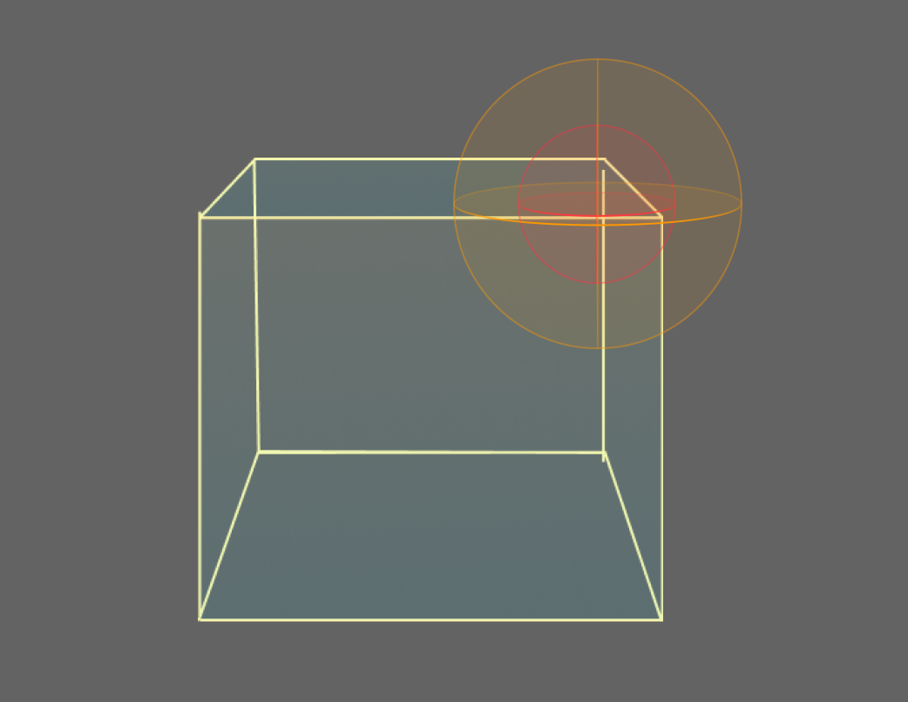
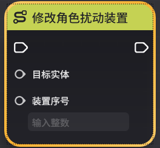

# 角色扰动装置

**URL**: https://act.mihoyo.com/ys/ugc/tutorial/detail/mhstl890y7xe

**爬取时间**: 2026-01-04 08:12:46

---

## 角色扰动装置

# 一、角色扰动装置组件的功能

角色扰动装置是赋予动态物件，可以对与其发生碰撞的角色施加模拟物理作用力的功能。

角色扰动装置组件可支持同时配置多个角色扰动装置，但是同时只能生效一个。

角色扰动装置支持通过*本地过滤器*判定是否生效

# **二、角色扰动装置组件的编辑**

## 1.添加组件

(1)在实体或元件编辑界面中，打开组件编辑页签

(2)点击下方的“添加通用组件”，选择并点击“角色扰动装置”，成功添加

 选中“角色扰动装置”时，编辑中的实体会以蓝色显示“角色扰动装置”组件当前生效的扰动装置范围。

(3)点击“详细编辑”，展开编辑页

## 2.角色扰动装置的编辑

* 通过点击，添加“角色扰动装置”。

若当前“角色扰动装置”组为空，则添加的“角色扰动装置”初始生效默认开启。

* “序号X”，X为“角色扰动装置序号”，作为节点输入项可以调整扰动装置的参数

* 基础设置

|  |  |
| --- | --- |
| 配置参数 | 说明 |
| 初始生效 | 是否在物件创建时激活 |
| 装置类型 | 角色扰动装置的类型 |
| 装置规则 | 根据选择的扰动类型不同，支持配置的扰动规则参数不同 |
| 本地过滤器 | 可引用本地过滤器节点图，用于判断扰动装置生效与否。两种过滤器的区分和使用请看节点图  *弹射器*：本地过滤器会在角色进入生效范围期间时，进行检测一次  *牵引器*：本地过滤器会在角色进入生效范围期间时，进行检测一次  *力场器*：本地过滤器会在角色进入生效范围期间内，持续进行检测  对应本地过滤器节点图中的基础节点，进行说明  * 获取自身实体  输出参数为挂载角色扰动装置组件的实体  * 获取目标实体  输出参数为在选项卡生效范围内的角色实体  * 获取当前角色  输出参数为本地角色 |

*

* 触发区域

可通过“添加触发区”添加基础形状，多个基础形状构成角色扰动装置的触发区域。

编辑时，可在编辑界面实时查看编辑实体上的触发区域范围。

* 区域编辑

|  |  |
| --- | --- |
| 配置参数 | 说明 |
| 触发区形状 | 支持配置矩形、球体、胶囊体三种基础形状 |
| 中心 | 相对实体或元件中心的偏移 |
| 旋转  | 以中心位置为基准，在不同轴向上支持调整朝向 |
| 缩放倍率  | 触发区配置形状在不同轴向上支持定义缩放 |

## 3.角色扰动装置的类型

### **(1)弹射器**

该作用力让角色在配置朝向上的速度额外增加对应配置值。

弹射器施加过程中，若检测到某朝向发生碰撞，会把某分量上施加的弹射器清除。

**装置规则**

* *当扰动方向配置为**指定方向**时，可额外配置参数为方向向量*

通过配置该三维向量，可明确该弹射器所施加力的方向

* *当扰动方向配置为**关联角色扰动方向**时，可额外配置参数为方向设置*

|  |  |
| --- | --- |
| 配置参数 | 说明 |
| **角色至实体连线方向** | 角色与实体中心连线，朝向实体中心 |
| *实体至角色连线方向* | 角色与实体中心连线，朝向角色 |

*其它可配置参数说明如下

|  |  |
| --- | --- |
| 配置参数 | 说明 |
| 运动速率(m/s) | 角色碰撞生效范围时，将被额外施加可以造成该速度的弹射器 |
| 稳定阶段时长(s) | 角色持续受到弹射器的时间，在此期间弹射器的大小不变 |
| 衰减阶段时长(s) | 角色受到的弹射器，在稳定阶段时长(s)结束后，弹射器逐渐减少至0的时间 |

***本地过滤器举例说明**

### **(2)牵引器**

该作用力让角色化身为球体特效，以配置的速度在扰动时间朝向牵引终点，被拖拽过去。

**牵引终点**

|  |  |
| --- | --- |
| 配置参数 | 说明 |
| 偏移 | 牵引终点和编辑实体的位置偏移量 |
| 半径 | 当角色到达牵引终点附近半径距离时，算作抵达终点 |

***装置规则**

|  |  |
| --- | --- |
| 配置参数 | 说明 |
| 运动速率(m/s) | 角色碰撞生效范围时，将被额外施加可以造成该速度的牵引器 |
| 稳定阶段时长(s) | 角色持续受到牵引器的时间，在此期间维持速率 |
| 衰减阶段时长(s) | 角色受到的牵引器，在扰动时间结束后，牵引器逐渐减少至0的时间 |
| 抵达终点时终止 | 若配置为激活，则角色到达牵引终点半径距离时，可提前结束受力 |
| 跳跃可打断 | 若配置为激活，则角色在运行中主动操作跳跃时，可提前结束受力 |
| 无视场景碰撞 | 若配置为关闭，则角色在运行中与场景发生碰撞时，可提前结束受力 |

***本地过滤器举例说明**

### **(3)力场器**

该作用力让角色在生效范围内持续受力，在不同的范围受到的作用力支持配置不同效果。

角色在配置的生效范围不同区域内，将持续被施加相应的作用力。

**逻辑力场球体**

力场器的施加是以该同心球为核心施加的

|  |  |
| --- | --- |
| 配置参数 | 说明 |
| 内球半径(m) | 力场逻辑生效范围的同心球的内球半径 |
| 外球半径(m) | 力场逻辑生效范围的同心球的外球半径 |
| 偏移 | 力场逻辑生效范围球体的中心，和实体位置的偏移 |

***装置规则**

* *当扰动方向配置为**指定方向**时，可额外配置参数为方向向量*

通过配置该三维向量，可明确该力场器所施加力的方向

* *当扰动方向配置为**球心与触发区中心连线**时，可额外配置参数为内径朝向和外径以外朝向*

|  |  |
| --- | --- |
| 配置参数 | 说明 |
| 内径朝向 | 逻辑力场内球的力朝向 |
| 外径以外朝向 | 逻辑力场外球以外的力朝向 |

*其中每一项可配置的参数又分为朝向球心和远离球心

|  |  |
| --- | --- |
| 配置参数 | 说明 |
| 朝向球心 | 角色和逻辑力场球心的连线，并朝向球心 |
| 远离球心 | 角色和逻辑力场球心的连线，并朝向角色 |

*其它可配置参数说明如下

|  |  |
| --- | --- |
| 配置参数 | 说明 |
| 内径速率(m/s) | 内球半径以内被额外施加可以造成该速度的力场器 |
| 外径以外速率(m/s) | 外球半径以外被额外施加可以造成该速度的力场器 |

***本地过滤器举例说明**

角色在力场器生效范围内时，本地过滤器将持续进行检测，若有结果变化，会立即生效

**力场器效果说明**

玩家进入配置的力场器范围内，才会受到作用力效果。

作用力效果和配置的内球半径、外球半径有关，具体效果如下

通过立体图来详细说明

* 玩家在内径范围内，受到内球半径的配置力效果
* 玩家在内外半径之间，受到内外径之间的过渡效果
* 玩家在外径之外，受到外球半径以外的配置力效果

# 三、注意事项

角色处于飞行状态，且存在额外受力情况时，不受重力效果。

此特性可以用于制作水平力场。

力场器向上的力，需要角色处于飞行状态，才会接受向上的力场器效果。

角色无法在力场器中原地起跳继而起飞

力场器内径速率过大，且方向为“球心与触发区中心连线-朝向球心时”，若角色以飞行，或坠落情况进入范围，可能会无法脱离状态

# 四、通过节点图管理角色扰动装置

实体运行时，可通过节点图管理其生效的角色扰动装置

* 修改角色扰动装置

调整运行中的实体生效的角色扰动装置

若序号配置为空，或配置不存在的序号，则所有角色扰动装置都不生效

