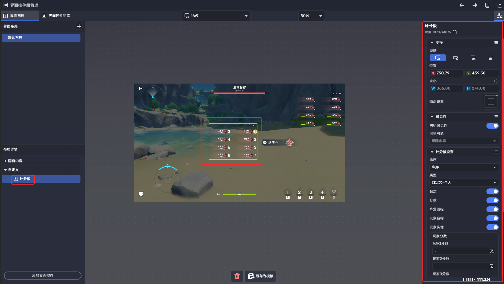

# 一、计分板的功能

关卡运行时，用于显示玩家自定义变量，并可以根据自定义变量进行排名的信息展示界面。

# **二、计分板的编辑**

|  |  |
| --- | --- |
| 配置参数 | 说明 |
| *排序* | 提供数值升序和降序 |
| *类型* | 个人、阵营，类型的选择将影响余下配置参数的配置内容 |

# **三、计分板的类型**

|  |  |  |  |  |
| --- | --- | --- | --- | --- |
| 类型 | 计分板样式 | 样式设置项 | 数据设置项 | 说明 |
| *个人* |  |  |  | 可设置计分板中需要显示的内容，包含名次/分数/阵营图标/玩家名称/玩家头像 |
| *阵营* |  |  |  | 可设置积分板中需要显示的内容，包含名次/分数 |

####