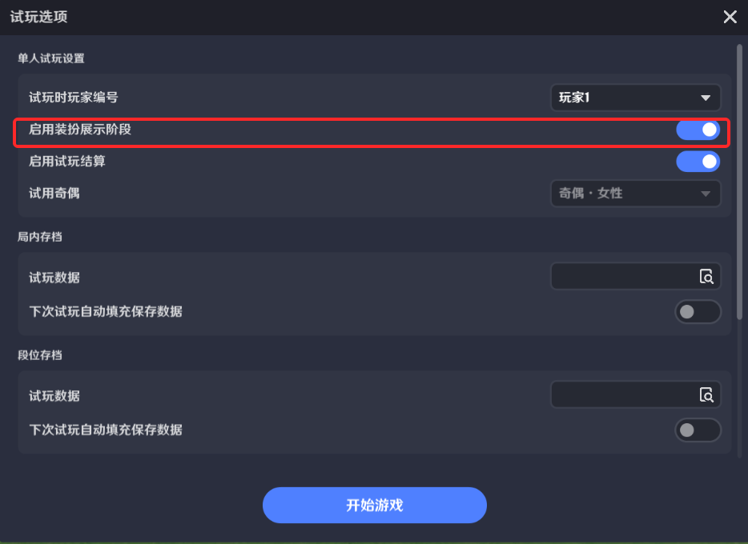
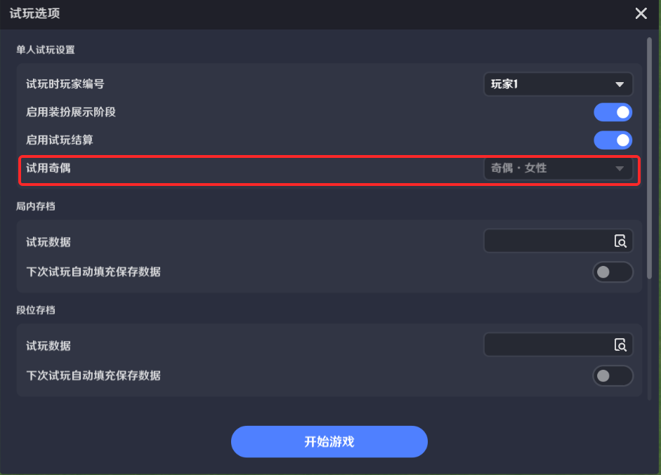
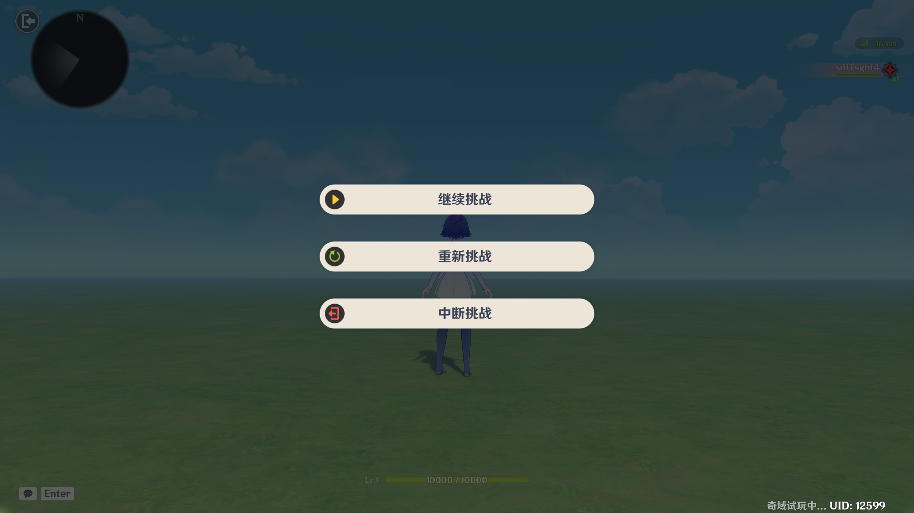

# 试玩

**URL**: https://act.mihoyo.com/ys/ugc/tutorial/detail/mhie54ik9ovg

**爬取时间**: 2026-01-04 08:03:03

---

## 试玩

# 一、功能简介

试玩功能可用于进行关卡测试，创作者(奇匠)可以通过试玩设置和试玩控制，满足自身对于不同情景的测试需求，以达到快速验证关卡的效果。

# 二、功能入口

系统菜单——试玩

# 三、功能限制

多人试玩房间未解散时，无法进行试玩功能。

# 四、试玩校验

点击【试玩】按钮后，会执行试玩必要的校验和上传流程，当检测到未满足条件时，将弹出对应的错误码供创作者(奇匠)检查。当所有检测条件都通过时，试玩流程将继续进行，弹出【试玩设置】窗口。

# 五、试玩流程

试玩流程分为：试玩前准备（上传，校验流程）——装扮展示——加载界面——进入关卡——结算关卡

## 1.试玩前准备

### (1)试玩玩家选取

试玩时玩家编号：点击后，将读取【关卡设置】中的已设定数据，可自由选择希望本次试玩的玩家对应编号。

### (2)存档数据设置

根据创作者(奇匠)需要，可通过系统菜单——试玩临时数据管理，进行存档数据的设置

在试玩设置中可以将存档数据在【试玩数据】中进行引用。

## 2.装扮展示

装扮展示阶段：关闭后，试玩进入关卡时，将跳过装扮展示流程，直接进入加载界面。

## 3.结算关卡

玩家可通过完成挑战或者主动退出来触发关卡结算。

为了加快测试效率以及减少试玩测试中的流程，创作者(奇匠)可通过【试玩选项】中【启用试玩结算】关闭结算相关流程。

## 4.试用奇偶

创作者(奇匠)在进入试玩前，可通过【试玩选项】内【试用奇偶】调整试玩中使用的奇偶性别。

## 5.加载界面

执行完装扮展示后，试玩将依照【关卡设置】中【加载界面】的配置情况，播放进关前的加载界面。

## 6.进入关卡

点击按钮后，将根据创作者(奇匠)的设置依次执行进入关卡流程（装扮展示——加载界面——进入关卡）。

# 六、试玩局内控制

## 1.退出按钮

处于试玩中时，可通过左上角退出按钮或Esc快捷键打开【试玩控制】面板。

## 2.试玩控制

### (1)继续挑战

点击【继续挑战】按钮后，将返回当前试玩进程

### (2)重新挑战

点击【重新挑战】按钮后，将重新执行从进关流程开始的所有启动流程，流程执行完后即重新开始新一局试玩。

注：如触发异常情况导致试玩无法直接重新开始，请退出试玩后重新开启试玩流程。

### (3)中断挑战

点击该按钮后，将立即结束本次试玩流程，触发对应的非正常结算结果。

