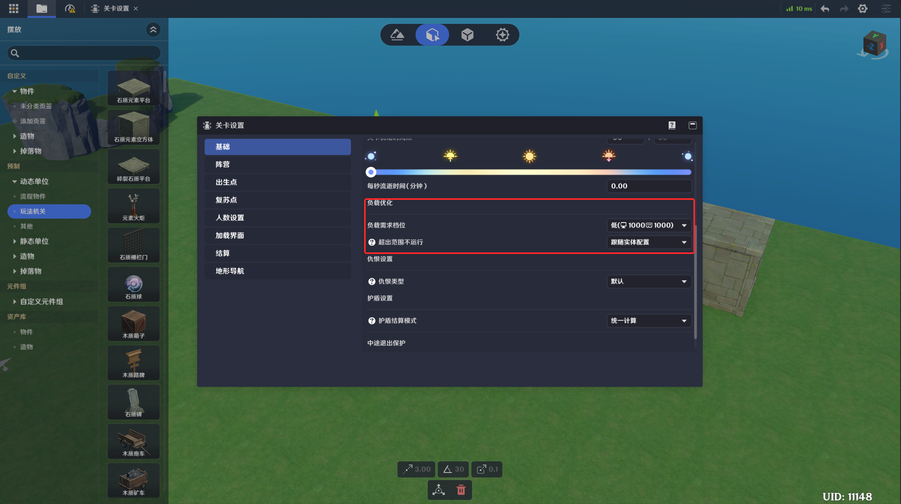
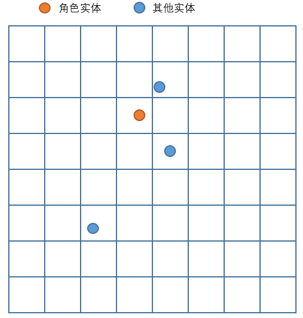
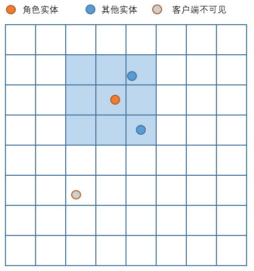
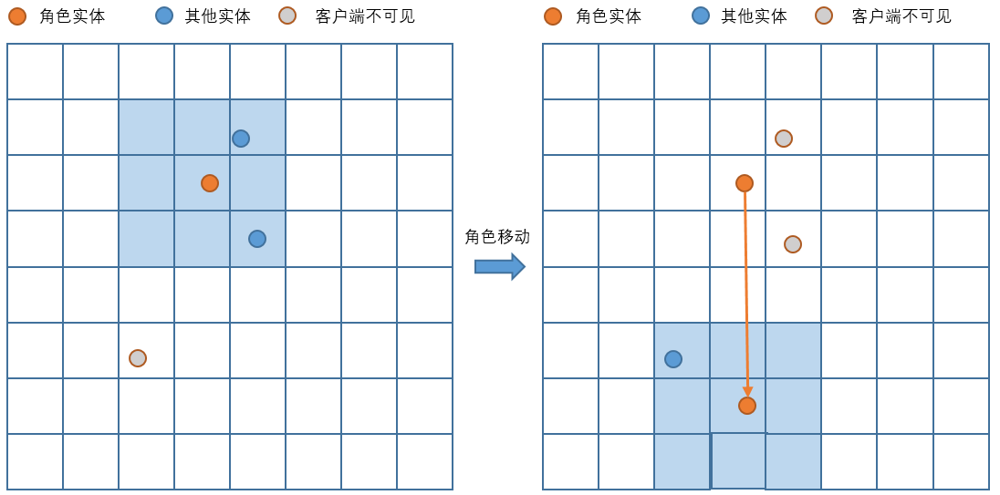
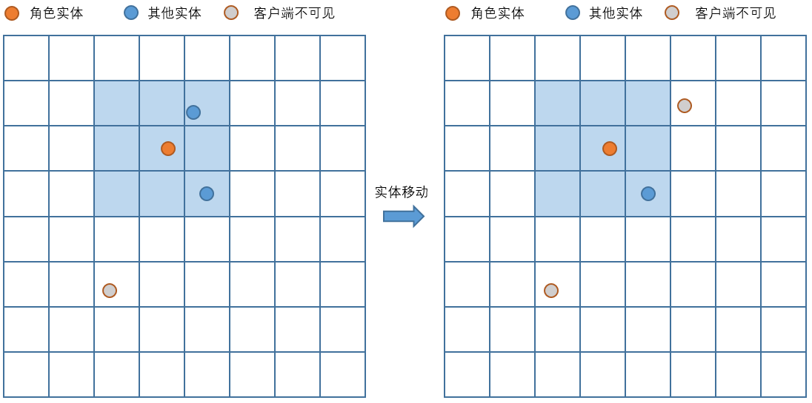

# 负载优化

**URL**: https://act.mihoyo.com/ys/ugc/tutorial/detail/mhlb1vivioys

**爬取时间**: 2026-01-04 08:08:30

---

## 负载优化

*当游戏运行中，场景内的*实体*过多时，可能会导致游戏负载超标，当用户遇到此类问题时可以考虑使用*视野检测*来进行*负载优化*。

简单来说，用户可以指定一些非关键的实体，使其在角色距离较远时，在本地卸载，以此来节约该部分物件的开销

# 一、视野检测参数配置

视野检测参数有两个配置入口：

## 1.负载优化全局配置

在关卡设置界面，可以看到负载优化选项

视野检测是否生效：

跟随实体配置：当选择该选项时，该项负载优化将会依据元件/实体上的属性配置进行生效

关闭：当选择该选项时，该项负载优化功能将会关闭

## 2.负载优化单位属性

在物件的基础信息页签，可以看到负载优化属性，如果设置为“开启”，则该物件的实体将会接受负载优化逻辑，从而可能在距离角色过远时在*本地销毁*

# 二、视野检测的生效规则

## 1.本地销毁状态

上述的“本地销毁”状态区别于实体的销毁，可以理解为仅仅是在客户端“不显示”了，但实体的逻辑依然存在：

* 依然可以通过节点图节点进行索引，并控制其逻辑
* 在玩家靠近一个本地销毁状态的实体时，实体在本地会重新被创建
* 在联机下，不同用户的本地被销毁的实体根据其距离本地角色距离，可能各不相同
* 当本地实体不存在时，部分纯本地逻辑可能会不执行，如播放特效等

## 2.销毁规则（视野网格）

### (1)平面网格化

在视野检测负载优化规则下，用户实际游玩的场景会被分为多个大小相同的正方形区域，则在运行时，角色单位和场景内的其他实体都会被落入某一个唯一的网格内：

以角色单位所在网格为中心，周围的复数个网格即为“*视野检测范围*”，在启动视野检测优化时，视野检测范围外的实体机会被“本地销毁”，并且在游玩时不可见，如下图，假设视野范围为3*3：

### (2)角色跨网格

当角色位置发生运动时，视野检测范围也会变化，同时实体在进/出角色的视野检测范围时也会被创建或销毁，如下图：

### (3)实体跨网格

通过运动器或造物的行为使实体跨越网格时，如果触发了进/出角色视野检测范围，也会被创建或销毁：

# 三、超限模式下的视野检测规格

## 1.网格大小

超限模式下的网格正方形大小为40m\*40m

## 2.视野检测范围

超限模式下的实际视野检测范围为除自身网格外的周围三格范围，如下图所示：

