# 负载计算功能

**URL**: https://act.mihoyo.com/ys/ugc/tutorial/detail/mho2hirgodxi

**爬取时间**: 2026-01-04 08:38:45

---

## 负载计算功能

# 一、负载计算功能是什么

在关卡编辑时，实时进行环境的整体评估，针对场景的布设复杂度，实体配置的数量和密度进行统一计算，按照区域进行风险提示的功能。

在关卡运行后，提供关卡运行状态的负载报告，对关卡的静态布设和节点图运行功能，进行记录，并汇总报告提供创作者(奇匠)，进行风险提示的功能。

# 二、关卡负载等级

关卡负载设置功能，可以提供给创作者(奇匠)关卡的负载辅助检测功能。

打开系统菜单中的关卡设置，**基础配置-负载设置**中可调整创作者(奇匠)希望该关卡正常运行所需的最低负载需求

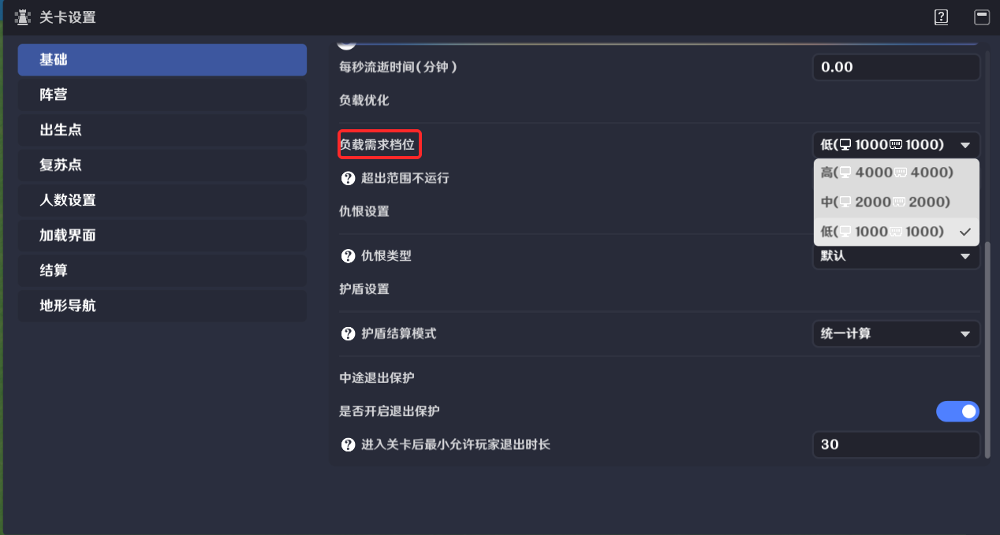

负载需求档位配置越高，提供的负载指标上限越高，关卡编辑时，检测的负载告警上限也越高。

根据关卡设置的负载需求，以及实际编辑情况，会将该关卡的最终负载需求在投放后的详情界面进行展示，并且在游玩前会对玩家进行负载相关的提示

# 三、负载计算功能概述

提供静态和动态两种负载计算方式。

静态负载计算

提供静态编辑的推荐负载指标上限，并对编辑关卡当前状态进行负载估算。

若超出上限，则进行预警，可能会造成关卡运行时的卡顿和掉帧，甚至闪退等问题。

若满足上限，则当前编辑状况良好，试玩状况预计良好。但并不能评估节点图等动态运行逻辑带来的负载消耗，不能杜绝运行时可能的卡顿等问题

动态负载计算

支持创作者(奇匠)自行启动负载记录，会在试玩时记录关卡运行时的负载相关数据。

对每一位玩家进行关卡运行时的负载监控，当每一端玩家的关卡运行达到负载峰值时，会进行截图，试玩结束后整理报告提供给创作者(奇匠)。

客户端相关负载指标

和玩家运行关卡时使用的设备相关，目前给定的客户端上限是以普通电脑的硬件条件作为上限投放的

请关注**关卡设置-人数配置**

客户端内存中的-其他，主要包含人数**上限**所需要占用的内存消耗

服务端相关指标负载

请关注**关卡设置-人数配置**

服务端将根据配置的最小人数，投放负载。例如1人游玩投放服务端负载为N，那么该关卡投放的负载为最小人数*N

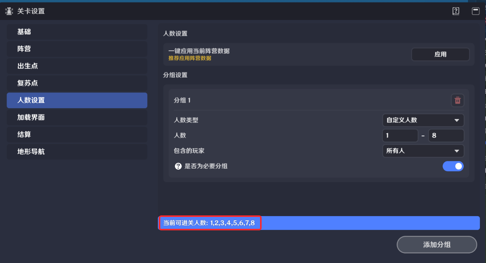

# 四、静态负载计算

菜单栏会提供静态负载选项，点击可查看当前全局负载计算情况。

为了便于创作者(奇匠)定位负载超标的位置，将关卡进行了区域的划分，针对不同的区域提供对应的负载计算，便于定位调整。

## 1.静态负载计算-全局

对编辑中关卡所有区域的负载计算进行汇总，将静态计算的所有负载指标统一在此展示

|  |  |
| --- | --- |
| 参数 | 说明 |
| \图标 | 任意指标超出推荐值，都会予以提示 |
| \全局资源占比 | 当前关卡所有区域中，负载计算最高的结果，和提供负载总量的对照关系。  可以提示已用资源所占总量百分比 |
| \计算静态负载 | 当前关卡任意区域的负载计算超标，则会提示 |
| \内存静态负载 | 当前关卡任意区域的负载计算超标，则会提示 |
| \存档大小 | 预估当前关卡的存档后，上传时需要占用的存储空间。  若超出上限，会**禁止创作者(奇匠)上传** |

## 2.静态负载计算-区域

点击**查看负载情况**可展开详情界面

### (1)区域负载占用总览

考虑玩家游玩时，以玩家所在作为中心，则周围一定范围内的环境和实体，都会占用一定的负载，因此在负载计算中，以区域为单位，进行负载计算和展示，便于理解。

仅显示负载超标区域：默认勾选，勾选则只筛选展示负载占比较高的区域，否则展示全部区域。

展示区域会按照区域的序号按升序枚举展示。

区域右侧的标识： 代表当前区域负载使用情况

|  |  |
| --- | --- |
| 参数 | 说明 |
|  | 当前区域的静态负载已超标，推荐调整 |
|  | 当前区域的静态负载已接近上限 |

### (2)区域负载占用详情

每个关卡内容，都会在每个被包含的区域内独立计算，不相互干扰。

每个区域的总负载计算都由内存静态负载和计算静态负载两部分构成。

* ***指定区域的**内存静态负载*

点击具体区域，可以展开区域负载计算详情，编辑场景中，会出现计算区域和场景的重叠面

位于区域内的场景、实体会占用区域的内存负载

关卡的负载计算区域，均匀的分布于整个场景中，因此对于不同高度的情况，都会有对应的区域进行计算。

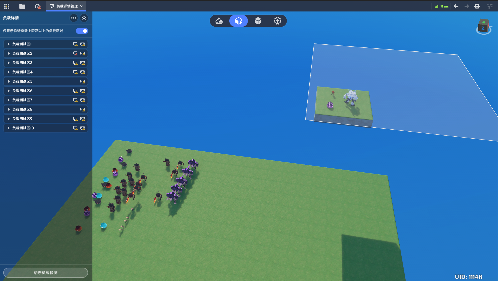

* ***指定朝向的**计算静态负载*

若玩家在不同的区域进行游玩，当朝向同样的位置时，可以看到/交互同样的关卡内容，可以理解不同的区域，在负载计算时，可能会包含同样的关卡内容。提供上述的朝向信息做更细化的负载计算范围，便于创作者(奇匠)调整

举例下图说明，可能会有疑惑为什么白色区域的一片空地，也会有较高的负载计算

这是因为，实际计算距离会大于图示范围，负载计算以中心坐标起始，向指定朝向检测可见视距范围，图示范围仅用于展示起始点、朝向范围等信息

因此下图显示较高负载计算，是Z轴负向布设敌人过多造成的

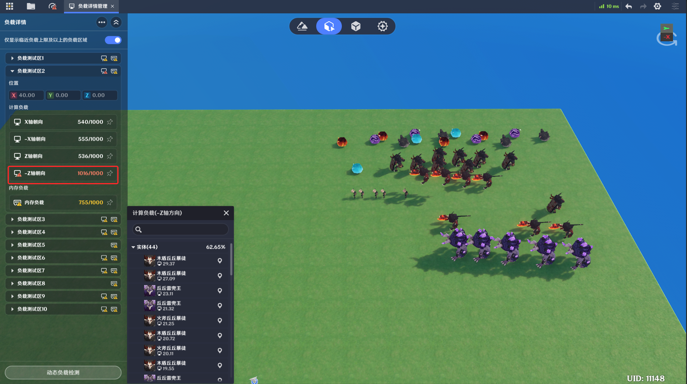

下图可以看出，两个区域的不同朝向，对同样的关卡内容都做了负载的统计，更加说明区域的负载计算是独立的

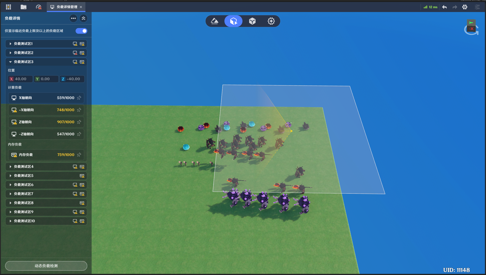

通过选择具体朝向，可以查看负载计算朝向信息，并且会列出包含在该计算中的所有实体枚举及其占用的负载数值

|  |  |  |
| --- | --- | --- |
| 参数 | 说明 | |
| \位置 | 分区域计算负载的中心位置 | |
| \朝向 | 以中心坐标起始，向指定朝向检测的80m范围内，负载计算数值展示  编辑场景中，会同步展示对应的朝向范围。 | |
| 视锥-红色  代表计算静态负载，超出推荐值 |  |
| 视锥-黄色  代表计算静态负载，接近推荐值 |  |
| 视锥-白色  代表计算静态负载，小于推荐值 |  |
| \计算静态负载 | 当前朝向的**计算静态负载**/推荐上限值  首先区域会计算以点位为中心，在指定朝向，且处于可见视距范围内的实体的负载  其次，根据实体和中心点的距离，会对实体以距离系数进行二次计算，最终实体的负载之和为计算静态负载  如下图，同样的八个史莱姆，根据距离中心点距离的不同，负载值也有不同计算结果，距离越远，负载越小。  而下图中，红色区域包含16个史莱姆，蓝色区域仅包含8个史莱姆，即便距离远距离系数小，红色区域依然会因为包含更多的实体而承担更多的计算负载。 | |
| \内存静态负载 | 当前区域的**内存静态负载** | |

# 五、动态负载计算

在关卡运行时，通过节点图创生的实体和特效等，会对运行的负载造成影响，这部分无法通过静态计算预估。因此提供了动态负载计算功能，便于创作者(奇匠)获取关卡运行的负载数据，进行调整。

## 1.动态负载计算窗口

打开千星沙箱，通过菜单栏的**窗口**打开**负载检测**窗口

## 2.开启动态负载计算

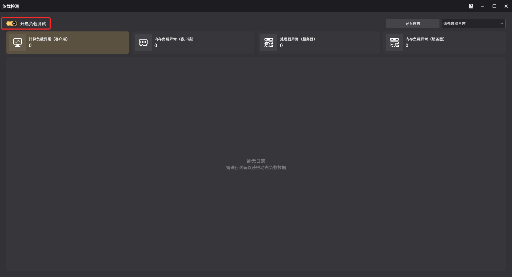

* 打开左上角的**开启负载测试**开关
* 进行关卡的**试玩**

在关卡运行开始，即会进行动态负载的检测，并对运行期间超出推荐值的时刻进行截图

*注意事项：*开启动态负载测试，也会带来负载的影响

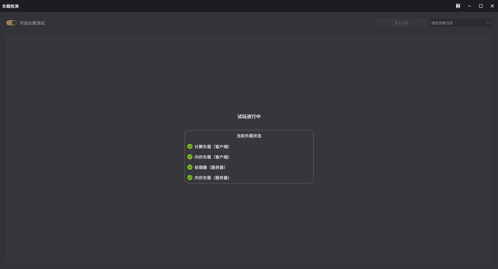

结束试玩之后，关卡的动态负载日志将会自动导入

*注意事项：*试玩和查看报告期间请不要关闭负载测试开关

## 3.查看动态负载计算报告

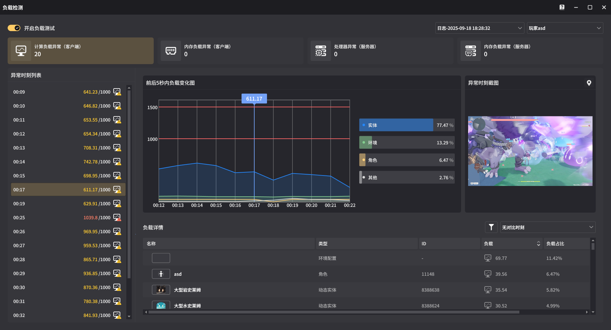

**子菜单**

|  |  |
| --- | --- |
| 参数 | 说明 |
| \计算负载异常(客户端) | 计算动态负载已接近上限或超标时，提供详情数据，推荐调整 |
| \内存负载异常(客户端) | 内存动态负载计算已接近上限或超标时，提供详情数据，推荐调整 |
| \处理器异常(服务器) | 服务端处理器已接近上限或超标时，提供详情数据，推荐调整 |
| \内存负载异常(服务器) | 服务端内存已接近上限或超标时，提供详情数据，推荐调整 |

### **(1)客户端计算负载异常**

* **负载检测工具提示**

* **负载检测工具详情**

\异常时刻列表

试玩时间段内，每一秒进行数据统计。

若计算动态负载超出推荐值，则会截图记录，记录按照时间顺序在此处枚举

选择后可查看详情

\异常时刻对比图

以选定的异常时刻作为图表的中心，实际运行截图会展示在右侧，支持选择前后各5s的时刻（若存在）进行负载详情数据的对比

选定图表/筛选栏中的异常时刻，负载详情会展示选定时刻和异常时刻的负载数据对比

\负载详情

选定的异常时刻，数据截图在此处列出，包括运行时的实体，以及环境信息。

展开实体，还可以查看对应实体的挂载特效等信息

### **(2)客户端内存负载异常**

内存动态负载的界面数据展示区块，意义和客户端计算负载异常相同。

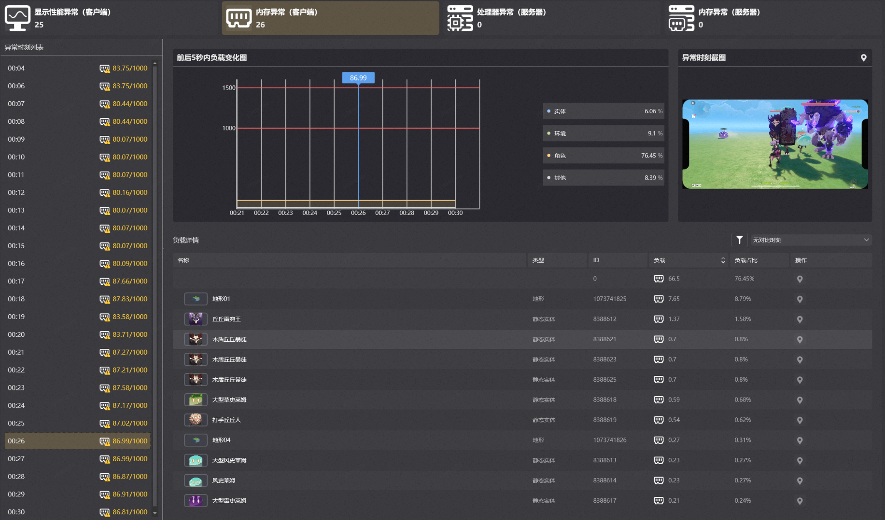

### **(3)服务端处理器异常**

* **关卡运行中提示**

* **负载检测工具提示**

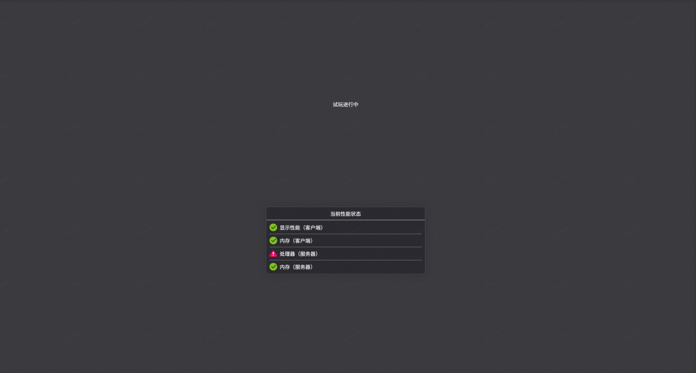

* **负载检测工具详情**

|  |  |  |
| --- | --- | --- |
| 参数 | 说明 | |
| 异常记录 | 异常原因会进行标注 | |
| 系统内容 | 系统必要功能占据处理器负载说明 | |
| 异常节点图 | 异常节点图占据处理器负载说明 | |
| 详情 | ID | 节点图的ID |
|  | 负载 | 指定功能的负载数值 |
|  | 负载占比 | 指定功能的负载占据总负载的百分比 |
|  | 所属实体 | 若目标为节点图，会提供所属实体 |
|  | 操作 | 可定位节点图，直接打开编辑 |

### **(4)服务端内存负载异常**

* **负载检测工具详情**

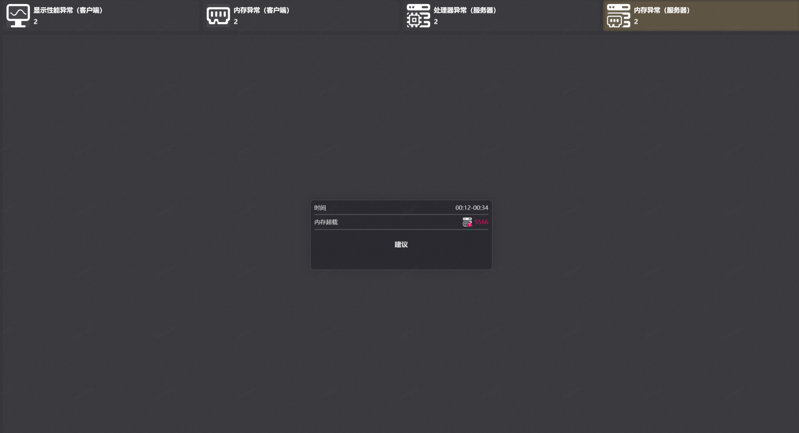

会提示服务端内存占用异常，以及占用总量

根据内存异常的不同原因，会提供相应的建议
