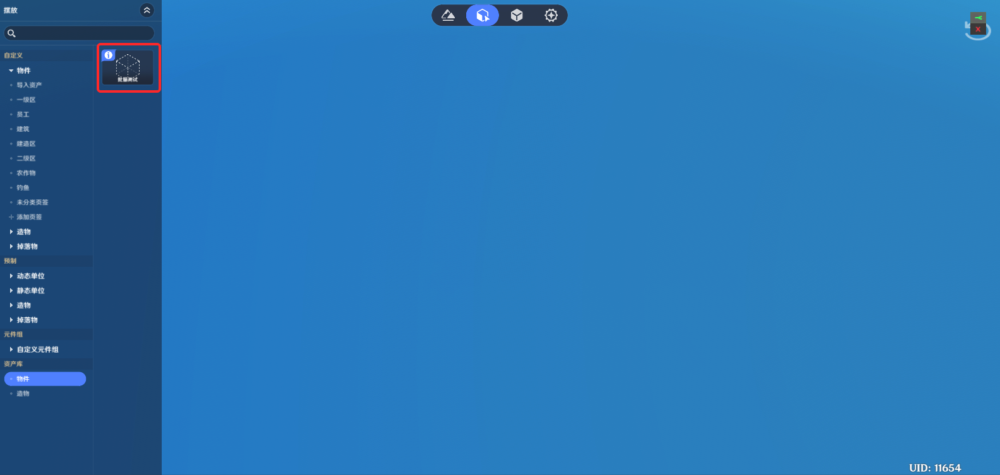

# 一、功能简介

资产导入导出功能用于将选中的已创作好的内容/内容集合变为一份数据存档，可供后续自己或他人导入并重复使用。

# 二、导出方式1 - 关卡内选中

## 1.入口

### (1)右键菜单

* 地形编辑 - 地形实体，物件实体，造物实体。
* 实体摆放 - 物件实体，造物实体。
* 元件库 - 物件元件，造物元件。
* 千星沙箱 - 服务器节点图，复合节点。

### (2)资产栏右键

* 元件库 - 物件元件，造物元件。
* 战斗预设 - 技能，状态，道具

## 2.功能逻辑

将选中内容生成一份以.gia格式结尾的存档文件。

## 3.关联项导出

* 元件导出时
* 挂载节点图跟随文件同步导ca38-4f5f-8f1dcb83e35d.png)7db-019532d371cc.png)体导出时
* 归属元件（如有），挂载节点图同步导出

## 4.操作流程

* 选择希望导出的内容，点击功能资产导

* 选择导出至本地的文件夹，输入文件名。

* 等待文件生成。

* 导出流程结束，存档文件生成于所选文件路径。

# 三、导出方式2 - 关卡内多选导出

## **1.入口**

* 地形编辑 - 地形实体，物件实体，造物实体b-41b8-851c-b6af3da5e3f3.png)体摆放 - 物件实体，造物实体。
* 元件库 - 物件元件，造物元件。

## *2700-41ea-ae2d-dc560d9707e4.png)e19-b64b35430bdd.png)ed3-b5ec-412f0b789596.png)a59e-90a5d9e58bab.png)d83-3cc83953b658.png)d7.png)逻辑**

多选内容导出时，以组合资产的形式导出形成单个文件（.7f6d9a5f.png)216b-493b-86b8-fae948b7350b.png)-8f5a-08c74aa0bebb.png)-4eff-94d0-11feb1a3bd2a.png)外部资产加载后，将以组合包的形式出现在【导入与转存】界面。

资产转存后，以组合资产的形式出现在【导入资产】资产栏可供使用。

## **3.操作流程**

-47ca-8b92-e83381d5d30f.png)中单个内容保持一# **4.关联项导出**

* 元件导出时
* 挂载节点图跟随文件同步导出。
* 实体导出时
* 归属元件（如有），挂载节点图同步导出。

# 四、导出方式3 - 界面单选/多选导 **1.入口**

系统菜单 - 资产导入导出工具

## **2.主界面**

## **3.功能逻辑**

该功能用于快捷进行多内容的选择导出，可选择内容：所有的具备单个导出功能的资产类型。整体功能逻辑与关卡内选中一致，内容多选时会以组合资产的形式导出形成单个文件（.gia），后续也以组合资产为单位进行使用。

## **4.操作流程**

* 点击选择/取消选择希望导出的资产。

* 通过按钮打开【已选内容管理】的面板。

* 完成内容选择后，点击导出资产按钮。

查看提示信息后，点击确认按钮。

* 选择导出至本地的文件夹，输入文件名。

* 等待文件生成。

# 五、本地资产导入/加载流程

## 1.入口

系统菜单 - 资产导入导出工具

## 2.功能逻辑

将指定的本地文件夹中的存档文件读取至千星沙箱内的资产库页签内，以供创作时使用。

每次本地资产导入进行时，会清空千星沙箱内所有资产库页签内的资产内容，并更新为新导入内容。

## 3.自动导入

应用运行周期内（应用关闭后重新计算）首次打开千星沙箱时，会自动进行一次本地文件加载。

## 4.操作流程

* 切到导入与转存页签。
* 点击右下角加载外部资产。
* 提示窗口点击加载外部资产。

* 等待外部资产加载完成。

* 弹出白字提示，所有文件添加成功。

## 5.查看资产

创作者(奇匠)可通过资产包右键功能查看组合包内所有资产。

# 六、资产使用流程

## 1.入口

* 各类型资产 - 资产栏 - 资产库
* 节点图管理器/节点管理器 - 文件夹 - 节点图外部资产/节点外部资产

## 2.功能逻辑

* 元件资产使用 - 将元件资产添加至指定自定义资产栏页签内。
* 实体资产使用 - 将实体资产添加至关卡内。

## 3.关联项导入

资产使用时，关联节点图，元件将被同步添加至默认分类页签/导入资产页签内。

## 4.操作流程

* 左键点击/右键菜单内选择转存资产。

* 弹出页签选择确认弹窗。

* 弹出白字提示，资产使用成功。

# 七、资产使用方式 - 组合内容

## **1.入口**

组合内容会同时出现在【组合资产】内含有的所有资产类型的资产栏处。

## **2.功能逻辑**

组合资产使用时，资产内的所有资产（例：元件、实体和节点图）会同步添加。

## **3.操作流程**

组合资产使用时，可选择所有资产同步添加至【默认页签】或【导入资产】页签内。（注：资产选择添加至导入资产页签，如没有该页签，系统会自动添加。）

# 八、引用关系恢复

## **1.功能逻辑**

通过[资产导入导出-三、导出方式2 - 关卡内多选导出](/ys/ugc/tutorial//detail/mhxbd59urbfu#NvCw4TM8-sd3mDnaaUspEK)/ [资产导入导出-四、导出方式3 - 界面单选/多选导出](/ys/ugc/tutorial//detail/mhxbd59urbfu#NcnPkUoM7qQNDjgY8BgnKE)导出组合资产时，组合内所有资产间的引用关系会被记录。当组合资产被使用时，通过GUID形成的引用关系将通过替换的方式保持引用关系。（即：只要属于同一批的组合资产，资产间的相对引用关系将在导入前及使用后保持一致）

## **2.注意事项**

* 为保证引用关系的正确保留，存在引用关系的资产建议同时通过导出功能形成组合资产进行使用。