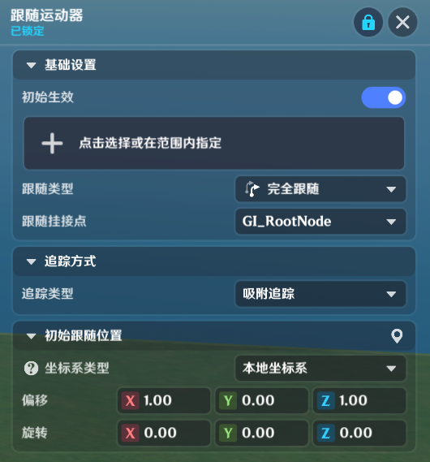
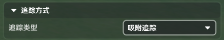
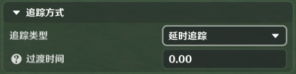
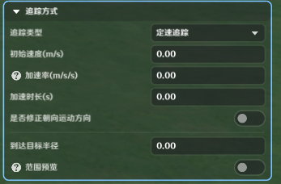
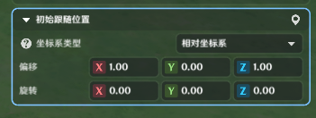
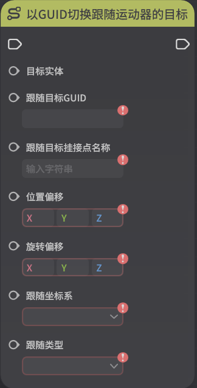

# 跟随运动器

**URL**: https://act.mihoyo.com/ys/ugc/tutorial/detail/mhuts59m9gju

**爬取时间**: 2026-01-04 08:14:19

---

## 跟随运动器

# 一、跟随运动器组件的功能

跟随运动器组件赋予实体跟随另一个实体运动的功能

跟随运动器组件上同时只能生效一个跟随运动器

# 二、跟随运动器组件的编辑

(1)在实体/元件编辑界面中，打开组件编辑页签

(2)点击下方的“添加通用组件”，选择并点击“跟随运动器”，成功添加

(3)点击“详细编辑”，展开编辑页

# 三、参数配置

跟随运动器的参数如下：

## 1.基础设置

初始生效：在实体创建后是否立即生效

追踪目标：可以选择跟随运动器的跟随目标，初始也支持不设置，后续通过节点图进行动态指定

跟随类型：目前提供了三种跟随类型

* *完全跟随：同时跟随位置和朝向*
* *跟随位置：仅跟随目标的位置，朝向保持不变*
* *跟随旋转：仅跟随目标的朝向，位置保持不变*

跟随挂接点：指定跟随目标的挂接点

## 2.追踪方式

追踪方式定义了当实体上的跟随运动器组件执行追踪逻辑时，追踪表现的细节行为定义，目前提供了三种行为表现：

### (1)吸附追踪

该方式会严格根据跟随位置的配置进行吸附

### (2)延时追踪

带有过渡时间的追踪赶方式。当跟随目标发生位置变化时，跟随运动器会在配置的过渡时间内逐步跟随到设定的跟随位置

过渡时间：追踪到目标跟随位置需要的时长

### (3)定速追踪

使用指定速度进行跟随的追踪方式。当跟随目标发生位置变化时，跟随运动器会用指定的速度进行跟随。

初始速度：跟随运动器的初始速度

加速率：每秒的速度提升值

加速时长：加速行为的时长

是否修正朝向运动方向：为“是”时，将会自动调整实体的向前朝向为速度朝向

到达目标半径：在追踪行为中跟随实体和被跟随实体的距离小于目标半径时，被视为追踪赶完成，追踪完成后的表现会和“吸附”相同

## 3.初始跟随位置

坐标系类型：决定了跟随时的偏移基于目标的世界坐标系还是相对坐标系

偏移：基于跟随目标的位置偏移值

旋转：基于跟随目标的朝向向偏移值

# 四、使用节点图控制跟随运动器

激活/关闭跟随运动器

以实体切换跟随运动器的目标

以GUID切换跟随运动器的目标

获取当前跟随运动器的目标

