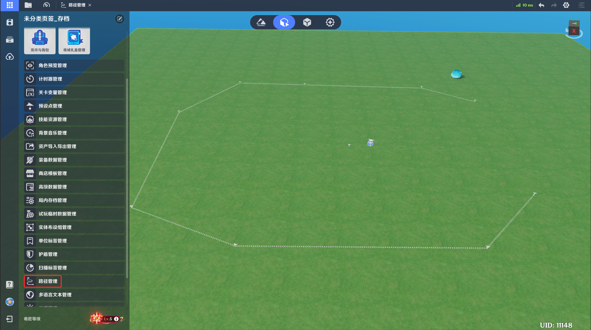
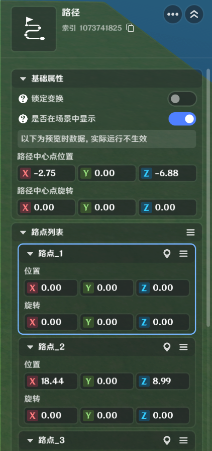

# 一、路径的功能

路径是将一至多个只包含位置和旋转信息的*路点*，汇总为一组路径信息的功能。

路径中的路点信息为世界坐标和旋转，不会因为被引用而被调整数据内容。

路径可被任意支持功能所引用，目前包括*造物*的*未入战-巡逻*功能、基础运动器组件的关卡路径运动。

# 二、路径管理工具的功能

*路径*通过路径管理工具进行统一管理

可以新增/删除路径，以及对路径内数据进行调整

可以管理路径的页签

# **三、路径的编辑**

## 1.入口

打开左上角系统菜单，选择*路径管理*，打开路径管理工具

## 2.工具展示界面

分为路径管理栏、路径配置栏

88e8b888-2347-4a4b-9f84-6d776d143b31.png)s/092d7e31-cbab-4452-a3e9-46bd285b041e.png)7de88a-db11-4916-8eab-a0bd69029ebf.png)42e9-8ffd-cdfb813dce17.png)-b9ce-36b2894a2c6b.png)s/d17a83e0-884d-49eb-ab59-eb0a81488b45.png)b-8873-676e034.png)1a9006d69c02dc55_1818194431287328309.png)

### **(1)路径管理栏**

* 新建路径

通过【创建路径】可以新建路径

新建的路径默认属于*\*未分类页签*

并以屏幕中路径的第一个路点

* 管理页签

选择*\*未分类页签*的可以新增页签，并对新增的页签命名

新增页签默认内容为空，可以指定路径，右键选择*\*更改页签*，调整路径所在的页签，便于管理

### **(2)路径配置栏**

* 索引和命名

|  |  |
| --- | --- |
| 配置参数 | 说明 |
| *\*名称* | 可用于标识的路径名称，不可重复，
| *索引* | 路径的唯一标识，可用作节点图入参 |

* 基础配置

|  |  |
| --- | --- |
| 配置参数 | 说明 |
| *\*锁定变换* | 若开启，则新增和删除路点，不可调节任意路点的信息 |
| *\*是否在场景中显示* | 若开启，则场景中会显示该路径的所有路点和连接顺序 |
| *\*路径中心点位置* | 路径的中心点位置，这个位置和所有路点的相对位置会保持不变。因此修改该位置可以影响该路径的所有路点的位置 |
| *\*路径中心点旋转* | 路径的中心点旋转，这个旋转和所有路点的相对旋转会保持不变。因此修改该旋转可以影响该路径的所有路点的旋转 |

* 路点列表

|  |  |
| --- | --- |
| 配置参数 | 说明 |
| *位置* | 可手动调整参数，修正路点位置 |
| *旋转* | 可手动调整参数，修正路点旋转 |
| *\*添加路点* | 点击创建新路点 |
| *\*自由放置* | 点击后编辑界面清空，通过鼠标左键点击场景，创建新路点    通过可以结束新建路点操作 |

点击路点的右侧按钮可展开辅助编辑

|  |  |
| --- | --- |
| 配置参数 | 说明 |
| *指向终点方向切线* | 调整路点旋转指向下一个路点 |
| *指向起点方向切线* | 调整路点旋转指向上一个路点 |
| *全选路径内路点* | 选中该路径上的所有路径点，若没有路径点则置灰 |
| *向终点方向新增路点* | 路点列表，在该点的序号后添加一个路点。  例如在2号路点添加一个后序路点，新增路点为3号路点，之前的3号路点会成为4号路点 |
| *向起点方向新增路点* | 路点列表，在该点的序号前添加一个路点。  例如在2号路点添加一个前序路点，新增路点为2号路点，之前的2号路点会成为3号路点 |
| *复制* | 复制路点的坐标和旋转信息 |
| *粘贴* | 粘贴已复制的路点坐标和旋转信息 |
| *删除该路点* | 删除指定路点 |

* 引用溯源

|  |  |
| --- | --- |
| 配置参数 | 说明 |
| *\*造物引用* | 显示该路径被引用次数  可定位引用该路径的造物 |
| *\*物件引用* | 显示该路径被引用次数  可定位引用该路径的物件 |

# 三、通过节点图管理路径

* **获取指定路径点信息**

