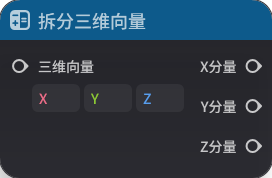
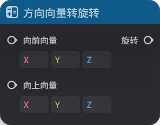
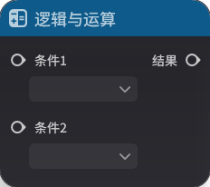
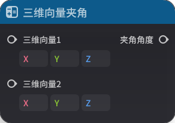
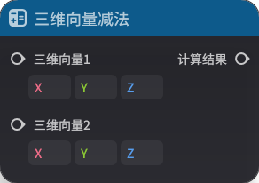
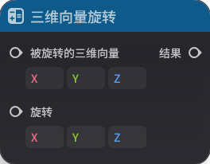

# 一、通用

## **1.枚举匹配**

**节点功能**

确认枚举的类型后，判断两个输入的值是否相等

**节点参数**

|  |  |  |  |
| --- | --- | --- | --- |
| **参数类型** | **参数名** | **类型** | **说明** |
| 入参 | 枚举1 | 泛型 |  |
| 入参 | 枚举2 | 泛型 |  |
| 出参 | 结果 | 布尔值 | 相等输出“是”，不相等输出“否” |

## **2.是否相等**

**节点功能**

判断两个输入是否相等

部分参数类型有较为特殊的判定规则：

浮点数：浮点数采用近似相等进行比较，当两个浮点数小于一个极小值时，这两个浮点数认为相等。例如：2.0000001与2.0认为相等

三维向量：三维向量的x、y、z分别采用浮点数近似相等比较

**节点参数**

|  |  |  |  |
| --- | --- | --- | --- |
| **参数类型** | **参数名** | **类型** | **说明** |
| 入参 |  | 泛型 |  |
| 入参 |  | 泛型 |  |
| 出参 | 结果 | 布尔值 |  |

## **3.数据类型转换**

**节点功能**

将输入的参数类型转换为另一种类型输出。具体规则见[基础概念](./基础概念_mhk23ora.md)-【基础数据类型之间的转换规则】

**节点参数**

|  |  |  |  |
| --- | --- | --- | --- |
| **参数类型** | **参数名** | **类型** | **说明** |
| 输入 | 泛型 |  |
| 出参 | 转换结果 | 泛型 |  |

# 二、数学

## **1.拆分三维向量**

**节点功能**

将三维向量的x、y、z分量输出为三个浮点数

**节点参数**

|  |  |  |  |
| --- | --- | --- | --- |
| **参数类型** | **参数名** | **类型** | * |
| 入参 | 三维向量 | 三维向量 |  |
| 出参 | X分量 | 浮点数 |  |
| 出参 | Y分量 | 浮点数 |  |
| 出参 | Z分量 | 浮点数 |  |

## **2.朝向转旋转**

**节点功能**向量转化为欧拉角

**节点参数**

|  |  |  |  |
| --- | --- | --- | --- |
| **参数类型** | **参数名** | **类型** | **说明** |
| 入参 | 朝向 | 三维向量 |  |
| 出参 | 旋转 | 三维向量 |  |**3.乘法运算**

**节点功能**

乘法运算，支持浮点数乘法和整数乘法

**节点参数**

|  |  |  |  |
| --- | --- | --- | --- |
| **参数类型** | **参数名** | **类型** | **说明** |
| 入参 |  | 泛型 |  |
| 入参 |  | 泛型 |  | | 结果 | 泛型 |  |

## **4.除法运算**

**节点功能**

除法运算，支持浮点数除法和整数除法。整数除法返回整除结果

除数不应为0，否则可能返回非法值

**节点参数**

|  |  |  |  |
| --- | ---- | --- |
| **参数类型** | **参数名** | **类型** | **说明** |
| 入参 |  | 泛型 |  |
| 入参 |  | 泛型 |  |
| 出参 | 结果 | 泛型 |  |

## **5.反余弦函数**

节点功能**

计算输入的反余弦值，返回为弧度值

**节点参数**

|  |  |  |  |
| --- | --- | --- | --- |
| **参数类型** | **参数名** | **类型** | **说明** |
| 入参 | 输入 | 浮点数
| 出参 | 弧度 | 浮点数 |  |

## **6.反正切函数**

**节点功能**

计算输入的反正切值，返回为弧度值

**节点参数**

|  |  |  |  |
| --- | --- | --- | --- |
| **参数类型** | **参数名** | **类型** | **说明** |
| 入参 | 输入 | 浮点数 |  |
| 出参 | 弧度 | 浮点数 |   **7.反正弦函数**

**节点功能**

计算输入的反正弦值，返回为弧度值

**节点参数**

|  |  |  |  |
| --- | --- | --- | --- |
| **参数类型** | **参数名** | **| **说明** |
| 入参 | 输入 | 浮点数 |  |
| 出参 | 弧度 | 浮点数 |  |

## **8.方向向量转旋转**

**节点功能**

给定向前向量和向上向量，转化为欧拉角

**节点参数**

|  |  |  |  |
| --- | --- | --- | --- |
| **参数类型** |名** | **类型** | **说明** |
| 入参 | 向前向量 | 三维向量 | 表示单位期望的朝向 |
| 入参 | 向上向量 | 三维向量 | 定义单位的上方向（用于确定旋转的旋转角度），默认值为世界坐标系Y轴正方向 |
| 出参 | 旋转 | 三维向量 |  |

#.弧度转角度**

**节点功能**

将弧度值转为角度值

**节点参数**

|  |  |  |  |
| --- | --- | --- | --- |
| **参数类型** | **参数名** | **类型** | **说明** |
| 入参 | 弧度 | 浮 |
| 出参 | 角度 | 浮点数 |  |

## **10.获取随机数**

**节点功能**

获取一个大于等于下限，小于等于上限的随机数。注意该节点生成的随机数包含上下限

**节点参数**

|  |  |  |  |
|| --- | --- | --- |
| **参数类型** | **参数名** | **类型** | **说明** |
| 入参 | 下限 | 泛型 |  |
| 入参 | 上限 | 泛型 |  |
| 出参 | 随机数 | 泛型 |  |**11.加法运算**

**节点功能**

计算两个浮点数或整数的加法

**节点参数**

|  |  |  |  |
| --- | --- | --- | --- |
| **参数类型** | **参数名** | **类型** | **说
| 入参 |  | 泛型 |  |
| 入参 |  | 泛型 |  |
| 出参 | 结果 | 泛型 |  |

## **12.减法运算**

**节点功能**

计算两个浮点数或整数的减法

**节点参数**

|  |  |  |  |
| --- | --- | --- | --- |
数类型** | **参数名** | **类型** | **说明** |
| 入参 |  | 泛型 |  |
| 入参 |  | 泛型 |  |
| 出参 | 结果 | 泛型 |  |

## **13.角度转弧度**

**节点功能**

将角度值转为弧度值

**节点参数**

|  |  | 
| --- | --- | --- | --- |
| **参数类型** | **参数名** | **类型** | **说明** |
| 入参 | 角度 | 浮点数 |  |
| 出参 | 弧度 | 浮点数 |  |

## **14.绝对值运算**

**节点功能**

返回输入的绝对值

***

|  |  |  |  |
| --- | --- | --- | --- |
| **参数类型** | **参数名** | **类型** | **说明** |
| 入参 | 输入 | 泛型 |  |
| 出参 | 结果 | 泛型 |  |

## **15.逻*

**节点功能**

对输入的布尔值进行非运算后输出

**节点参数**

|  |  |  |  |
| --- | --- | --- | --- |
| **参数类型** | **参数名** | **类型** | **说明** |
| 入参 | 条件 | 布尔值 |  |
| 出参 | 结果  |  |

## **16.逻辑或运算**

**节点功能**

对输入的两个布尔值进行或运算后输出

**节点参数**

|  |  |  |  |
| --- | --- | --- | --- |
| **参数类型** | **参数名** | **类型** | **说明** |
| 入参 | 条件1 | 布尔|
| 入参 | 条件2 | 布尔值 |  |
| 出参 | 结果 | 布尔值 |  |

## **17.逻辑异或运算**

**节点功能**

对输入的两个布尔值进行异或运算后输出

**节点参数**

|  |  |  |  |
| --- | --- | --- | --- |
| **参数类型**参数名** | **类型** | **说明** |
| 入参 | 条件1 | 布尔值 |  |
| 入参 | 条件2 | 布尔值 |  |
| 出参 | 结果 | 布尔值 |  |

## **18.逻辑与运算**

**节点功能**

对输尔值进行与运算后输出

**节点参数**

|  |  |  |  |
| --- | --- | --- | --- |
| **参数类型** | **参数名** | **类型** | **说明** |
| 入参 | 条件1 | 布尔值 |  |
| 入参 | 条件2 | 布尔值 |  |
| 出参 | 结果 | 布尔值 |## **19.三维向量归一化**

**节点功能**

将三维向量的长度归一化后输出

**节点参数**

|  |  |  |  |
| --- | --- | --- | --- |
| **参数类型** | **参数名** | **类型** | **说明** |
| 入参 | 三维向量 | 三维向量 | 出参 | 结果 | 三维向量 |  |

## **20.三维向量加法**

**节点功能**

计算两个三维向量的加法

**节点参数**

|  |  |  |  |
| --- | --- | --- | --- |
| **参数类型** | **参数名** | **类型** | **说明** |
| 入维向量1 | 三维向量 |  |
| 入参 | 三维向量2 | 三维向量 |  |
| 出参 | 计算结果 | 三维向量 |  |

## **21.三维向量夹角**

**节点功能**

计算两个三维向量之间的夹角，以角度输出

**节点参数**

|  |  |  |  |
| --- | --- | --- | --- |
|类型** | **参数名** | **类型** | **说明** |
| 入参 | 三维向量1 | 三维向量 |  |
| 入参 | 三维向量2 | 三维向量 |  |
| 出参 | 夹角角度 | 浮点数 |  |

## **22.三维向量减法**

**节点功能*两个三维向量的减法

**节点参数**

|  |  |  |  |
| --- | --- | --- | --- |
| **参数类型** | **参数名** | **类型** | **说明** |
| 入参 | 三维向量1 | 三维向量 |  |
| 入参 | 三维向量2 | |  |
| 出参 | 计算结果 | 三维向量 |  |

## **23.三维向量模运算**

**节点功能**

计算输入三维向量的模

**节点参数**

|  |  |  |  |
| --- | --- | --- | --- |
| **参数类型** |名** | **类型** | **说明** |
| 入参 | 三维向量 | 三维向量 |  |
| 出参 | 结果 | 浮点数 |  |

## **24.三维向量内积**

**节点功能**

计算两个输入三维向量的内积（点乘）

**节点参数**

|  |  ||
| --- | --- | --- | --- |
| **参数类型** | **参数名** | **类型** | **说明** |
| 入参 | 三维向量1 | 三维向量 |  |
| 入参 | 三维向量2 | 三维向量 |  |
| 出参结果 | 浮点数 |  |

## **25.三维向量缩放**

**节点功能**

将输入的三维向量缩放后输出（三维向量数乘）

**节点参数**

|  |  |  |  |
| --- | --- | --- | --- |
数类型** | **参数名** | **类型** | **说明** |
| 入参 | 缩放倍率 | 浮点数 |  |
| 入参 | 三维向量 | 三维向量 |  |
| 出参 | 结果 | 三维向量 |  |

## **26.三维向量外积**

!
**节点功能**

计算两个三维向量的外积（叉乘）

**节点参数**

|  |  |  |  |
| --- | --- | --- | --- |
| **参数类型** | **参数名** | **类型** | **说明** |
| 入参 | 三维向量1 | 三维向量 |  |
| 入参 | 三维向量2 | 三维向量 |  |
| 出参 | 计算结果 | 三维向|

## **27.三维向量旋转**

**节点功能**

将被旋转的三维向量，按照旋转所表示的欧拉角进行旋转后返回结果

**节点参数**

|  |  |  |  |
| --- | --- | --- | --- |
| **参数类型** | **参数名** | **类型** | **说明** |
| 入参 | 被旋转的三维向量 | 三维向量 |  |
| 入参 | 旋转 | 三维向量 |  |
| 出参 | 结果 | 三维向量 |  |

## **28.是否大于**

**节点功能**

返回左值是否大于右值

**节点参数**

|  |  |  |  |
| --- | --- | --- | --- |
| **参数类型** | **参数名** | **类型** | **说明** |
| 入参 |  | 泛型 |  |
| 入参 |  | 泛型 |  |
| 出参 | 结果 | 布尔值 |  |

## **29.是否大于等于**

**节点功能**

返回左值是否大于等于右值

**节点参数**

|  |  |  |  |
| --- | --- | --- | --- |
| **参数类型** | **参数名** | **类型** | **说明** |
| 入参 |  | 泛型 |  |
| 入参 |  | 泛型 |  |
| 出参 | 结果 | 布尔值 |  |

## **30.是否小于**

**节点功能**

返回左值是否小于右值

**节点参数**

|  |  |  |  |
| --- | --- | --- | --- |
| **参数类型** | **参数名** | **类型** | **说明** |
| 入参 |  | 泛型 |  |
| 入参 |  | 泛型 |  |
| 出参 | 结果 | 布尔值 |  |

## **31.是否小于等于**

**节点功能**

返回左值是否小于等于右值

**节点参数**

|  |  |  |  |
| --- | --- | --- | --- |
| **参数类型** | **参数名** | **类型** | **说明** |
| 入参 |  | 泛型 |  |
| 入参 |  | 泛型 |  |
| 出参 | 结果 | 布尔值 |  |

## **32.余弦函数**

**节点功能**

计算输入弧度的余弦

**节点参数**

|  |  |  |  |
| --- | --- | --- | --- |
| **参数类型** | **参数名** | **类型** | **说明** |
| 入参 | 弧度 | 浮点数 |  |
| 出参 | 结果 | 浮点数 |  |

## **33.正切函数**

**节点功能**

计算输入弧度的正切

**节点参数**

|  |  |  |  |
| --- | --- | --- | --- |
| **参数类型** | **参数名** | **类型** | **说明** |
| 入参 | 弧度 | 浮点数 |  |
| 出参 | 结果 | 浮点数 |  |

## **34.正弦函数**

**节点功能**

计算输入弧度的正弦

**节点参数**

|  |  |  |  |
| --- | --- | --- | --- |
| **参数类型** | **参数名** | **类型** | **说明** |
| 入参 | 弧度 | 浮点数 |  |
| 出参 | 结果 | 浮点数 |  |

## **35.创建三维向量**

**节点功能**

根据x、y、z分量创建一个三维向量

**节点参数**

|  |  |  |  |
| --- | --- | --- | --- |
| **参数类型** | **参数名** | **类型** | **说明** |
| 入参 | X分量 | 浮点数 |  |
| 入参 | Y分量 | 浮点数 |  |
| 入参 | Z分量 | 浮点数 |  |
| 出参 | 三维向量 | 三维向量 |  |

# 三、列表

## **1.拼装列表**

**节点功能**

将多个类型相同的入参(至多100个)拼装为一个列表

**节点参数**

|  |  |  |  |
| --- | --- | --- | --- |
| **参数类型** | **参数名** | **类型** | **说明** |
| 入参 | 0~99 | 泛型 | 将至多100个参数拼装为一个列表 |
| 出参 | 列表 | 泛型列表 | 拼装成的列表 |