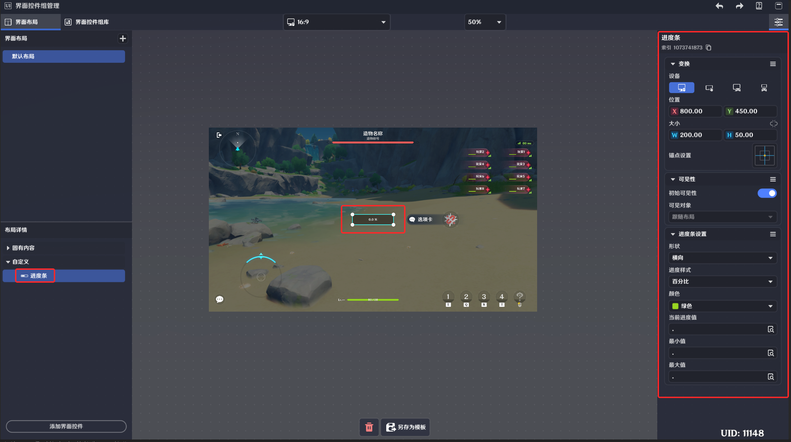

# 进度条界面控件

**URL**: https://act.mihoyo.com/ys/ugc/tutorial/detail/mhwpzpixrad0

**爬取时间**: 2026-01-04 08:21:16

---

## 进度条界面控件

# 一、进度条的功能

关卡运行中，可以实时展示需求变量在默认配置范围中占比的图形界面。

# **二、进度条的编辑**

形状 

|  |  |
| --- | --- |
| 横向 |  |
| 纵向 |  |
| 圆环 |  |

进度样式

|  |  |
| --- | --- |
| 不显示 | 隐藏进度提示文本 |
|  | |
| 百分比 | 按真实比例的百分比显示进度，精度为整数 |
|  | |
| 真实比例 | 实时显示真实比例 |
|  | |
| 当前值 | 实时显示当前值 |
|  | |

颜色

进度条内进度图形的底色

当前进度值

支持配置玩家和关卡的自定义变量

最小值

支持配置玩家和关卡的自定义变量

最大值

支持配置玩家和关卡的自定义变量
