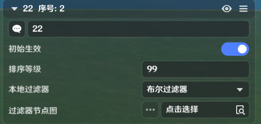
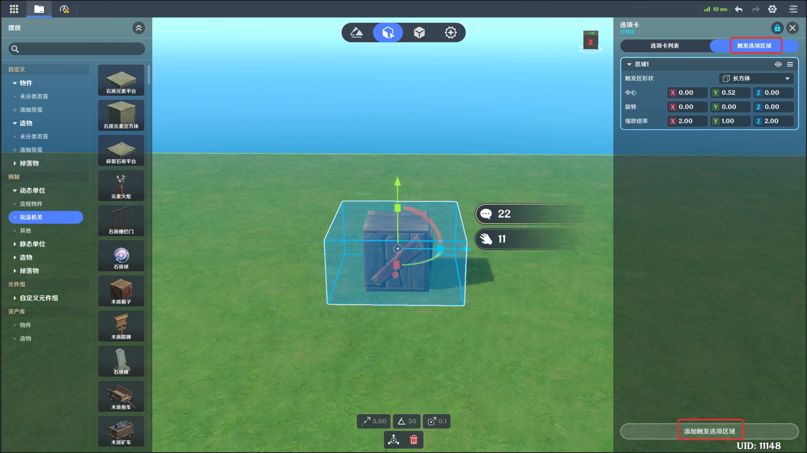

# 一、选项卡组件的功能

选项卡组件赋予玩家对动态物件和造物配置交互操作的功能

实体添加此组件后，支持同时配置、生效多个选项卡

每个选项卡支持通过本地过滤器判定对每个玩家是否显示

触发选项卡功能的实体类型为*角色*

# 二、选项卡组件的编辑

## 1.添加组件

(1)在实体或元件编辑界面中，打开组件编辑页签(A)

(2)点击下方的“添加通用组件”，选择并点击“选项卡”，成功添加(B)、(C)

选中“选项卡”时，编辑中的实体会以蓝色范围显示选项卡触发区

(3)点击“详细编辑”，展开编辑页(D)

## 2.选项卡的编辑

### (1)选项卡基础信息

|  |  |
| --- | --- |
| 配置参数 | 说明 |
| *初始生效选项卡* | 下拉菜单提供选项卡枚举  通过修改后面的勾选框，10-47ca-ba93-f488937bf84c.f6a44529.png)b-0a5f-49a2-8565-e209f5851e51.png)g)0-92483517bb95.png)ges/c423d851-cges/7a500877-045a-4ac1-91fa-e331d4757de9.png)s/77feb70d-503e-4841-8b9f-5812853dfdb2.png)7bd-b205-2d090c9c7acf.png)效情况，0f757bcc.png)-8dac-4128-bacc-b6e157f0f677.png)-4cd6-93bb-1d92ba524781.png)状态会同步到选项卡编辑页内 |
| *\*选项卡列表* | 枚举实体配置的所有选项卡 |

可以通过点击来切换选项卡在编辑窗口的可见性状态，仅编辑时生效

点击“详细编辑”可进表和触发区域
### (2)选项卡列表

* 新增选项卡

点击添加选项卡，可新增选项卡

* 选项卡编辑

*选项序号*  *序号**X*，可用于节点图入参，调整选项卡的生效与否

*选项卡图标* 点击，可切换选项卡前面的图标。

*初始生效* 若开启，则该选项卡随实体创建立即生效。生效的选项卡可见，并可操作选中

*排序等级*  控制选项卡的显示顺序，数字越大，显示越靠前

*本地过滤器* 分为布尔过滤器和整数过滤器两种。具体可见[节点图](./节点图_mhjwjrr5.md)

*过滤器节点图*  可引用上述选择类型的过滤器节点图，用于判断选项卡是否达成显示条件

以下用布尔过滤器举例

本地过滤器会在角色进入生效范围期间内，持续进行检测，若结果变化，立即更新显示。

对应本地过滤器节点图中的基础节点，进行说明

* 获取自身实体

输出参数为挂载选项卡组件的实体

* 获取目标实体

当自身角色在范围里，该节点输出参数为在选项卡生效范围内的自身角色实体

* 获取当前角色

输出参数为本地角色

* 举例说明

### (3)触发选项区域

* 添加触发区域

点击添加触发选项区域按键，可新增触发区域

* 触发区域

|  |  |
| --- | --- |
| 配置参数 | 说明 |
| *触发区形状* | 支持长方体、球体、胶囊体，根据选择的不同形状会展开具体的大小配置参数 |
| *中心* | 相对实体/元件中心的偏移 |
| *旋转* | 以中心位置为基准，在不同轴向上支持调整朝向 |
| *缩放倍率* | 触发区配置形状在不同轴向上支持定义缩放 |

# 三、通过节点图管理选项卡

* 激活/关闭选项卡

通过输入选项卡序号，可控制选项卡的激活与否

* 选项卡选中时

生效的选项卡被选中后，会向节点图发送事件

配置选项卡组件的实体节点图，会接受该事件

|  |  |
| --- | --- |
| 配置参数 | 说明 |
| *事件源实体* | 挂载选项卡组件的实体 |
| *事件源GUID* | 挂载选项卡组件的实体，若无则输出0 |
| *选项卡序号* | 选项卡的序号 |
| *选择者实体* | 触发选项卡时的角色实体 |