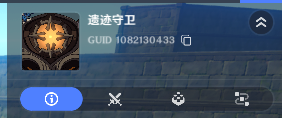
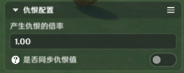
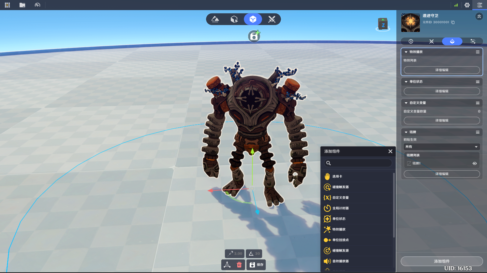

# 造物

**URL**: https://act.mihoyo.com/ys/ugc/tutorial/detail/mhufqo0c0tqw

**爬取时间**: 2026-01-04 08:05:59

---

## 造物

# 一、造物的定义

造物是对人型生物、元素生物、深渊魔物、异种魔兽、小动物、机械战斗单位等的统称

造物可以自主对敌对阵营的实体做出反应，包含但不限于入战、追踪

阵营详见阵营

# 二、造物的特点

造物实体依赖编辑时配置的*行为模式*决定其行为逻辑，不可在运行时动态替换。

造物实体运行时仅生效一种行为模式，造物会在整个生命周期内严格依据模式执行行为。

造物实体运行时，默认携带和自身模型相等大小的*受击盒*，可以正确接收战斗信息。

造物实体遵循实体的一切通用规则。

# 三、造物的行为模式

造物实体的行为模式均来自于预先提供的行为池，不同造物实体支持配置的行为模式数量和内容不同，支持编辑时进行选择，不支持实体运行时动态切换。

每种行为模式都分为*未入战*和*入战*两部分逻辑，这两部分也提供了对应的模式配置，在不同的行为模式下分别提供不同的配置参数。

### (1)非入战

当造物创建后，默认处于非入战状态

当造物入战后，通过各种原因脱战，会重新回到非入战状态

### (2)入战

当造物通过*范围感知*或*视野检测*获取到敌对关系的实体时，造物会以对应实体为目标，从非入战状态切换为入战状态

# 四、造物的编辑

## 1.基础信息

菜单栏第一栏，为基础信息栏

* **变换**

不支持空间X、Z轴的旋转，仅支持Y轴（水平朝向）的编辑

## 2.特化配置

菜单栏第二栏，为特化配置栏

### **(1)基础战斗属性**

从等级属性和固定属性两方面，支持创作者(奇匠)对造物进行参数的调整、成长曲线的规划，详见基础战斗属性

### (2)仇恨配置

详见[仇恨配置](仇恨配置_mhw9ut96q96y.md)

### (3)常规设置

详见[常规设置](常规设置_mh3rgo0c16c8.md)

## **3.组件功**能

菜单栏第三栏，为通用组件栏

通过下方的“添加通用组件”按键，可以按需选择组件挂载。

每一种组件最多挂载一次。

造物实体支持添加多种组件功能，包括

* [选项卡](选项卡_mh5jko05fzyw.md)
* [碰撞触发器](碰撞触发器_mh8w69rzuc3i.md)
* [自定义变量](自定义变量_mhso1b9wjica.md)
* [全局计时器](全局计时器_mhawd6rl5kpy.md)
* [单位状态](单位状态_mhd7nxrfa8im.md)
* [特效播放](特效播放_mh4ppo02m1o8.md)
* [自定义挂接点](自定义挂接点_mhmshmimtegs.md)
* [碰撞触发源](碰撞触发源_mhn95di01j84.md)
* [音效播放器](音效播放器_mhwiv89yra02.md)
* [背包组件](背包组件_mh5y5001vqd4.md)
* [战利品](战利品_mh63ox06afy8.md)
* [铭牌](铭牌_mh5n160t2b6w.md)
* [文本气泡](文本气泡_mhwtz297kp6a.md)
* [商店组件](商店组件_mho6gviqhsqs.md)
* [扫描标签](扫描标签_mhfc0lr1tcke.md)
* [小地图标识](小地图标识_mh0pppib5eyc.md)

## 4.节点图功能

菜单栏第四栏，为*节点图*配置栏

可引用预先配置的实体节点图，为造物添加逻辑功能
