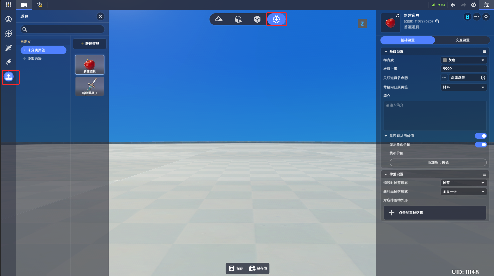
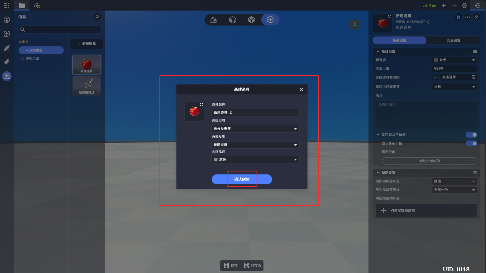
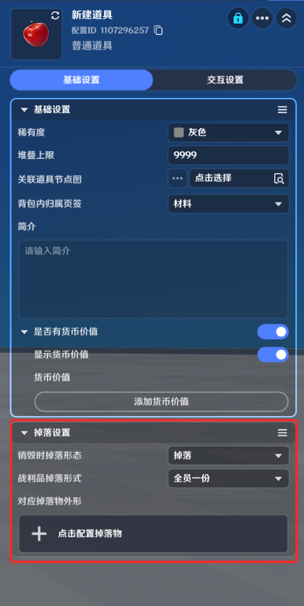

# 道具

**URL**: https://act.mihoyo.com/ys/ugc/tutorial/detail/mhbgx0rspbqu

**爬取时间**: 2026-01-04 08:25:21

---

## 道具

# 一、道具的定义

道具是玩家可以在局内获取、使用或装备的虚拟物品，在千星奇域中，道具被分为多种类型，都由道具背包作为容器，进行统一的管理

# 二、道具的分类

道具被分为装备、材料、消耗品、贵重物品几类

# 三、道具的编辑

在下图的道具页签中，可对道具进行编辑

点击新建道具按钮，在弹窗内选择确认创建即可新建一个道具模板

道具名称：在实际游玩时界面上显示的道具名

道具图标：在实际游玩时界面上显示的图标样式

配置ID：道具模板的唯一标识，可在节点图中使用

## 1.基础设置

基础设置主要定义了一个道具的外显信息，以及在背包内的显示形式

稀有度：稀有度决定了道具图标的底图颜色，目前提供了灰色、绿色、蓝色、紫色、橙色五种

堆叠上限：在道具进入背包时，一个背包栏位里可容纳的道具数量上限

关联道具节点图：当道具进入角色的背包时，关联的节点图会被附加到角色单位上

背包内归属页签：决定当道具进入背包后，会被分类在哪个页签当中

简介：道具的说明，游玩时会在界面中显示

是否有货币价值：选择为“是”，可以关联单个道具的货币价值，在商店模块中，作为其交易的价值锚定

显示货币价值：开启后在背包内会显示该道具的货币价值

货币价值：具有货币价值时，点击【添加货币价值】可配置具体的数值

## 2.掉落设置

道具可以以多种方式从背包里掉落到场景内，包括持有者被击倒、节点图主动触发等，掉落设置部分定义了当产生一次掉落行为时，具体执行的逻辑

销毁时掉落形态：当道具的持有者被击倒时，道具所执行的处理

掉落：持有者被击倒时道具转化为掉落物实体，创建在场景中

销毁：持有者被击倒时道具销毁

保留：持有者被击倒时道具保留在背包内，该设置仅在持有者是角色时有意义，如果为其他类型的实体则逻辑等同于销毁

战利品掉落形式：分为全员一份和每人一份

全员一份：所有玩家共享同一份掉落物，当一名玩家拾取时，其他玩家无法再次拾取

每人一份：每一个玩家的本地会独立掉落一份该道具，玩家之间的拾取行为互不干预

对应掉落物外形：配置一个掉落物元件，掉落物是一个有物理实体的元件，当虚拟道具被创建在场景上，会以对应掉落物的模型进行展示

## 3.交互设置

交互设置定义了玩家在背包中可以如何操作一个道具

允许销毁：玩家是否可以通过界面操作销毁背包内的该道具

允许交易：该道具是否可以在商店中出售

允许使用：玩家是否可以通过界面操作来使用道具

是否可批量使用：能否一次操作使用多个道具

进包后自动使用：为“是”时，获取该道具时会被自动使用

冷却时间(s)：道具在使用后会进入冷却，冷却时间内将无法再次使用

关系组冷却时间(s)：当该道具进入冷却时，会使冷却连带关系组关联的所有道具同时进入冷却，冷却时长等于该项配置值

冷却连带关系组：配置一个道具的列表，定义关系组内的所有道具
