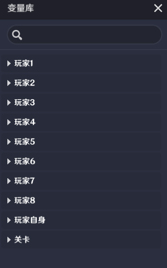
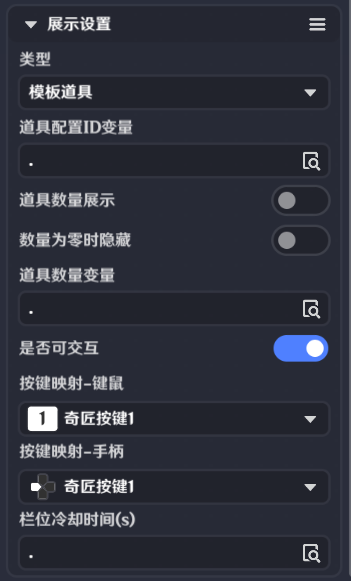

# 一、道具展示的功能

关卡运行中，点击和外接设备输入，都可以触发该界面控件的交互。

支持玩家进行交互，在选择类型为“玩家当前装备”或“模板道具”时，交互后向节点图发送*界面控件组触发时*事件

# **二、道具展示的编辑**

*是否可交互*

开启时可以配置交互的方式

*按键映射-键鼠*

提供PC按键供选择，作为输入交互项。选择后会显示在编辑窗口按键下方

-eb2d-46d5-ad91-2daca57db0e9.pnga8a.png)87328309.png)

*按键映射-手柄*

提供手柄按键供选择，作为输入交互项。选择后会显示在编辑窗口按键下方b5-4e1a-9f72-c894c39fceeb.png)()

*类型*

分为玩家当前装备、模板道具、背包内道具三种类型

* 玩家当前装备

*装备配*

可选取玩家自身的变量

*无装备时表现*

当前没有装备时，该控件的表现形式

分为显示空白槽位和隐藏两种

*栏位冷却时间(s)*

可选取玩家自身，玩家1-8，关卡上的某个自定义变量

*栏位使用次数*

开启后可以配置无次数时隐藏和无次数时隐藏*

开启后若无使用次数则隐藏该控件

*次数*

可选取玩家自身，玩家1-8，关卡上的某个自定义变量

* 模板道具

*道具配置ID变量*

可选取玩家自身，玩家1-8，关卡上的某个自定义变量

*道具数量展示*

开启后图标正下方会显示当前道具数量，图中00

*数量为零时隐藏*

开启后若道具数量为零时则隐藏该控件

*道具数量变量*

可选取玩家自身，玩家1-8，关卡上的某个自定义变量

*栏位冷却时间(s)*

可选取玩家自身，玩家1-8，关卡上的某个自定义变量

* 背包内道具

*道具配置ID变量*

可选取玩家自身上的某个自定义变量

*无道具时表现*

当前没有道具时，该控件的表现形式

分为显示空白槽位和隐藏两种

# 三、通过节点图管理道具展示

**界面控件组触发时**

在关卡运行中，通过按钮界面控件制作的界面控件组，被执行交互操作会发送节点图事件”界面控件组触发时“，此事件只有触发交互的*玩家*节点图可以获取

