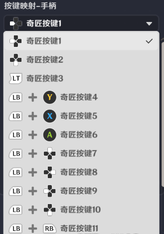
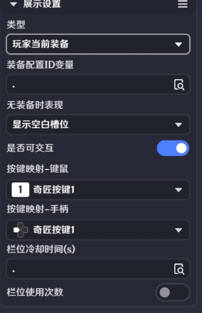
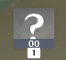

# 道具展示界面控件

**URL**: https://act.mihoyo.com/ys/ugc/tutorial/detail/mhjja1ipq9ck

**爬取时间**: 2026-01-04 08:20:24

---

## 道具展示界面控件

# 一、道具展示的功能

关卡运行中，点击和外接设备输入，都可以触发该界面控件的交互。

支持玩家进行交互，在选择类型为“玩家当前装备”或“模板道具”时，交互后向节点图发送*界面控件组触发时*事件

# **二、道具展示的编辑**

是否可交互

开启时可以配置交互的方式

按键映射-键鼠

提供PC按键供选择，作为输入交互项。选择后会显示在编辑窗口按键下方

按键映射-手柄

提供手柄按键供选择，作为输入交互项。选择后会显示在编辑窗口按键下方

类型

分为玩家当前装备、模板道具、背包内道具三种类型

* 玩家当前装备

装备配置ID变量

可选取玩家自身的变量

无装备时表现

当前没有装备时，该控件的表现形式

分为显示空白槽位和隐藏两种

栏位冷却时间(s)

可选取玩家自身，玩家1-8，关卡上的某个自定义变量

栏位使用次数

开启后可以配置无次数时隐藏和次数

无次数时隐藏

开启后若无使用次数则隐藏该控件

次数

可选取玩家自身，玩家1-8，关卡上的某个自定义变量

* 模板道具

道具配置ID变量

可选取玩家自身，玩家1-8，关卡上的某个自定义变量

道具数量展示

开启后图标正下方会显示当前道具数量，图中00

数量为零时隐藏

开启后若道具数量为零时则隐藏该控件

道具数量变量

可选取玩家自身，玩家1-8，关卡上的某个自定义变量

栏位冷却时间(s)

可选取玩家自身，玩家1-8，关卡上的某个自定义变量

* 背包内道具

道具配置ID变量

可选取玩家自身上的某个自定义变量

无道具时表现

当前没有道具时，该控件的表现形式

分为显示空白槽位和隐藏两种

# 三、通过节点图管理道具展示

**界面控件组触发时**

在关卡运行中，通过按钮界面控件制作的界面控件组，被执行交互操作会发送节点图事件”界面控件组触发时“，此事件只有触发交互的*玩家*节点图可以获取

