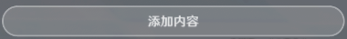
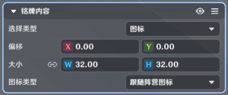
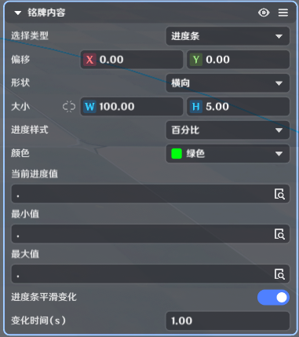
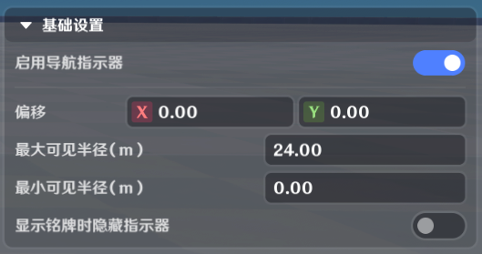
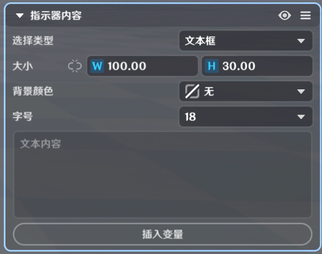
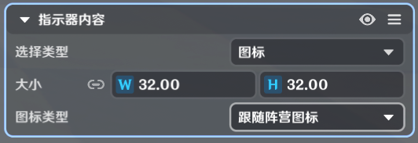

# 铭牌

**URL**: https://act.mihoyo.com/ys/ugc/tutorial/detail/mh5n160t2b6w

**爬取时间**: 2026-01-04 08:15:40

---

## 铭牌

# 一、铭牌组件的功能

铭牌组件，支持指定实体在关卡运行时，提供可视化的信息展示，可以提供例如实体*生命值*、*等级*等具体信息，也可以提供方向指引、距离显示等提示表现。

## **1.概**述

铭牌组件需要挂载于实体，支持*角色*、*物件*、*造物*使用。

铭牌组件可支持同时生效多个铭牌。

铭牌可以通过默认配置激活/关闭，也可以通过*节点图*控制指定铭牌的激活/关闭；同时支持通过*本地过滤器*调整指定铭牌的可见性。

## **2.细**分

**铭牌实际显示**包括铭牌和导航指示器两部分

**铭牌**

会被环境遮挡

和实体同一物理层级

**导航指示器**

不会被环境遮挡

高于交互界面层级

# **二、铭牌组件的编**辑

## **1.添加组**件

(1)在实体/元件编辑界面中，打开组件编辑页签

(2)点击下方的“添加组件”，选择并点击“铭牌”，成功添加

 选中铭牌时，编辑中的实体会显示铭牌组件当前生效的所有铭牌叠加表现情况。

(3)点击“详细编辑”，展开编辑页

## **2.铭牌组**件的编辑

|  |  |
| --- | --- |
| 配置参数 | 说明 |
| 初始生效铭牌 | 下拉菜单提供铭牌枚举  通过修改后面的勾选框，可以修改生效情况，修改后生效状态会同步到铭牌编辑页内 |
| \铭牌列表 | 枚举实体配置的所有铭牌 |

# **三、铭牌的编**辑

## **1.添加铭**牌

* 通过点击，添加铭牌。

添加的铭牌**初始生效**默认开启。

* 铭牌X，X为铭牌配置ID，作为节点输入项可以调整铭牌的初始生效参数。

## 2.铭牌的编辑

### (1)选定铭牌子菜单

### (2)基础设置

|  |  |  |
| --- | --- | --- |
| 配置参数 | 说明 | |
| 选择挂点 | 选择实体的预制*挂点*，或玩家自定义挂点。  可通过下拉菜单进行选择。铭牌将以此点为基础坐标点调整位置。 | |
| 可见半径(m) | 铭牌的生效距离，角色和实体距离满足配置，才会实际运行铭牌的逻辑。 | |
| 过滤器节点图 | 可引用本地过滤器节点图，用于决策铭牌在本地客户端可见与否，两种过滤器的区分和使用请看节点图 | |
| 选择类型：布尔型 | 当本地过滤器返回值为true时，该铭牌对本地客户端可见 |
| 选择类型：整型  生效整数范围：按需配置整数列表 | 当本地过滤器返回值在生效整数范围内时，该铭牌对本地客户端可见 |
| 对应本地过滤器节点图中的基础节点，进行说明  * 获取自身实体  输出参数为挂载铭牌组件的实体  * 获取目标实体  输出参数为在铭牌生效范围内的角色实体  当且仅当该角色实体等于本地客户端角色才会获取成功  * 获取当前角色  输出参数为本地角色 | |
| 初始生效 | 是否跟随物件创建一同激活  若多个铭牌同时激活，可能会造成重叠现象。 | |

### (3)铭牌内容

铭牌提供五种独立类型的编辑内容，支持单独和混合使用，支持对每一项进行位置、大小、细节数据的调整。

通过**添加内容**，可在铭牌中增加内容项。

通过对指定项在编辑状态下的可见性进行调整。

通过对指定项进行复制、粘贴、删除等操作。

#### **a.文本框**

|  |  |
| --- | --- |
| 配置参数 | 说明 |
| 偏移 | 以基础设置选定的挂点为基准，可调整偏移 |
| 大小 | 文本框的尺寸调整 |
| 背景颜色 | 支持配置透明、黑色半透明底色 |
| 字号 | 字体大小配置 |
| 文本内容 | 显示文本编辑  支持调整文本内容的对齐效果  支持**插入变量**，选择自身属性，或者特殊参数，也可以选择实体自身的自定义变量，会在文本框内实时更新  若配置的文本内容超出文本框的范围，则不会显示  插入引用的自定义变量以富文本的形式填写，格式为：  **{类型:前缀.变量名}**  类型：  引用实体自身的自定义变量时，为1  引用实体属性时，为2  前缀：  铭牌挂载在非角色/玩家的实体上时，前缀为s  铭牌挂载在角色实体时，前缀为a  铭牌挂载在玩家实体时，前缀为p  变量名：  引用自定义变量名时，变量名即需要引用的自定义变量名  引用实体的属性时，变量名如下：  当前生命值：HpCur  生命值上限：HpMax  当前攻击力：AtkCur  当前防御力：DefCur  当前等级：LvCur  玩家昵称：PName  与玩家的距离：PDist |

#### **b.图标**

|  |  |  |
| --- | --- | --- |
| 配置参数 | 说明 | |
| 偏移 | 以基础设置选定的挂点为基准，可调整偏移 | |
| 大小 | 图标的尺寸调整 | |
| 图标类型 | 自定义图标 | 需要额外选择图标，指定使用 |
| 跟随阵营图标 | 无需二次选择图标，会读取实体的阵营，并使用对应图标 |

#### **c.进度条**

|  |  |  |
| --- | --- | --- |
| 配置参数 | 说明 | |
| 偏移 | 以基础设置选定的挂点为基准，可调整偏移 | |
| 形状 | 横向 | 支持配置 宽、高 |
| 纵向 | 支持配置 宽、高 |
| 圆环 | 支持配置 直径 |
| 大小 | 进度条的尺寸调整 | |
| 进度样式 | 百分比 | 按真实比例的百分比显示进度，精度为整数 |
| 不显示 | 隐藏进度提示文本 |
| 当前值 | 实时显示当前值 |
| 真实比例 | 实时显示真实比例 |
| 颜色 | 可在预制颜色中进行选取 | |
| 当前进度值 | 支持选择挂载实体的部分属性，以及实体自身的自定义变量 | |
| 最小值 | 支持选择挂载实体的部分属性，以及实体自身的自定义变量 | |
| 最大值 | 支持选择挂载实体的部分属性，以及实体自身的自定义变量 | |
| 进度条平滑变化 | 若开启，则会在变化时间内，完成进度值变化的表现。 | |
| 变化时间（s） | 当前进度值变化时，在配置时间内完成表现变化。 | |

#### **d.计时器**

|  |  |
| --- | --- |
| 配置参数 | 说明 |
| 偏移 | 以基础设置选定的挂点为基准，可调整偏移 |
| 类型 | 正计时、倒计时 |
| 指定计时器 | 会枚举符合类型的所有预定义全局计时器 |
| 来源实体 | 默认配置为关卡实体，可选择关卡实体，或者实体自身 |

#### **e.生命值与护盾**

|  |  |  |
| --- | --- | --- |
| 配置参数 | 说明 | |
| 偏移 | 以基础设置选定的挂点为基准，可调整偏移 | |
| 大小 | 生命值条的尺寸调整 | |
| 生命值显示样式 | 不显示 | 不显示生命值条 |
| 进度条 |  |
| 进度条+数值 | 数值精确到小数点后两位 |
| 生命值颜色 | 控件条会以配置的颜色作为显示 | |
| 护盾显示 | 不显示 | 仅显示生命值条 |
|  | 单独显示 | 若配置护盾单独显示，则护盾条控件会显示于生命值条的下方 |
|  | 混合显示 | 若配置混合显示，控件条会将生命值和护盾值同时显示，并按照扣除优先级从右往左显示护盾和生命值 |
| 是否有护盾显示上限 | 若勾选，则当护盾值超过配置上限时，护盾值条都显示满 | |
| 护盾显示上限值 | 仅当勾选**是否有护盾显示上限**，才会开放配置  护盾显示上限会调整为配置值，超过上限的护盾会持续显示充满控件条。  当且仅当护盾值小于配置上限值，才会看到控件条显示扣除情况。 | |

## 3. 导航指示器的编辑

### (1)选定导航指示器子菜单

### (2)基础设置

|  |  |
| --- | --- |
| 配置参数 | 说明 |
| 偏移 | 以基础设置选定的挂点为基准，可调整偏移 |
| 最大可见半径（m） | 指示器的最大生效范围 |
| 最小可见半径（m） | 指示器的最小生效范围 |
| 显示铭牌时隐藏指示器 | 若开启，则铭牌在生效范围时，指示器不会显示，便于实现铭牌和指示器的切换效果。 |

### (3)导航指示器内容

导航指示器提供两种独立类型的编辑内容，支持单独和混合使用，支持对每一项进行位置、大小、细节数据的调整。

通过**添加内容**，可在导航指示器中增加内容项。

通过对指定项在编辑状态下的可见性进行调整。

通过对指定项进行复制、粘贴、删除等操作。

#### **a.文本框**

|  |  |
| --- | --- |
| 配置参数 | 说明 |
| 大小 | 文本框的尺寸调整 |
| 背景颜色 | 支持配置透明、黑色半透明底色 |
| 字号 | 字体大小配置 |
| 文本内容 | 显示文本编辑  支持**插入变量**，选择指定实体的自定义变量，会在文本框内实时更新  支持调整文本内容的对齐效果  若配置的文本内容超出文本框的范围，则不会显示 |

#### **b.图标**

|  |  |  |
| --- | --- | --- |
| 配置参数 | 说明 | |
| 大小 | 图标的尺寸调整 | |
| 图标类型 | 自定义图标 | 需要额外选择图标，指定使用 |
| 跟随阵营图标 | 无需二次选择图标，会读取实体的阵营，并使用对应图标 |

# **四、通过节点图管理铭牌**

实体运行时，可通过节点图管理其生效的铭牌

* **设置实体生效铭牌**

通过节点输入的铭牌配置ID列表，将完整覆盖目标实体的生效铭牌

|  |  |  |
| --- | --- | --- |
| 配置参数 | 数据类型 | 说明 |
| 目标实体 | 实体 | 运行时的实体 |
| 铭牌配置ID列表 | 配置ID列表 |  |

**