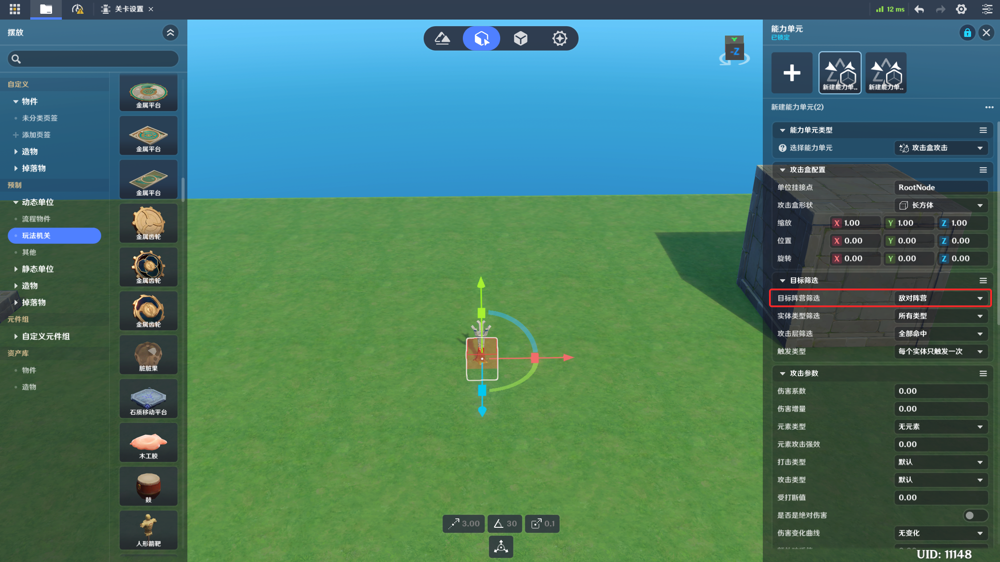
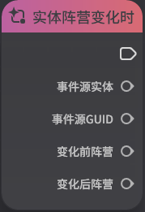
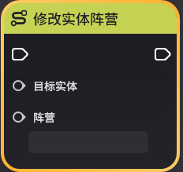

# 阵营

**URL**: https://act.mihoyo.com/ys/ugc/tutorial/detail/mhe1ixri46ta

**爬取时间**: 2026-01-04 08:07:48

---

## 阵营

*为了构建对抗性玩法而将实体划分为不同的群体，归属于同一群体内的玩家有着相同的游戏目标，这个群体被称为*阵营*

在组队竞技类型的游戏中，阵营可以作为结算目标或得分的判断依据

# 一、阵营的全局定义

在*基础信息*上选择阵营之前，需要先在关卡设置的阵营页签定义玩法所需要的阵营

阵营名称：该阵营的命名

默认阵营对象：新创建的玩家/物件/造物将被归类到对应的默认阵营中

包含的玩家：是一个玩家的列表，代表初始有哪些玩家归属于该阵营

包含的实体：是物件和造物的列表，代表初始有哪些物件和造物归属于该阵营

# 二、阵营关系

任意两个阵营之间都一定存在*敌对*和*友善*两种关系，可以通过关卡设置中的阵营关系进行配置

需要注意的是，阵营关系是单向的，阵营1对于阵营2敌对，但阵营2不一定对阵营1敌对。可能存在阵营2对阵营1友善的情况，此时仅阵营1的实体可以攻击阵营2，阵营2的实体无法攻击阵营1

以下图为例：初始玩家阵营与初始物件阵营和初始造物阵营均为敌对，因此可以直接攻击阵营为这两个阵营的实体（角色、造物或物件）

其他系统中，阵营相关的配置均以关卡配置的阵营关系生效。例如下图中的能力单元会正确命中敌对阵营的目标

# 三、默认阵营配置

每个阵营均可以配置一个默认阵营对象。当该对象类型的实体（例如图中的玩家和物件）创建时，如果是默认阵营（阵营的值为0），那么会被分配至该实体类型的默认阵营

以上图为例，该石质球元件在创建时，如果没有对其实体覆写阵营，那么会以【初始物件阵营】进行创建（因为物件的默认阵营是初始物件阵营）

# 四、使用节点图控制玩家阵营

实体阵营变化事件

修改实体阵营

查询实体阵营

