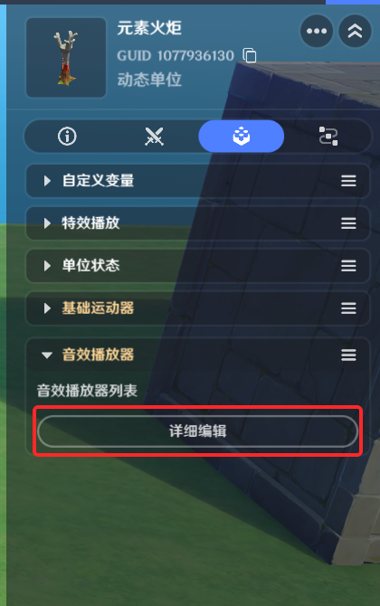

# 一、音效播放器组件的功能

*音效播放器组件*提供了让单位额外播放音效的功能，组件提供了两种播放方式

1.默认配置在组件上，会在持有该组件的单位创建后自动播放

2.通过节点图进行播放，但必须要求播放音效的单位持有音效播放器组件

# 二、音效播放器组件的编辑

## 1.添加音效播放器组件

(1)切换到实体或元件的组件页签

(2)找到或新增一个音效播放器组件

## 2.新增音效播放器

06d69c02dc55_1818194431287328309.png)

点击【详细编辑】进入详情编辑页

在音效播放器组的详情页面，可以点击【添加音效】来新增一个音效配置

## 3.配置音效播放器

*序号*：音效播放器的识别序号

*名称*：播放器的名称

*音效资产*：引用具体要播放的音效资产

*音音效播放时的响度大小

*播放速度*：音效资产的播放速度

*循环播放*：开启后，音效资产的播放完毕后会再次进行播放

*循环时间间隔（s）*：循环播放的音效在结束后会等待配置的间隔时间后再次播放

*3D音效*：是否是3D音效，如果勾选则可以进行相关配置

*\*范围预览*：开启后可以在场景内看到对应的音效传播范围

*范围半径(m)*：可配置音效传播的范围

*挂接点*：可指定某个挂接点位置作为音dbb-440a-994b-e7f76bce5d4a.png)2-465b-83d0-60fac204cb7e.png)22e3-47cd-98f2-3012a74fe1f6.png)68dd-4f3b-b3c8-1b763c2cdb7c.png)置

*衰减方式*：在使用3D音效的情况下，听者（大多数时候是角色）距离音源越远，则听到的音量越小，直至超过范围后音量变为0，衰减方式定了音量变小的趋势

*均匀衰减*：音量的衰减和听者距离音源的距离为线性关系

*先快后慢*：听者在音源较近处时，远离音源造成的音量衰减会更快

*先慢后快*：听者在音源较近处时，远离音源造成的音量衰减会更慢

*偏移*：音源的位置偏移

# 三、使用节点图控制音效

添加音效播放器

调整指定音效播放器

关闭指定音效播放器

启动/暂停指定音效播放器

玩家播放单次2D音效

