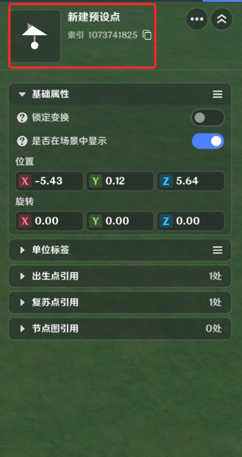
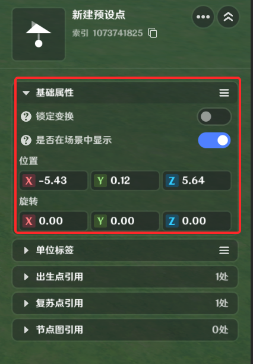
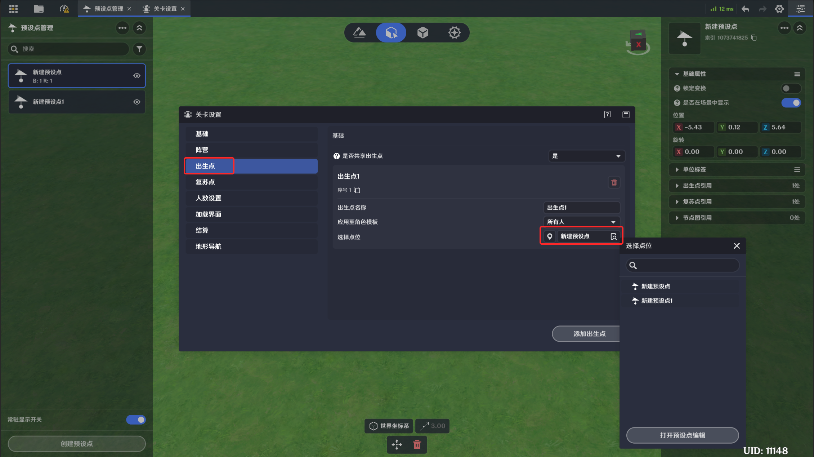

# 预设点

**URL**: https://act.mihoyo.com/ys/ugc/tutorial/detail/mhfvn30ctm9c

**爬取时间**: 2026-01-04 08:27:53

---

## 预设点

# 一、预设点是什么

预设点是一组场景中的世界位置和朝向的数据信息。

预设点可以被需要点位信息的功能所引用，例如出生点、复苏点、节点图获取点位等。

# 二、预设点的编辑

## 1.编辑入口

## **2.整体编辑界面**

### (1)预设点库

所有预设点在这个窗口枚举。

可管理对应预设点在布设场景的可见性

### **(2)编辑窗口预设点可见**性

常驻显示开关开启	关闭预设点管理工具，在编辑窗口也可以看到所有预设点

常驻显示开关关闭* *关闭预设点管理工具，所有预设点不可见

### **(3)创建预设**点

通过点击“创建预设点”，在当前编辑窗口中央生成新的预设点。并自动开启命名编辑。

### **(4)预设点的参数**

预设点名称* *预设点的名称，可以修改

预设点索引		作为节点的入参，是预设点的唯一标识

|  |  |
| --- | --- |
| 配置参数 | 说明 |
| 锁定变换 | 勾选后不可调整预设点的位置和旋转 |
| 是否在场景中显示 | 取消勾选后，只留坐标轴，定点模型不可见 |
| 位置  | 预设点的位置数据 |
| 旋转 | 预设点的朝向数据 |
| 单位标签 | 可以给预设点添加单位标签。详见[单位标签](单位标签_mhzldmiwdgu4.md) |
| ***引用关系 |  |

# 三、预设点的引用

## 1.出生点

在“关卡设置”-出生点配置中，可通过选择点位引用预设点，作为出生点

## 2.复苏点

在“关卡设置”-复苏点配置中，可通过选择点位引用预设点，作为复苏点

## 3.节点图

* **查询预设点位置旋转**

通过预设点索引，可以查询其位置和旋转数据

通过点击，可展开所有预设点枚举，用于选择做入参

* **以单位标签获取预设点位列表**

